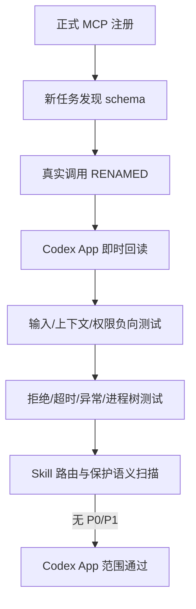

# 模型无关的会话重命名工具验收标准

结论：验收以“统一工具真实可发现、只改当前任务、立即且持久生效、失败稳定可控”为准；影响：高优先级问题、任意线程 ID 输入、进程树遗留或旧原生优先路由都会阻止放行；范围：工具 schema、元数据、App Server、Skill 路由、正式注册、真实任务和保护语义；非范围：无工具调用模型和其他宿主未经验证适配器；变化：主路径只调用统一 MCP 一次；完成标准：九类验收场景达到通过或明确环境不具备；术语说明：持久化任务是可由 Codex App 再次读取的非临时任务；验证状态：Codex App 路径已通过，非 GPT 实机环境不具备。

## 文档信息

图片资产决策：N/A + 原因：验收对象是工具协议、进程、规则和文本结果；证据：没有图片输入或交付。

| 字段 | 内容 |
| --- | --- |
| 来源需求 | `REQ-TR-20260722` |
| 验收对象 | `thread-title-rules`、本地 MCP、App Server 客户端、全局注册 |
| local 环境 | `F:\luode-skills`、Codex App 本机 host |
| 第三方验证 | N/A + 原因：无外部服务 |

## 验收目标与判定原则

- 通过：真实工具调用和自动化断言同时成立，且无未决 P0/P1。
- 通过标准：真实工具调用、自动化断言和保护语义扫描全部成立，且无未决 P0/P1。
- 失败标准：模型可传其他线程 ID、上下文缺失仍猜测、成功后重复回退、App Server 进程树遗留或 UI 回读不一致。
- 环境不具备：当前无非 GPT 工具调用模型，只能限制结论，不能伪报通过。

## 前置条件

| ID | 前置条件 | 未满足处理 |
| --- | --- | --- |
| `AC-TR-PRE-001` | `thread_session` 经 `codex mcp get` 显示 enabled | 阻断真实发现测试 |
| `AC-TR-PRE-002` | Node.js 20+、锁定依赖已安装 | 阻断 MCP 启动 |
| `AC-TR-PRE-003` | 使用持久化 Codex App 任务 | ephemeral 仅记录为非支持边界 |

## 验收流程图

图形目的：说明从工具发现到真实持久化、故障回归和保护语义的验收顺序。

关联 ID：`AC-TR-001` 至 `AC-TR-009`。

## 验收场景

| AC ID | 场景 | 输入/样本 | 预期结果 | 实际状态 |
| --- | --- | --- | --- | --- |
| `AC-TR-001` | 发现测试 | 新持久化任务列出工具 | 只发现 `rename_current_thread`，schema 仅 `title` | 通过 |
| `AC-TR-002` | 成功与持久化 | 标题“模型无关会话重命名终验” | 返回 `RENAMED`，App 回读同名 | 通过 |
| `AC-TR-003` | 上下文测试 | 缺失、冲突、格式错误元数据 | `THREAD_CONTEXT_MISSING`，不调用 App Server | 通过 |
| `AC-TR-004` | 权限边界 | arguments 额外 `threadId`、cwd、preview | schema 拒绝或忽略，不猜测任务 | 通过 |
| `AC-TR-005` | 输入测试 | 空白、trim 后空、25 字 | `INVALID_TITLE` | 通过 |
| `AC-TR-006` | 故障与回收 | CLI 不存在、拒绝、残缺响应、超时、异常退出、真实 Windows 进程树 | 稳定错误码且无遗留子进程 | 通过 |
| `AC-TR-007` | 兼容路由 | MCP 成功/失败、原生工具存在/缺失 | 成功即停止；其他失败最多原生回退一次 | 通过 |
| `AC-TR-008` | 跨模型 | 当前可用模型列表 | 支持工具调用的模型共用契约；非 GPT 实机当前不具备 | 限制通过 |
| `AC-TR-009` | 保护语义 | 用户禁止、标题准确、主题不稳定、小步骤推进 | 明确跳过，不弱化自动触发和标题规则 | 通过 |

## 异常分支场景

- `codex exec --ephemeral` 返回拒绝：按非支持边界记录，不改为内部存储直写。
- MCP 配置在旧任务中未热加载：使用注册后的新持久化任务验收，不宣称旧任务已发现。
- `_meta` 被任意外部客户端构造：明确其不属于 Codex App 宿主信任边界，本工具不作为多用户授权组件。
- taskkill 启动失败或进程仍存活：自动化失败并阻断，不仅断言调用过 kill。

## 范围外场景

- Claude Desktop、Claude Code 或其他宿主的真实改名适配器。
- 完全不支持 function calling/MCP 的模型。
- Git 提交、推送、PR、数据库和生产服务。

## REQ-AC 追踪矩阵

| REQ/RULE | AC |
| --- | --- |
| `REQ-TR-001`,`RULE-TR-001` | `AC-TR-001`,`AC-TR-005` |
| `REQ-TR-002`,`RULE-TR-002`,`RULE-TR-004` | `AC-TR-003`,`AC-TR-004` |
| `REQ-TR-003`,`REQ-TR-005`,`RULE-TR-003`,`RULE-TR-005` | `AC-TR-002`,`AC-TR-006` |
| `REQ-TR-004`,`RULE-TR-006`,`RULE-TR-007`,`RULE-TR-008` | `AC-TR-007`,`AC-TR-008`,`AC-TR-009` |

## 证据与命令

| TEST | 命令/入口 | 通过标准 |
| --- | --- | --- |
| `TEST-TR-AUTO` | `npm test --prefix thread-title-rules/mcp` | 16/16 通过 |
| `TEST-TR-QUICK` | `quick_validate.py thread-title-rules` | Skill valid |
| `TEST-TR-MCP-CONFIG` | `codex mcp get thread_session` | enabled、命令与入口正确 |
| `TEST-TR-REAL` | 新持久化任务调用 MCP + `read_thread` | `RENAMED` 且标题一致 |
| `TEST-TR-SCAN` | 活动旧路由扫描 | 仅历史事件保留旧口径 |

## 完成条件、停止条件与交付物

- 完成条件：AC-TR-001 至 AC-TR-007、AC-TR-009 通过，AC-TR-008 明确环境限制，无未决 P0/P1。
- 停止条件：UI 不更新、元数据不可靠、App Server 方法不可用、进程树遗留或 validator 失败。
- 交付物：MCP 代码、Skill 路由、工具契约、锁文件、自动化、正式注册、四份工程文档、字典和项目状态。
