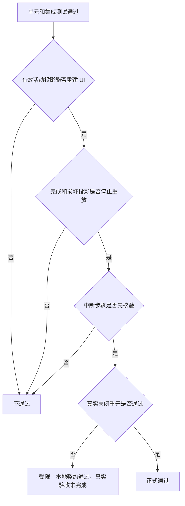

# Codex Desktop 任务悬浮窗断点恢复验收标准

结论：按磁盘一致性、UI 重建和中断安全三个层次验收；影响：决定本能力能否正式用于跨 Desktop 关闭继续任务；范围：投影脚本、Skill 路由、项目状态和真实关闭重开；非范围：应用启动但用户尚未发送消息时的 UI；变化：验收从单进程计划展示扩展为跨进程恢复；完成标准：所有自动测试通过且一次真实关闭重开通过；术语说明：失活投影是已完成且不得再次重建的任务投影；验证状态：标准已冻结，实现证据按任务逐项补齐。

## 文档信息

| 项目 | 内容 |
|---|---|
| 来源需求 | [REQDOC-RTP-001](../2-需求/2026-07-23_012302_CodexDesktop任务悬浮窗断点恢复.md) |
| 验收环境 | Windows local 工作区与本机 Codex Desktop |
| 图片资产决策 | N/A。原因：验收对象是状态和工具行为；证据：JSON、测试输出和真实 UI 核对足够。 |

图片资产决策：N/A。原因：验收对象是状态和工具行为；证据：JSON、测试输出和真实 UI 核对足够。

## 验收场景

| 验收 ID | 场景 | 通过标准 | 失败标准 |
|---|---|---|---|
| `AC-RTP-001` | 状态跨进程保留 | 新进程读到相同步骤、顺序和三态 | 丢步、乱序或状态变化 |
| `AC-RTP-002` | 首次继续回合重建 UI | 有效活动投影调用 `update_plan` 并显示一致列表 | 未调用、payload 不一致或误报成功 |
| `AC-RTP-003` | 中断写操作保护 | 进行中步骤先核验，中断写操作不自动重放 | 未核验即继续写入 |
| `AC-RTP-004` | 完成计划失活 | `inactive` 投影不调用工具 | 完成计划再次出现 |
| `AC-RTP-005` | 损坏和工具缺失 | 保留磁盘状态并明确失败原因 | 覆盖用户正文或声称已恢复 |

## 场景与前置条件

| 场景 | 前置条件 | 样本 |
|---|---|---|
| 活动恢复 | 3 个步骤，1 完成、1 进行中、1 待处理 | 临时 `PROJECT_CURRENT.md` |
| 完成失活 | 所有步骤完成且 `state=inactive` | 单元测试 fixture |
| 负向安全 | 重复区块、损坏 JSON、两个进行中、未知状态、敏感字段 | 单元测试 fixture |
| 真实重启 | 当前任务已显示活动悬浮窗 | 本机 Codex Desktop |

## 输入与预期结果

- 输入合法活动投影时，脚本输出与 `update_plan` 一致的 `steps` 列表和固定恢复说明。
- 输入过期指纹、来源不匹配或损坏投影时，命令非零退出且原文件哈希不变。
- 状态迁移 `pending -> in_progress -> completed` 时，磁盘先更新，随后工具 payload 与磁盘一致。
- 真实关闭重开后，用户发送“继续任务”，Agent 在领域动作前重建悬浮窗。

## 异常与边界条件

- 两个 `in_progress`、超过 20 步、单条超过 256 字符、未知字段、敏感字段和超 51,200 字节均拒绝。
- `update_plan` 不可用时，验收允许磁盘状态保留，但 UI 恢复判定失败，不能正式放行。
- 无法确认来源对象或中断点含未知幂等性写操作时，只恢复展示状态并暂停执行。

## 范围外说明

- 范围外：修改 Desktop 本体、数据库或 UI 源码；依据：`BOUND-RTP-004`。
- 范围外：在用户没有发起新回合时自动运行 Skill；依据：Skills 不具备启动钩子。
- 范围外：恢复多个并行活动投影；依据：`BOUND-RTP-006`。

## 验收决策图

图形目的：说明放行条件；关联 ID：`AC-RTP-001` 至 `AC-RTP-005`。

## REQ-AC 追踪矩阵

| 需求 | 验收 | 实施任务 | 证据入口 |
|---|---|---|---|
| `REQ-RTP-001` | `AC-RTP-001` | `TASK-RTP-03`、`TASK-RTP-04`、`TASK-RTP-05` | 单元与崩溃点集成测试 |
| `REQ-RTP-002` | `AC-RTP-002` | `TASK-RTP-06`、`TASK-RTP-08` | 新进程和 Desktop 重启证据 |
| `REQ-RTP-003` | `AC-RTP-003` | `TASK-RTP-05`、`TASK-RTP-06`、`TASK-RTP-08` | 非幂等中断负向测试 |
| `REQ-RTP-004` | `AC-RTP-004` | `TASK-RTP-03`、`TASK-RTP-06` | inactive 测试 |
| `REQ-RTP-005` | `AC-RTP-005` | `TASK-RTP-03`、`TASK-RTP-06` | 损坏和工具缺失测试 |

## 完成条件、停止条件与交付物

- 完成条件：全部 profile、单元测试、集成测试、Skill 合规审查和真实 Desktop 重启验收通过。
- 停止条件：工具不可用、投影损坏、来源不匹配、未知幂等性写操作或用户内容保护失败。
- 交付物：新 Skill、脚本、测试、相邻 Owner 接入、字典、项目四件套、审查和最终验收记录。
