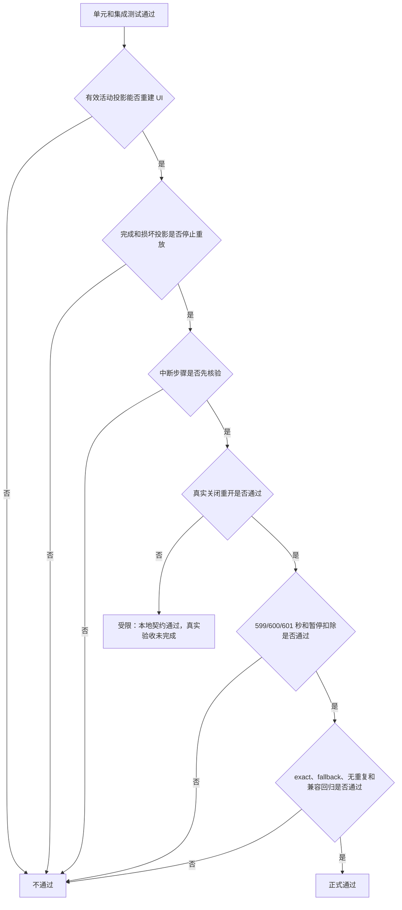
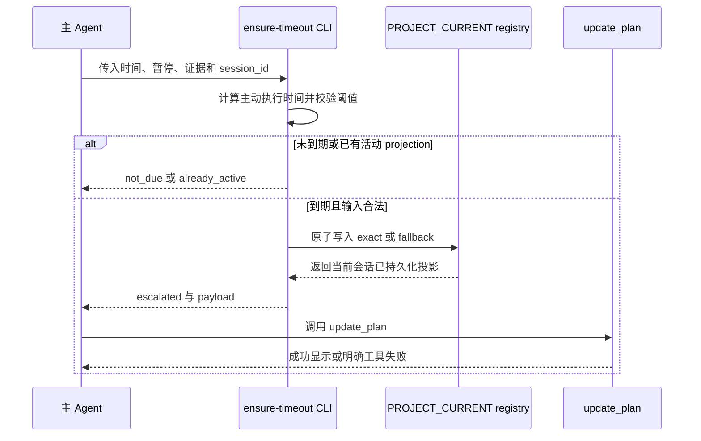

# Codex Desktop 任务悬浮窗断点恢复验收标准

结论：在原有磁盘一致性、UI 重建和中断安全验收上，增加无悬浮窗任务超时升级的边界验收；影响：决定简单任务执行较久后能否获得稳定、无重复的进度展示；范围：主动执行时间计算、严格 600 秒边界、精确与兜底投影、原子写入、失败保护和兼容性；非范围：后台定时唤醒、投影 schema 变更和计时事实持久化；变化：验收从“已有投影能恢复”扩展为“没有投影且执行超时也能安全补建”；完成标准：新增四项验收的主路径、异常和边界场景全部得到二值断言；术语说明：精确投影是从唯一正式来源提取任务步骤，兜底投影是来源不唯一时使用的固定安全三步；验证状态：验收标准已冻结，实现证据由第五实施周期逐项补齐。

## 文档信息

| 项目 | 内容 |
|---|---|
| 来源需求 | [REQDOC-RTP-001](../2-需求/2026-07-23_012302_CodexDesktop任务悬浮窗断点恢复.md) |
| 验收环境 | Windows local 工作区与本机 Codex Desktop |
| 当前变更 | `CHG-RTP-001`：无活动悬浮窗的未完成任务主动执行严格超过 600 秒后自动升级 |
| 图片资产决策 | N/A。原因：验收对象是状态和工具行为；证据：JSON、测试输出和真实 UI 核对足够。 |

图片资产决策：N/A。原因：验收对象是状态和工具行为；证据：JSON、测试输出和真实 UI 核对足够。

## 验收场景

| 验收 ID | 场景 | 通过标准 | 失败标准 |
|---|---|---|---|
| `AC-RTP-001` | 状态跨进程保留 | 新进程读到相同步骤、顺序和三态 | 丢步、乱序或状态变化 |
| `AC-RTP-002` | 首次继续回合重建 UI | 有效活动投影调用 `update_plan` 并显示一致列表 | 未调用、payload 不一致或误报成功 |
| `AC-RTP-003` | 中断写操作保护 | 进行中步骤先核验，中断写操作不自动重放 | 未核验即继续写入 |
| `AC-RTP-004` | 完成计划失活 | `inactive` 投影不调用工具 | 完成计划再次出现 |
| `AC-RTP-005` | 损坏和工具缺失 | 保留磁盘状态并明确失败原因 | 覆盖用户正文或声称已恢复 |
| `AC-RTP-006` | 主动执行时间与严格阈值 | 599 秒和 600 秒返回 `not_due`；601 秒返回到期；Plan Mode、等待用户和 `blocked` 暂停均被扣除 | 恰好 600 秒升级、暂停计入执行时间或起点早于首次真实执行动作 |
| `AC-RTP-007` | 到期投影选择与持久化顺序 | 唯一正式来源生成 `exact`，证据不唯一生成固定三步 `fallback`；两者均先原子持久化再返回 `escalated + payload` | 来源不唯一仍生成 exact、先返回 payload 后写盘或覆盖其它会话 |
| `AC-RTP-008` | 不升级和非法输入保护 | 任务完成、许可非 `confirmed`、Plan Mode、已有活动 projection 均不创建；非法时间或损坏 registry 非零退出且文件字节不变 | 重复创建、猜测时间、损坏原文件或刷新已有 UI |
| `AC-RTP-009` | 能力边界与兼容 | 不新增后台监控、schema 字段或计时持久化；`update_plan` 失败只保留磁盘状态；既有 v1-v3 读取与 v4 多会话隔离回归通过 | 宣称第 601 秒后台唤醒、持久化时间字段、工具失败仍声称 UI 已出现或破坏旧兼容 |

## 场景与前置条件

| 场景 | 前置条件 | 样本 |
|---|---|---|
| 活动恢复 | 3 个步骤，1 完成、1 进行中、1 待处理 | 临时 `PROJECT_CURRENT.md` |
| 完成失活 | 所有步骤完成且 `state=inactive` | 单元测试 fixture |
| 负向安全 | 重复区块、损坏 JSON、两个进行中、未知状态、敏感字段 | 单元测试 fixture |
| 真实重启 | 当前任务已显示活动悬浮窗 | 本机 Codex Desktop |
| 超时边界 | 当前会话无活动 projection、任务未完成、执行许可为 `confirmed` | `started_at=2026-07-25T08:00:00Z`，观察时间分别为 599、600、601 秒后 |
| 暂停扣除 | 墙钟经过 901 秒，其中等待用户或 `blocked` 暂停 301 秒 | `paused_seconds=301`，主动执行时间恰好 600 秒 |
| 精确与兜底 | 到期且无活动 projection | 唯一来源 fixture 与来源冲突 fixture 各一份 |
| 不重复与失败保护 | 当前会话已有活动 projection，或时间/registry 非法 | 临时 `PROJECT_CURRENT.md` 原始字节和 SHA-256 |

## 输入与预期结果

- 输入合法活动投影时，脚本输出与 `update_plan` 一致的 `steps` 列表和固定恢复说明。
- 输入过期指纹、来源不匹配或损坏投影时，命令非零退出且原文件哈希不变。
- 状态迁移 `pending -> in_progress -> completed` 时，磁盘先更新，随后工具 payload 与磁盘一致。
- 真实关闭重开后，用户发送“继续任务”，Agent 在领域动作前重建悬浮窗。
- 输入 599 秒、600 秒和 601 秒主动执行时间时，分别得到 `not_due`、`not_due` 和 `escalated`；暂停秒数先从墙钟差中扣除。
- 到期且来源唯一时返回 `mode=exact`；来源缺失、冲突或不唯一时返回固定三步 `mode=fallback`，两条路径都必须能从已写入磁盘的当前会话 projection 重新生成相同 payload。
- 当前会话已有活动 projection 时返回 `already_active`；非法 UTC 时间、观察时间早于开始时间、负暂停、暂停超过墙钟时长或损坏 registry 时非零退出且原文件哈希不变。

## 异常与边界条件

- 两个 `in_progress`、超过 20 步、单条超过 256 字符、未知字段、敏感字段和超 51,200 字节均拒绝。
- `update_plan` 不可用时，验收允许磁盘状态保留，但 UI 恢复判定失败，不能正式放行。
- 无法确认来源对象或中断点含未知幂等性写操作时，只恢复展示状态并暂停执行。
- 任务已完成、当前处于 Plan Mode、执行许可不是 `confirmed` 或当前 `session_id` 已有活动 projection 时，超时入口不得创建或替换投影。
- 恰好 600 秒仍属于未到期；只有计算结果严格大于 600 秒才允许升级。
- `started_at`、`observed_at` 必须为 UTC ISO-8601；`paused_seconds` 必须非负且不超过墙钟时长，否则拒绝并保持原文件字节不变。

## 范围外说明

- 范围外：修改 Desktop 本体、数据库或 UI 源码；依据：`BOUND-RTP-004`。
- 范围外：在用户没有发起新回合时自动运行 Skill；依据：Skills 不具备启动钩子。
- 范围外：恢复多个并行活动投影；依据：`BOUND-RTP-006`。
- 范围外：后台线程、系统定时器或无新检查点的第 601 秒自动唤醒；依据：`BOUND-RTP-008` 和 Skills 运行时能力边界。
- 范围外：把起始时间、观察时间或暂停秒数写入 v4 registry、projection 或项目长期状态；依据：`RULE-RTP-010`。

**新增超时验收场景明细**

| 验收 | 需求/规则 | 前置状态与权限 | 输入与动作 | 可观察断言 | 异常、边界与清理 | 实施/测试/证据 |
|---|---|---|---|---|---|---|
| `AC-RTP-006` | `REQ-RTP-006`、`RULE-RTP-007`、`RULE-RTP-008` | 默认执行回合；许可为 `confirmed`；从首次真实执行动作记录起点；无需外部权限 | 对同一临时文件分别调用 `ensure-timeout`，构造 599、600、601 秒及带暂停样本 | 599/600 秒为 `not_due` 且无 payload；601 秒到期；墙钟 901 秒减暂停 301 秒仍为 `not_due` | 非 UTC、负暂停、暂停超过墙钟均 `FAIL`；每例在临时目录独立创建并删除 fixture | `CYCLE-RTP-05`、`TASK-RTP-12`、`TASK-RTP-13`、`TEST-RTP-009`、`EVIDENCE-RTP-009` |
| `AC-RTP-007` | `REQ-RTP-007`、`RULE-RTP-005`、`RULE-RTP-009` | 到期、当前 `session_id` 无活动 projection；输入只含白名单证据 | 唯一来源 fixture 调用一次，冲突来源 fixture 调用一次 | 前者 `exact`、后者固定三步 `fallback`；均先写入 registry，再返回 `action=escalated` 和与磁盘一致的 payload | 原子替换失败或文件超限为 `FAIL` 且原文件不变；测试后删除临时目录 | `CYCLE-RTP-05`、`TASK-RTP-12`、`TASK-RTP-13`、`TEST-RTP-010`、`EVIDENCE-RTP-010` |
| `AC-RTP-008` | `REQ-RTP-006`、`REQ-RTP-007`、`RULE-RTP-009` | 分别构造已完成任务、Plan Mode、许可非 `confirmed`、已有活动 projection 和非法 registry | 在规则路由测试与 CLI 负向测试中逐项触发 | 不满足升级前置时不调用写入；已有活动投影返回 `already_active`；非法输入非零退出；原文件 SHA-256 不变 | 任一重复投影、跨会话覆盖或错误 payload 为 `FAIL`；临时文件全部清理 | `CYCLE-RTP-05`、`TASK-RTP-11`、`TASK-RTP-12`、`TASK-RTP-13`、`TEST-RTP-011`、`EVIDENCE-RTP-011` |
| `AC-RTP-009` | `REQ-RTP-007`、`RULE-RTP-010` | 现有 v1-v3 读取样本、v4 两会话 registry、模拟 `update_plan` 不可用 | 运行全量回归、Skill 触发文本检查和 schema 对比 | 无新增计时字段；其它会话 projection 字节语义不变；工具失败只报告磁盘已保存；规则明确无后台唤醒 | 发现 schema 漂移、兼容回归或“UI 已出现”误报即 `FAIL`；测试不连接外部服务 | `CYCLE-RTP-05`、`TASK-RTP-11`、`TASK-RTP-12`、`TASK-RTP-13`、`TEST-RTP-012`、`EVIDENCE-RTP-012` |

所有 `AC-RTP-006..009` 只允许 `PASS` 或 `FAIL`。审查人和验收人为执行本周期的主 Agent；验收时间取实际测试完成时间。N/A：不需要数据库、缓存、消息队列、HTTP/RPC 上游或业务账号；原因是全部输入均为 local 临时 Markdown/JSON fixture；证据为 `TEST-RTP-009..012` 的命令和清理步骤。

## 验收决策图

图形目的：说明原恢复能力和新增超时升级共同放行条件；关联 ID：`AC-RTP-001` 至 `AC-RTP-009`。

```mermaid
flowchart TD
    A["单元和集成测试通过"] --> B{"有效活动投影能否重建 UI"}
    B -- "否" --> X["不通过"]
    B -- "是" --> C{"完成和损坏投影是否停止重放"}
    C -- "否" --> X
    C -- "是" --> D{"中断步骤是否先核验"}
    D -- "否" --> X
    D -- "是" --> E{"真实关闭重开是否通过"}
    E -- "否" --> Y["受限：本地契约通过，真实验收未完成"]
    E -- "是" --> F{"599/600/601 秒和暂停扣除是否通过"}
    F -- "否" --> X
    F -- "是" --> G{"exact、fallback、无重复和兼容回归是否通过"}
    G -- "否" --> X
    G -- "是" --> Z["正式通过"]
```

**超时升级验收时序图**

图形目的：验证跨角色场景中必须先持久化、后刷新 UI；关联 ID：`AC-RTP-006` 至 `AC-RTP-009`、`TEST-RTP-009` 至 `TEST-RTP-012`。

```mermaid
sequenceDiagram
    participant A as 主 Agent
    participant C as ensure-timeout CLI
    participant P as PROJECT_CURRENT registry
    participant U as update_plan
    A->>C: 传入时间、暂停、证据和 session_id
    C->>C: 计算主动执行时间并校验阈值
    alt 未到期或已有活动 projection
        C-->>A: not_due 或 already_active
    else 到期且输入合法
        C->>P: 原子写入 exact 或 fallback
        P-->>C: 返回当前会话已持久化投影
        C-->>A: escalated 与 payload
        A->>U: 调用 update_plan
        U-->>A: 成功显示或明确工具失败
    end
```

异常覆盖：CLI 校验失败时不接触 `update_plan`；`update_plan` 失败时不回滚磁盘投影，不把“已保存”误报为“已显示”。

## REQ-AC 追踪矩阵

| 需求 | 验收 | 实施任务 | 证据入口 |
|---|---|---|---|
| `REQ-RTP-001` | `AC-RTP-001` | `TASK-RTP-03`、`TASK-RTP-04`、`TASK-RTP-05` | 单元与崩溃点集成测试 |
| `REQ-RTP-002` | `AC-RTP-002` | `TASK-RTP-06`、`TASK-RTP-08` | 新进程和 Desktop 重启证据 |
| `REQ-RTP-003` | `AC-RTP-003` | `TASK-RTP-05`、`TASK-RTP-06`、`TASK-RTP-08` | 非幂等中断负向测试 |
| `REQ-RTP-004` | `AC-RTP-004` | `TASK-RTP-03`、`TASK-RTP-06` | inactive 测试 |
| `REQ-RTP-005` | `AC-RTP-005` | `TASK-RTP-03`、`TASK-RTP-06` | 损坏和工具缺失测试 |
| `REQ-RTP-006`、`RULE-RTP-007`、`RULE-RTP-008` | `AC-RTP-006` | `TASK-RTP-11`、`TASK-RTP-12`、`TASK-RTP-13` | `TEST-RTP-009`、`EVIDENCE-RTP-009` |
| `REQ-RTP-006`、`REQ-RTP-007`、`RULE-RTP-009` | `AC-RTP-008` | `TASK-RTP-11`、`TASK-RTP-12`、`TASK-RTP-13` | `TEST-RTP-011`、`EVIDENCE-RTP-011` |
| `REQ-RTP-007`、`RULE-RTP-005`、`RULE-RTP-010` | `AC-RTP-007`、`AC-RTP-009` | `TASK-RTP-11`、`TASK-RTP-12`、`TASK-RTP-13` | `TEST-RTP-010`、`TEST-RTP-012`、`EVIDENCE-RTP-010`、`EVIDENCE-RTP-012` |

## 完成条件、停止条件与交付物

- 完成条件：全部 profile、既有单元与集成回归、`TEST-RTP-009..012`、Skill 合规审查和适用的真实 Desktop 重启验收通过。
- 停止条件：时间输入不可靠、工具不可用、投影损坏、来源不匹配、跨会话覆盖、未知幂等性写操作或用户内容保护失败。
- 交付物：超时规则、`ensure-timeout` CLI、测试、相邻 Owner 接入、字典、项目四件套、审查和最终验收记录；不新增后台服务或 schema 迁移资产。

**自动 Goal 升级验收增量**

**文档信息**

| 项目 | 内容 |
|---|---|
| 来源 | `SRC-RTP-005`、`CHG-RTP-001` |
| 范围 | `SLICE-RTP-005/CYCLE-RTP-06` |
| 范围外 | Desktop 产品代码、后台定时器、多个并行 Goal；这些产品改造均不在本周期验收范围内。 |

**场景与前置条件**

| 验收 ID | 场景 | 前置条件 | 通过标准 | 失败标准 |
|---|---|---|---|---|
| `AC-RTP-010` | 严格超时探测 | local 临时 PROJECT_CURRENT；599/600/601 秒、暂停样本 | 仅 601 秒返回 `goal_check_required`，文件哈希不变；active/blocked 不升级 | 600 秒触发、探测写文件或跨 session 读取 |
| `AC-RTP-011` | 创建或复用 Goal | 默认执行、confirmed、任务未完成 | 先 `get_goal`；无活动只创建一次，匹配 Goal 复用；安全三步先写后 UI | 重复创建、先调 UI、子 Agent 创建 Goal |
| `AC-RTP-012` | 失败降级 | Goal 工具失败、不匹配、投影或 UI 失败样本 | Goal 不重复创建；使用原 `ensure-timeout` 或保留已写投影；不虚报 UI | 长任务没有任何可见投影或未知结果被当成功 |
| `AC-RTP-013` | 摘要、隐私和终态 | 脱敏摘要、敏感负样本、complete/blocked | 摘要单行且不超过 80 字符；投影无原文/ID/凭据；终态按既有门槛收口 | 敏感内容落盘、Plan Mode 创建、完成后复活 |

**输入与预期结果**

| 输入 | 预期结果 |
|---|---|
| 599、600、601 秒 | `not_due`、`not_due`、`goal_check_required` |
| 匹配活动 Goal | 不调用 `create_goal`，同步或恢复安全投影 |
| 不匹配/不明确/工具失败 | 不覆盖现有 Goal，普通 `exact/fallback` 降级 |
| `update_plan` 失败 | 磁盘投影保留，不声称 UI 已刷新 |

**异常与边界条件**

Plan Mode、许可非 confirmed、任务已完成、计时上下文丢失、registry 损坏、UTF-8 错误和其它会话投影均不得触发 Goal 创建。Goal 阻断仍需满足运行时连续三次同一阻断条件。

**范围外说明**

不验证 Desktop 内部数据库或 UI 源码；不承诺无检查点时第 601 秒即时唤醒；不验证 test/prod 环境。以上均为范围外，不降低本地行为验收门槛。

**REQ-AC 追踪矩阵**

| 需求/规则 | 验收 |
|---|---|
| `REQ-RTP-008`、`RULE-RTP-011/012` | `AC-RTP-010` |
| `REQ-RTP-009`、`RULE-RTP-013` | `AC-RTP-011` |
| `RULE-RTP-015` | `AC-RTP-012` |
| `RULE-RTP-014` | `AC-RTP-013` |

**完成条件、停止条件与交付物**

- 完成条件：`AC-RTP-010..013` 自动化断言与真实 Desktop happy-path 通过，且测试 Goal 已清理。
- 停止条件：Goal 无法清理、投影含敏感内容、UI 与 payload 不一致或现有 57 项回归失败。
- 交付物：代码、61 项以上回归、测试报告、实现审查、当前改动总审查和最终验收。
