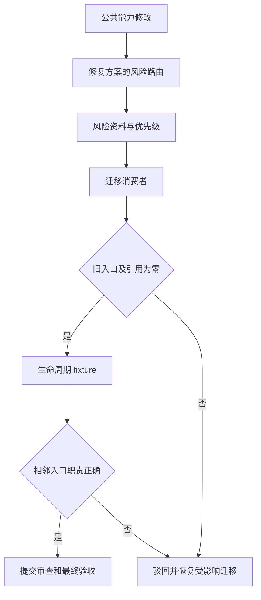

# Bug 域回归风险入口合并验收标准

结论：把重复的回归风险入口收敛到修复方案阶段，并删除旧 Skill 目录。影响：风险分析入口唯一，Bug 生命周期仍保持分工。范围：风险资料、消费者引用、保留入口 YAML 与专项断言。非范围：不合并信息接入、复现、根因和修复后关闭入口。变化：风险资料迁入修复方案入口，旧目录和全部活跃引用移除。完成标准：六项验收场景全部通过，审查与最终验收证据齐全。术语说明：回归风险指修改公共能力后对已有行为造成影响的可能性。验证状态：专项本地验证、文档门禁和最终审查均以实际执行结果为准。

## 文档信息

| 项目 | 内容 |
| --- | --- |
| 来源对象 | `SRC-BUG-STREAMLINE-20260724-001`。 |
| 验收范围 | `REQ-BS-001` 至 `REQ-BS-006` 的入口合并、删除与边界保留。 |
| 验收环境 | local 本地仓库与本地 Python，不连接外部服务。 |
| 通过原则 | 每个场景有实现、真实测试、审查和验收证据。 |

## 验收场景

| 场景 | 验收方法 | 通过标准 | 失败标准 |
| --- | --- | --- | --- |
| `AC-BS-001` | route fixture：公共接口、缓存与兼容性变更。 | 命中 `bug-fix-proposal-rules#regression-risk`，输出风险维度、等级与验证优先级。 | 路由缺失、命中旧入口或风险维度不可定位。 |
| `AC-BS-002` | 迁移 reference 清单与正文断言。 | 三份风险资料均由目标 route 可达，风险资料回写要求保留。 | 资料丢失、断链或落在非目标入口。 |
| `AC-BS-003` | 删除前清单检查。 | source-target、SHA-256、回退说明、消费者归零和 YAML 解析均通过。 | 缺少迁移证据或删除前条件未满足。 |
| `AC-BS-004` | 删除后专项检查。 | 旧目录不存在；非归档消费者、显式选择器和 agent UI 引用均为零。 | 旧目录或活跃消费者残留。 |
| `AC-BS-005` | 生命周期 fixture。 | intake 两条 route、复现、根因、验证和 `test-regression-rules` 正负例均正确。 | 相邻 Skill 抢占或遗漏原有职责。 |
| `AC-BS-006` | 审查与安全扫描。 | local、只读、清理、根因修复和关闭边界仍可定位；Skill YAML 可解析。 | 使用非 local 环境、YAML 失效或安全边界丢失。 |

图形目的：展示从风险变更输入到唯一入口、删除确认和生命周期验收的判定路径。关联 ID：`AC-BS-001`、`AC-BS-004`、`AC-BS-005`。

## 前置条件

| 前置条件 | 验证方式 | 不满足时处理 |
| --- | --- | --- |
| 已完成周期 01 至 04 的最小任务。 | 周期文档与专项验证证据可读取。 | 停止正式验收，回到缺失周期。 |
| 仅使用 local 文件与 local Python。 | 命令和测试不读取 test、staging 或 production 配置。 | 终止该验证，改用 local 输入。 |
| 旧风险资料已存在可比对基线。 | 三个 SHA-256 与迁移目标一一对应。 | 禁止删除旧目录。 |
| 保留 Skill 的 YAML 已可解析。 | Python YAML 解析断言。 | 先修复 YAML，再重新验收。 |

## 输入与预期结果

| 输入 | 预期结果 | 证据 |
| --- | --- | --- |
| 公共方法、共享模块、接口、数据库、缓存、兼容性或异常语义改动。 | 唯一进入 `bug-fix-proposal-rules#regression-risk`。 | `TEST-BS-03-ROUTE`。 |
| 缺失信息、截图或简短 Bug 描述。 | 仍进入 `bug-intake-rules#discovery-and-gap`。 | `TEST-BS-TRIGGER`。 |
| 日志、断点、调用栈或运行时状态。 | 仍进入 `bug-intake-rules#runtime-diagnostics`。 | `TEST-BS-TRIGGER`。 |
| 修复后的关闭判断。 | 仍进入 `bug-validation-rules`，旧能力回归仍归 `test-regression-rules`。 | `TEST-BS-TRIGGER`。 |

## 异常与边界条件

| 情况 | 判定 | 处理 |
| --- | --- | --- |
| 旧目录未删除或仍被活跃文本引用。 | `AC-BS-004` 失败。 | 恢复受影响映射或删除残留后重测。 |
| 风险资料内容与迁移前 SHA-256 不一致。 | `AC-BS-002` 失败。 | 从冻结基线精确修复目标资料。 |
| 某保留入口把风险分析或关闭职责吸收。 | `AC-BS-005` 失败。 | 纠正路由边界，不扩大合并范围。 |
| 验证器或 YAML 解析失败。 | `AC-BS-006` 失败。 | 停止验收，修复最小文件集并同输入复验。 |

## 范围外说明

| 范围外项目 | 原因 | 证据 |
| --- | --- | --- |
| 业务代码和线上服务联调。 | 本次只整理本地 Skill 资产与工程文档。 | 目录改动和专项脚本均为本地资产。 |
| 修改复现、根因、验证与常规回归测试的职责。 | 目标是消除风险入口重复，不是压缩完整生命周期。 | `AC-BS-005` 的正负例。 |
| 图片资产。 | N/A + 原因：验收只使用文本、YAML 与专项 fixture；证据：验收场景和测试资产没有图片输入。 | 无图片清单且门禁的图片决策为 N/A。 |

## 完成条件、停止条件与交付物

| 类型 | 条件或交付物 |
| --- | --- |
| 完成条件 | `AC-BS-001` 至 `AC-BS-006` 全部通过，每个 `TASK-BS-*` 具备实现、真实测试、审查和验收证据。 |
| 停止条件 | 旧入口残留、消费者未归零、风险资料不一致、YAML 失效或生命周期串线。 |
| 交付物 | 保留入口与风险资料、专项验证脚本、实施周期记录、审查记录、最终验收记录。 |
| 回滚边界 | 仅恢复本次迁移、删除或 YAML 修复触及的文件；不修改其余 Bug 生命周期入口。 |

## REQ-AC 追踪矩阵

| 需求 | 验收 | 周期 | 最小任务 | 测试证据 |
| --- | --- | --- | --- | --- |
| `REQ-BS-001`、`REQ-BS-002` | `AC-BS-001`、`AC-BS-002` | `CYCLE-BS-03` | `TASK-BS-03-01` | `TEST-BS-03-ROUTE`。 |
| `REQ-BS-003`、`REQ-BS-004` | `AC-BS-003`、`AC-BS-004` | `CYCLE-BS-01`、`CYCLE-BS-03` | `TASK-BS-01-01`、`TASK-BS-03-02` | `TEST-BS-PRE`、`TEST-BS-POST`。 |
| `REQ-BS-005`、`REQ-BS-006` | `AC-BS-005`、`AC-BS-006` | `CYCLE-BS-02`、`CYCLE-BS-04` | `TASK-BS-02-01`、`TASK-BS-04-01` | `TEST-BS-TRIGGER`。 |
| `RULE-BS-001`、`RULE-BS-002` | `AC-BS-006` | `CYCLE-BS-04` | `TASK-BS-04-02` | 审查与最终验收证据。 |

图片资产决策：N/A + 原因：验收仅使用文本、YAML 和本地 fixture；证据：所有验收输入与专项验证器均未声明图片资产。
