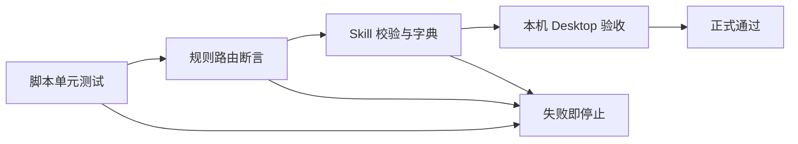

# Goal 模式任务悬浮窗进度可视化验收标准

结论：验证目标进度展示是否可靠；影响：失败时不得交付；范围：本地规则、脚本和桌面核验；非范围：产品界面；变化：增加默认列表、恢复与终态检查；完成标准：自动与人工断言通过；术语说明：无。验证状态：待实施后执行。

## 验收场景

| 验收 ID | 场景 | 前置与样本 | 通过标准 | 失败标准 |
|---|---|---|---|---|
| `AC-GTP-001` | 新建 Goal | 无正式计划的活动 Goal | 生成固定三步，首步进行中，先写入后 `update_plan` | 缺步、乱序、先调 UI 或保存原文 |
| `AC-GTP-002` | 正式计划替换 | 已有 1–20 个合法最小任务 | 默认三步被真实任务替换，状态迁移顺序不变 | 默认任务残留或覆盖非 Goal 正式计划 |
| `AC-GTP-003` | 重开恢复 | 现有合法 Goal 投影与活动 Goal | 默认执行回合重建相同 payload；Plan Mode 不调用 UI | 无活动状态仍恢复、Plan Mode 刷 UI |
| `AC-GTP-004` | 终态 | `complete` 与 `blocked` 两条路径 | 完成后失活；阻断后无进行中步骤且不自动继续 | 完成后复活、阻断后重放 |
| `AC-GTP-005` | 兼容和隐私 | v2 persisted/synthesized、含目标文本或敏感字段的负样本 | 旧投影可读；非法 Goal 输入拒绝且原文件哈希不变 | 旧投影损坏或写入原始目标 |

## 验收流程与追踪

图形目的：说明放行顺序；关联 ID：`AC-GTP-001` 至 `AC-GTP-005`。

| 需求 | 验收 | 测试与证据 |
|---|---|---|
| `REQ-GTP-001/002` | `AC-GTP-001` | `TEST-GTP-001/002`、payload 输出 |
| `REQ-GTP-003` | `AC-GTP-002` | `TEST-GTP-003`、状态迁移断言 |
| `REQ-GTP-004` | `AC-GTP-003` | `TEST-GTP-004`、规则契约断言、Desktop 截图 |
| `REQ-GTP-005` | `AC-GTP-004/005` | `TEST-GTP-005/006`、原文件哈希和 v2 兼容断言 |

- local 命令：`python -B task-plan-rehydration-rules/tests/test_task_plan_projection.py`，样本只写临时目录；通过标准为全部测试成功、无网络访问。
- Desktop 人工步骤：创建一个无正式计划 Goal，确认三步悬浮窗；关闭并重开 Desktop，在默认执行回合确认重建；分别完成和阻断 Goal，确认终态；清理由测试产生的活动 Goal。
- 停止标准：工具不可用、活动 Goal 无法核验、或 UI 与 payload 不一致时，仅记录受限结论。

## 文档信息

| 项目 | 内容 |
|---|---|
| 来源 | `REQDOC-GTP-001` |
| 执行环境 | local 工作区与本机 Codex Desktop |
| 图片资产决策 | N/A。原因：只验证已有 UI 的状态；证据：payload 与人工核验。 |

## 场景与前置条件

| 场景 | 前置条件 | 样本 |
|---|---|---|
| 默认列表 | Goal 创建成功、无正式任务 | 无目标原文的活动状态 |
| 正式替换 | 有合法最小任务 | 1–20 个任务 fixture |
| 恢复 | 重开后的默认执行回合 | 合法 Goal 投影 |
| 终态 | Goal complete 或 blocked 成功 | 三态 fixture |

## 输入与预期结果

- `goal` CLI 的安全输入只生成固定三步和 payload；含目标原文或敏感字段时非零退出且原文件不变。
- 活动 Goal 的恢复输入生成与落盘一致的 payload；Plan Mode 输入不生成 UI 调用。

## 异常与边界条件

- 无活动 Goal、投影损坏、来源不一致、`update_plan` 不可用和 Goal 工具失败均不允许报告悬浮窗成功。
- 终态阻断只展示无进行中状态，不授予自动继续权限。

## 范围外说明

- 范围外：产品 UI 和多个并行 Goal；依据：`BOUND-GTP-005/007`。
- 范围外：无用户执行回合时的启动自动刷新；依据：Skills 无 Desktop 启动钩子。

结论：验证 Goal 进度展示是否可靠；影响：失败时不得交付；范围：本地规则、脚本和 Desktop 核验；非范围：产品 UI；变化：增加默认列表、恢复与终态检查；完成标准：自动与人工断言通过；术语说明：验收以可见步骤和状态为准；验证状态：待实施后执行。

- 完成条件：`AC-GTP-001` 至 `AC-GTP-005` 自动断言通过，且本机 Desktop 验收成功。
- 停止条件：活动 Goal 无法验证、原文可进入投影、或 UI 与 payload 不一致。
- 交付物：v3 契约、脚本、规则、回归、字典、四件套、测试与审查记录。

## 文档信息
| 项目 | 内容 |
|---|---|
| 来源 | `REQDOC-GTP-001` |
| 执行环境 | local 工作区与本机 Codex Desktop |
| 图片资产决策 | N/A。原因：验收既有 UI；证据：payload 和人工核验。 |

## 验收场景
验收场景以创建、替换、恢复、终态和隐私五项表格为准。

## 场景与前置条件
| 场景 | 前置条件 | 样本 |
|---|---|---|
| 默认列表 | Goal 创建成功 | 无正式任务 |
| 正式替换 | 已有最小任务 | 1–20 个任务 fixture |
| 恢复 | 执行回合 | 合法 Goal 投影 |
| 终态 | Goal 终态成功 | 三态 fixture |

## 输入与预期结果
安全输入生成固定三步；含原文或敏感字段时失败且原文件不变。

## 异常与边界条件
无活动 Goal、损坏投影、来源不一致、UI 工具失败均不得报告成功。

## 范围外说明
范围外：产品 UI 和多个并行 Goal；依据：`BOUND-GTP-005/007`。

## REQ-AC 追踪矩阵
| 需求 | 验收 |
|---|---|
| `REQ-GTP-001/002` | `AC-GTP-001` |
| `REQ-GTP-003` | `AC-GTP-002` |
| `REQ-GTP-004` | `AC-GTP-003` |
| `REQ-GTP-005` | `AC-GTP-004/005` |

## 完成条件、停止条件与交付物
- 完成条件：自动断言和本机 Desktop 验收均通过。
- 停止条件：活动 Goal 不可验证、原文进入投影或 UI 不一致。
- 交付物：契约、脚本、规则、测试和证据。

图片资产决策：N/A。原因：不新增图片；证据：仅核验已有悬浮窗。
