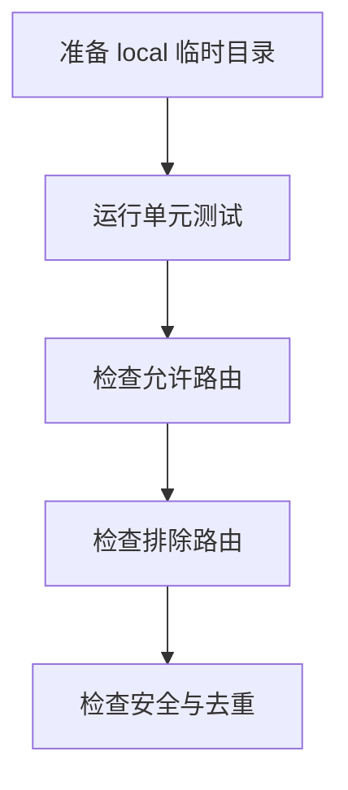

# 持续代码质量监督 Skill 验收标准

结论：以自动化契约测试验收监督 Skill 的触发、Owner 路由、排除边界、状态安全和 finding 去重；影响：可确认它能作为 Goal 会话中的静态质量观察器；范围：本 Skill 资产和脚本；非范围：真实 Desktop UI 和生产代码；变化：把人工引用矩阵变成可测试的路由和状态契约；完成标准：所有 P0 场景通过；术语说明：Owner 是实际规则 Skill，finding 是去重后的质量记录；验证状态：待执行自动验收。

## 文档信息

| 项目 | 内容 |
|---|---|
| 验收对象 | `continuous-code-quality-supervisor-rules` |
| 真实环境 | local Python 临时目录，无网络、无外部服务 |
| 不适用项 | Desktop 人工 UI 验收：本轮只新增 Skill 仓库资产，不能伪造宿主 UI 证据；结论为 N/A + 原因 + 证据。 |

图片资产决策：N/A。原因：不新增图片或 UI；证据：验收表和流程图覆盖行为边界。

## 场景与前置条件

- local Python 可执行，仓库规则 Skill 文件存在或可被测试构造为缺失。
- 测试使用临时 checkout 和状态目录，不连接网络、不运行业务服务。

## 验收场景

| 场景 | 前置条件 | 输入 | 预期 |
|---|---|---|---|
| `AC-CCQS-001` 双条件触发 | Goal active 已确认 | 消息含/不含“监控代码” | 仅双条件同时满足时 active |
| `AC-CCQS-002` 基础代码 | 有 `.py` 或通用代码 diff | 基础改动 | 命中风格、最小改动、可读性、命名和注释 Owner |
| `AC-CCQS-003` API 路由 | 有 endpoint/request/response/swagger 信号 | API 改动和非 API 改动 | API 四 Owner 同时且条件准确命中 |
| `AC-CCQS-004` 条件域 | 有 Schema、Query、日志、时间、Go/Vue/React/测试信号 | 多类型改动 | 按优先级和条件路由，不执行测试 |
| `AC-CCQS-005` 缺失 Owner | 注册 Owner 名称不存在 | 扫描请求 | 只生成 `unclassified/limited` |
| `AC-CCQS-006` 排除边界 | 普通代码或测试改动 | 监督扫描 | 不命中审查、测试执行、Git、验收和元流程 Owner |

## 输入与预期结果

```text
start --goal-active --intent 监控代码 --checkout <repo>
record-scan --diff-id <id> --changed-file src/api/user.py
```

通过标准：命令只写 `$CODEX_HOME/state/continuous-code-quality-supervisor/<checkout-sha256>.json`，状态 JSON 不含代码正文、Goal 原文、提示词、响应或凭据。

失败标准：双条件不满足仍 active、排除 Skill 被路由、缺失 Owner 被猜测、重复 finding 未去重或状态写入敏感字段。

## 异常与边界条件

- Owner 文件不可读：`limited`，记录缺失 Owner 和恢复所需路径，不生成规则结论。
- 状态文件损坏：命令失败并保持原文件，不静默覆盖。
- 相同 fingerprint 重复扫描：只更新最后观察时间，不新增重复 finding。
- Goal inactive 或 Plan Mode：不激活、不调用 `update_plan`、不发送完成通知。

## 范围外说明

真实 Desktop 悬浮窗、真实 Goal 会话间隔和实施会话消息通道属于宿主能力，不在本轮 Skill 仓库自动化验收内，使用脚本状态和路由契约作为替代证据；这不是功能通过结论。

## 验收流程

图形目的：表示验收从输入准备到负向边界的闭环；关联 ID：`AC-CCQS-001` 至 `AC-CCQS-006`。



## 验收对象与通过门槛

| 验收对象 | 通过标准 | 失败标准 |
|---|---|---|
| 触发 | `AC-CCQS-001` 断言通过 | 仅单条件即可启动 |
| 路由 | `AC-CCQS-002` 至 `AC-CCQS-004` 断言通过 | 未改动域误触发或应命中域遗漏 |
| 排除 | `AC-CCQS-006` 断言通过 | 调用阶段审查、测试执行或 Git |
| 安全 | 无敏感字段、无原文和无自动改码 | 状态泄漏或写入业务正文 |

## 追踪矩阵

| 需求 | 验收 | 测试入口 | 证据 |
|---|---|---|---|
| `REQ-CCQS-001` | `AC-CCQS-001` | `python -B continuous-code-quality-supervisor-rules/tests/test_supervisor_state.py` | `EVD-CCQS-AC-001` |
| `REQ-CCQS-002/003` | `AC-CCQS-002/003` | 同上 | `EVD-CCQS-AC-002` |
| `REQ-CCQS-004` | `AC-CCQS-004/006` | 同上 | `EVD-CCQS-AC-003` |
| `REQ-CCQS-005` | `AC-CCQS-005` | 同上 | `EVD-CCQS-AC-004` |

## 完成条件、停止条件与交付物

- 完成条件：测试全通过、quick validate 通过、字典刷新成功、文档 profile 通过、代码审查和 Skill 合规结论为 PASS。
- 停止条件：出现敏感字段、排除项误触发、状态损坏被覆盖、测试失败或 Owner 读取结果不可信。
- 交付物：Skill 主文件、OpenAI 入口、三份 references、状态脚本、测试文件及字典刷新结果。
- 范围外：真实 Desktop 任务悬浮窗人工验收为 N/A，原因是本轮不修改宿主产品；替代证据是状态脚本和路由契约测试。
