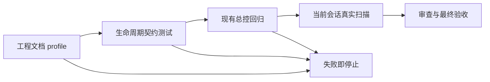

# 子 Agent 遗留实例终局清理验收标准

结论：验收以真实扫描、真实关闭结果和关闭后复查为准；影响：停止、完成通知或口头说明不能替代关闭证据；范围：进入前预检、批次回收、终局扫描、数量对账和无关闭能力告警；非范围：其他会话、根 Agent 和 Desktop 产品内部实现；变化：增加六组可检查场景；完成标准：契约测试、现有总控回归和当前会话真实扫描均符合冻结口径；术语说明：复查是关闭动作后再次枚举 Agent；验证状态：验收标准已冻结，待实施后执行。

## 文档信息

| 项目 | 内容 |
| --- | --- |
| 需求文档 | [子 Agent 遗留实例终局清理需求](../2-需求/2026-07-25_142508_子Agent遗留实例终局清理.md) |
| 实施总览 | [子 Agent 遗留实例终局清理实施总览](../3-实施/2026-07-25_142508_子Agent遗留实例终局清理_实施总览.md) |
| 执行环境 | local 工作区与当前 Codex 会话 |
| 图片资产决策 | N/A。原因：验收对象为状态和工具结果；证据：表格、日志和 Mermaid 足以复核。 |

## 验收场景

| 验收 ID | 场景 | 前置与样本 | 通过标准 | 失败标准 |
| --- | --- | --- | --- | --- |
| AC-SAC-001 | 进入前预检与保留 | 根 Agent、仍需和不再需要的 Agent | 只处理当前会话非根 Agent，仍需实例被保留 | 关闭根 Agent、其他会话或仍需实例 |
| AC-SAC-002 | 运行与终态回收 | running、completed、failed、canceled、interrupted | 运行实例先停止再关闭，终态实例直接关闭 | 跳过停止或遗漏终态实例 |
| AC-SAC-003 | 真实关闭判定 | 关闭成功/失败、复查活跃/不活跃 | 仅工具成功且复查不活跃计入关闭数 | 中断、完成通知或关闭失败被计入 |
| AC-SAC-004 | 数量对账 | 成功、失败、取消、中断和无关闭工具混合样本 | 所有新增与保留数量可从实例台账重算 | 数量不恒等或重复扫描重复计数 |
| AC-SAC-005 | 批次与最终门禁 | 上一批含未关闭实例 | 下一批被禁止；最终回复可带准确告警收口 | 未释放仍启动下一批或伪报全部关闭 |
| AC-SAC-006 | 幂等与无关闭能力 | 重复扫描，平台仅有中断工具 | 关闭数为 0、未关闭数非零、告警具体且不重复计数 | 把中断冒充关闭或告警缺实例信息 |

## 验收流程

图形目的：说明文档、契约、回归、真实扫描和收口的放行顺序；关联 ID：AC-SAC-001..006。

## 场景与前置条件

| 场景 | 前置条件 | 样本来源 |
| --- | --- | --- |
| 保留仍需实例 | 实例属于当前任务且尚未取回结果 | 标准库 unittest fixture |
| 关闭已终态实例 | 平台提供真实关闭能力 | 闭包模拟平台工具结果 |
| 无关闭能力 | 当前平台仅可枚举和中断 | 当前会话真实 Agent 列表 |

## 输入与预期结果

- 输入为当前会话 Agent 列表、当前任务需要集合与平台能力集合。
- 预期输出为实例级台账、可重算数量、下一批判定和最终告警。

## 异常与边界条件

- 列表工具失败、结果不能限定当前会话、关闭工具失败或复查仍活跃时，必须保留未关闭记录。
- 重复扫描不得重复增加终态数、关闭数或告警实例数。

## 范围外说明

- 范围外：其他会话和根 Agent；依据：BOUND-SAC-005。
- 范围外：Desktop 产品代码新增关闭 API；依据：BOUND-SAC-004。

## REQ-AC 追踪矩阵

| 需求/规则 | 验收 | 测试 | 证据 |
| --- | --- | --- | --- |
| REQ-SAC-001/002、RULE-SAC-001/005 | AC-SAC-001/002 | TEST-SAC-001/002 | EVD-SAC-001 |
| REQ-SAC-003/004、RULE-SAC-002/003 | AC-SAC-003/004 | TEST-SAC-003/004 | EVD-SAC-002 |
| REQ-SAC-005/006/007、RULE-SAC-004 | AC-SAC-005/006 | TEST-SAC-005..008 | EVD-SAC-003 |

## 完成条件、停止条件与交付物

- 完成条件：AC-SAC-001..006 全部通过；契约测试、总控回归、文档校验、字典刷新和真实扫描都有证据。
- 停止条件：必须修改 Desktop 产品代码、工具无法限定当前会话、目标文件冲突无法安全合并，或任一必需测试失败。
- 交付物：需求、验收、实施文档、生命周期规则、提示词、契约测试、测试证据、审查、最终验收、字典和长期记忆。

图片资产决策：N/A。原因：不新增图片；证据：契约状态可用文本和 Mermaid 完整表达。
