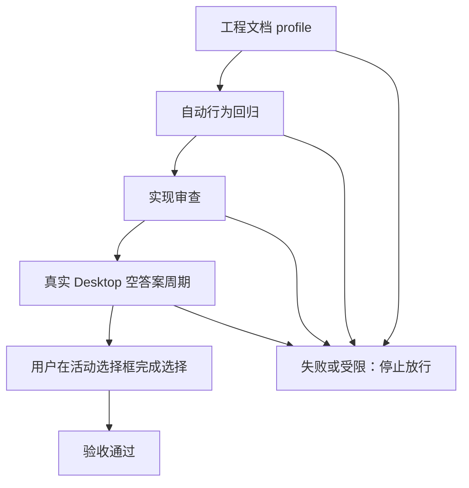

# Plan Mode 选择框永久等待验收标准

结论：验收只认可用户真正完成选择、明确授权代选或明确停止之后的合法状态迁移；影响：离开会话的用户不会因选择框被宿主关闭而丢失决策入口；范围：覆盖调用参数、空答案、部分答案、长时间等待、总结闸门、授权/停止和宿主故障七类场景；非范围：Codex Desktop 产品源码、其它交互工具、Goal、任务投影和 Browser Use；变化：未决状态会持续等待或重发同一选择框，计划不会提前收敛；完成标准：全部冻结验收场景和对应自动回归通过，并完成真实 Desktop 可见链路；术语说明：验收场景是可重复观察的用户动作与结果组合，空答案不代表取消；验证状态：标准已冻结，修复实现与真实宿主验证待执行。

## 文档信息

| 项目 | 内容 |
| --- | --- |
| 来源 Bug | [BUG-PLAN-WAIT-20260726-001](../4-bugs/2026-07-26_040639_PlanMode选择框永久等待/README.md) |
| 实施总览 | [Plan Mode 永久等待实施总览](../3-实施/2026-07-26_040639_BUG-PLAN-WAIT-20260726-001_实施总览.md) |
| 实施周期 | [CYCLE-PMW-01 周期文档](../3-实施/2026-07-26_040639_BUG-PLAN-WAIT-20260726-001_实施周期01_永久等待与总结闸门.md) |
| 标准版本 | v1.0；未发生需求变更 |
| 图片资产决策 | `N/A`。原因：验收对象是状态迁移、调用参数和文本输出；证据：场景表、断言和 Mermaid 足以复核。 |

## 验收目标与判定原则

- 所有未决输入必须停留在 `WAITING_DECISION`，不允许使用推荐项替代用户选择。
- `request_user_input` 决策调用必须省略 `autoResolutionMs`；`null`、`0`、`60000` 等值均判失败。
- 空答案、缺少预期问题 ID 和宿主隐式超时都按未决处理，下一动作只能是重发。
- 重发次数没有上限；测试用例使用 2、10、100 次作为代表性样本，不能把样本数当作实现上限。
- 真实 Desktop 验收是必要的用户可见证据；自动回归通过但缺真实宿主证据，只能记为受限，不能宣布正式通过。

## 验收场景

| 验收 ID | 场景 | 前置与样本 | 通过标准 | 失败标准 |
| --- | --- | --- | --- | --- |
| `AC-PMW-001` | 决策调用参数 | 一个包含两个问题的 Plan Mode 决策点；分别检查初次调用与重发调用 | 每次调用都没有 `autoResolutionMs` 字段，问题 ID、选项、推荐标记和文案一致 | 出现 `autoResolutionMs`、改写问题身份或用文本替代选择框 |
| `AC-PMW-002` | 第一次空答案重发 | 宿主返回 `{"answers":{}}` | Agent 保持 `WAITING_DECISION`，下一动作立即再次调用相同选择框 | 进入总结、`final_answer`、`task_complete`、默认选择或发送其它 commentary |
| `AC-PMW-003` | 连续空答案无限等待 | 连续注入 2、10、100 次空答案 | 每轮均只有一个活动选择框，状态不离开 `WAITING_DECISION`，无次数和时间上限 | 任意轮次结束任务、降低为文本通知、出现多个并存选择框或停止重发 |
| `AC-PMW-004` | 部分答案保留 | 两个问题先回答一个，再让宿主关闭选择框 | 已答项保留，重发只包含剩余问题；未决期间总结闸门拒绝最终输出 | 丢失已答项、重复询问已答项、输出总结或采用推荐项 |
| `AC-PMW-005` | 延迟完成选择 | 先跨越两个以上空答案周期，再在当前活动选择框提交全部答案 | 用户最终选择被读取并进入 `DECISION_RESOLVED`，计划从原决策点继续 | 需要额外文本唤醒、读取旧答案、跳过选择或提前总结 |
| `AC-PMW-006` | 明确授权与停止 | 分别输入“你来定/按推荐”和“停止任务” | 只有明确授权才进入 `USER_DELEGATED`；明确停止后进入 `STOPPED` 且不再重发 | 将普通沉默或空答案当授权/停止，或停止后仍继续调用 |
| `AC-PMW-007` | 工具不可恢复故障与历史失败轨迹 | 模拟再次调用明确不可用；回放“空答案 → 结果与结论”负例 | 工具故障保持未决并报告阻断；历史负例被判失败；任何未决状态拒绝总结和任务完成 | 吞掉工具故障、输出方案总结、默认采用推荐项或把负例判为通过 |

## 验收流程

图形目的：说明验收必须先通过文档和自动行为门禁，再完成真实宿主选择，任一失败立即停止放行；关联 ID：`AC-PMW-001..007`、`TEST-PMW-001..010`。

## 前置条件

| 条件 | 证据入口 | 通过要求 |
| --- | --- | --- |
| 来源 Bug 与规则冻结 | `BUG-PLAN-WAIT-20260726-001`、`RULE-PMW-001` | 规则、问题身份和文案已冻结，`unresolved_decisions` 为零 |
| 自动测试环境 | 本地 Python 3、临时 fixture、无外部服务 | 测试只读/临时写入，结束后自动清理 |
| 真实 Desktop 环境 | 更新后的 Plan Mode 宿主 | 可显示选择框并把空答案回传给 Agent |
| 安全边界 | 当前 local 工作区 | 不连接 test/prod 数据库、缓存、消息队列或 HTTP/RPC 上游 |

## 异常分支场景

- 宿主返回缺少预期问题 ID 的结果：视为未决，只保留可识别的已答项并重发剩余问题。
- 宿主返回 `null` 或隐式超时：视为未决，下一动作仍是同一选择框重发。
- `request_user_input` 明确不可再次调用：进入 `HOST_BLOCKED`，记录阻断并停止，不输出方案总结。
- 重发尚未返回时：不创建第二个活动选择框，不发送 commentary 或总结。
- 用户明确停止：不执行下一轮重发；该分支不代表修复失败。

## 范围外场景

- 范围外：普通执行模式的用户输入超时策略；依据：本 Bug 只覆盖 Plan Mode 决策选择框。
- 范围外：Goal、任务投影、Browser Use 和后台定时器；依据：用户冻结计划明确排除这些能力。
- 范围外：修改 Codex Desktop 产品源码；依据：当前规则只收紧 Skill 调用与输出解释，平台故障按 `HOST_BLOCKED` 记录。

## REQ-AC 追踪矩阵

| 需求/规则 | 验收 | 测试 | 证据 |
| --- | --- | --- | --- |
| `RULE-PMW-001`、`REQ-PMW-001` | `AC-PMW-001` | `TEST-PMW-001` | `EVIDENCE-PMW-001` |
| `REQ-PMW-002` | `AC-PMW-002` | `TEST-PMW-002` | `EVIDENCE-PMW-002` |
| `REQ-PMW-002`、`REQ-PMW-003` | `AC-PMW-003`、`AC-PMW-004` | `TEST-PMW-003`、`TEST-PMW-004` | `EVIDENCE-PMW-003`、`EVIDENCE-PMW-004` |
| `REQ-PMW-005` | `AC-PMW-005`、`AC-PMW-006` | `TEST-PMW-005`、`TEST-PMW-006` | `EVIDENCE-PMW-005`、`EVIDENCE-PMW-006` |
| `REQ-PMW-004`、`REQ-PMW-006`、`REQ-PMW-007` | `AC-PMW-007` | `TEST-PMW-007..010` | `EVIDENCE-PMW-007..010` |

反向追踪：每个 `AC-PMW-*` 都回指至少一个 `REQ-PMW-*` 或 `RULE-PMW-001`；每个 `TEST-PMW-*` 都回指验收场景和实施任务；`EVIDENCE-PMW-*` 由测试 README、审查记录或真实 Desktop 记录承接。没有数据库 schema、HTTP API、迁移或公开接口；原因：本次只改变 Plan Mode 的规则解释和输出闸门，证据：范围与文件操作契约。

## 完成条件、停止条件与交付物

- 完成条件：`AC-PMW-001..007` 全部满足；自动回归覆盖 2、10、100 次空答案、部分答案、授权、停止、故障、参数负例和空答案后总结负例；实现审查无 P0/P1；真实 Desktop 观察到每次空答案立即重发，用户最终选择后才继续。
- 失败标准：任何一次空答案后输出总结/最终回复/任务完成、默认采用推荐项、问题身份漂移、部分答案丢失、并存选择框、重发有上限，或真实宿主选择前计划继续。
- 受限标准：自动回归全部通过但真实 Desktop 不可用，只能标记 `LIMITED` 并保留人工重验入口；不能写成正式通过。
- 停止条件：工具明确不可恢复、必须修改 Desktop 产品源码、出现数据/权限安全风险、文档 profile 或 Mermaid 校验失败，或用户明确停止任务。
- 交付物：四份工程文档、规则 Owner 改动、总结 Owner 改动、专项行为回归、实现审查、真实 Desktop 证据和最终验收记录。

## 执行附录

### 测试与清理契约

- 自动行为测试使用本地 Python 3 和 `TemporaryDirectory` fixture；每个用例结束后删除临时文件，不访问非 local 服务。
- 断言同时检查返回值、调用次数、问题身份、状态机状态和输出事件；静态阅读、`build`、`lint` 不作为真实行为证据。
- 负例必须包括 `autoResolutionMs: 60000`、`null`、`0`，并验证它们被规则检查拒绝。
- 真实 Desktop 测试需记录每个宿主空答案周期的时间、调用参数和可见选择框数量；用户最后选择后记录计划恢复点。

### 回滚与重验

- 规则回滚：撤销本来源对象新增的空答案重发和总结闸门条款，保留其他规则文件的既有内容；回滚后不得宣称 Bug 已修复。
- 测试回滚：只删除本轮临时 fixture 和专项测试资产，不删除共享测试基础设施。
- 重验入口：回到 `CYCLE-PMW-01` 中未通过的 `TASK-PMW-*`，使用同一输入、同一断言和同一失败预期复验。

## 追踪附录

| 追踪层 | 稳定 ID | 下游承接 | 当前状态 |
| --- | --- | --- | --- |
| 来源 | `BUG-PLAN-WAIT-20260726-001`、`SRC-PMW-001/002` | `DEC-PMW-001..004` | 已确认 |
| 规则 | `RULE-PMW-001`、`REQ-PMW-001..007` | `AC-PMW-001..007` | 已冻结 |
| 周期 | `CYCLE-PMW-01` | `TASK-PMW-01..04` | 待实施 |
| 测试 | `TEST-PMW-001..010` | `EVIDENCE-PMW-001..010` | 待执行 |
| 审查/验收 | `REVIEW-PMW-001`、`ACCEPT-PMW-001` | 最终验收文档 | 待执行 |

图片资产决策：`N/A`。原因：没有 UI 原型、视觉对比或截图交付；证据：验收场景和 Mermaid 能表达全部判定关系。
