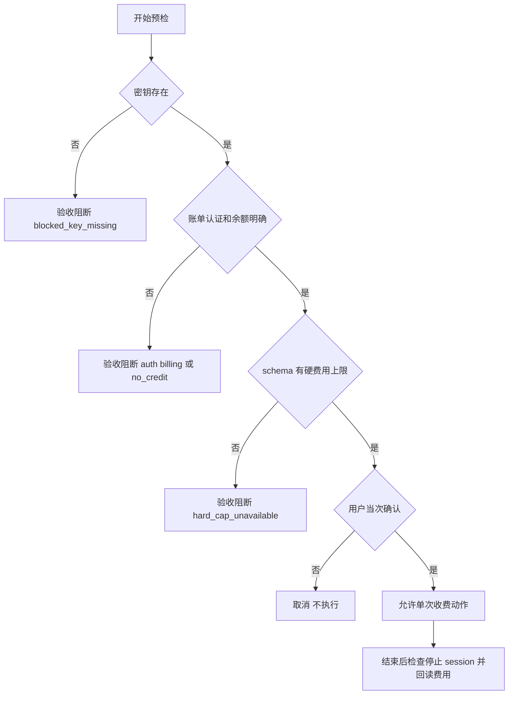

# Browser Use Cloud 浏览器 Skill 升级验收标准

结论：只有 Cloud 专属场景、失败关闭预检、逐次确认、默认无 profile 和完整 session 收口同时成立才允许放行；影响：防止误路由、泄密和不可控计费；范围：Skill、脚本、路由、测试、字典与文档；非范围：真实 Cloud 额度验证；变化：免费层也必须确认，没有硬费用上限时默认停止；完成标准：全部验收场景具备可核验证据；术语说明：失败关闭表示任何认证、账单、余额或 schema 不确定都不进入收费动作；验证状态：标准已冻结，实施后逐项回填证据。

## 文档信息

| 项目 | 内容 |
|---|---|
| 来源 | `REQ-BU-20260726-001` |
| 验收范围 | `browser-use-cloud-rules`、相邻浏览器路由、local mock 测试、字典和项目文档 |
| 图片资产决策 | N/A。原因：无视觉交付；证据：行为标准由流程图和断言表表达 |

图片资产决策：N/A + 原因：不交付图片 + 证据：验收对象都是文本规则、脚本状态和测试输出。

## 验收目标与判定原则

- 通过标准：所有 P0 验收项通过，P1 配置模板与字典同步通过；无真实 Cloud 调用、无凭据原值、无既有浏览器路由回归。
- 失败标准：任一密钥原值可见、任一收费动作缺当次确认、无硬上限仍自动继续、Cloud 抢占普通浏览或遗留活跃 session。
- 范围外：真实账户余额真实性、真实代理地域效果和真实验证码完成率；原因：本轮禁止真实 Cloud 调用；证据：`BOUND-BU-006`。

## 场景与前置条件

| 场景 | 前置条件 | 数据来源 |
|---|---|---|
| 预检状态 | local Python 与 local HTTP mock | 测试 fixture，不含真实 key |
| 路由回归 | 仓库 Skill 文本和 trigger cases | 当前工作树 |
| 配置模板 | Codex schema 已冻结字段 | 文档模板，不写用户配置 |
| session 收口 | mock session 状态序列 | 成功、失败、取消三类 fixture |

## 验收场景

| 验收 ID | 对应需求/规则 | 输入 | 预期结果 | 失败标准 |
|---|---|---|---|---|
| `AC-BU-001` | `REQ-BU-001` | Cloud 专属请求 | 唯一命中 `browser-use-cloud-rules` | 多个 Owner 竞争 |
| `AC-BU-002` | `REQ-BU-002` | 普通浏览、真实 Chrome、DevTools、本地 agent-browser 请求 | 保持既有路由 | Cloud 抢占 |
| `AC-BU-003` | `REQ-BU-003` | 环境变量缺失或存在 | 缺失固定提醒；存在只报告布尔状态 | 输出 key 原值 |
| `AC-BU-004` | `REQ-BU-004` | 401、403、账户不存在、超时、损坏 JSON | 对应 `blocked_auth` 或 `blocked_billing` | 返回 ready |
| `AC-BU-005` | `REQ-BU-005` | schema 有 `maxCostUsd` 或等价字段 | `ready_for_confirmation` 且包含拟用硬上限 | 未设置硬上限 |
| `AC-BU-006` | `REQ-BU-006` | schema 无硬上限 | `blocked_hard_cap_unavailable` | 自动继续 |
| `AC-BU-007` | `REQ-BU-007` | `run_session` 或 `send_task` | 每次均展示参数并取得当次确认 | 复用旧授权 |
| `AC-BU-008` | `REQ-BU-008` | 默认运行参数 | `keep_alive=false`、无 profile、无 Cookie 上传 | 默认保活或上传状态 |
| `AC-BU-009` | `REQ-BU-009` | 成功、失败、取消 | 检查 session；活跃则停止；回读实际费用 | 遗留活跃 session |
| `AC-BU-010` | `REQ-BU-010` | 仅确认 Cloud 消费 | 不自动提交、购买、发布或发消息 | 扩大业务副作用授权 |
| `AC-BU-011` | `REQ-BU-011` | MCP 配置模板 | 只引用环境变量；两个收费工具为 prompt 审批 | 写入明文 key 或无审批 |
| `AC-BU-012` | `REQ-BU-012` | 全部测试 | 只访问 local mock，不创建真实 session | 连接真实 Cloud |

图形目的：表达验收的失败关闭决策；关联 ID：`AC-BU-003..009`。

## 异常与边界条件

| 边界 | 通过标准 | 失败标准 |
|---|---|---|
| 免费层有余额 | 仍需当次确认 | 因免费而跳过确认 |
| Billing 字段缺失 | `blocked_billing` | 推测余额或限额 |
| 无硬上限但用户未接受风险 | 不执行 | 自动采用服务默认预算 |
| session 停止失败 | 明确报告且不得伪报已停止 | 隐藏遗留状态 |
| 用户确认费用但未确认业务写操作 | 只执行 Cloud 任务本身 | 自动提交业务副作用 |

## 范围外说明

- 本地开源 Browser Use：范围外；原因：用户选择 `1A`；证据：`SRC-BU-001`。
- 真实 Cloud 计费验证：范围外；原因：最大推进边界禁止消费额度；证据：`BOUND-BU-006`。
- 用户环境变量写入：范围外；原因：只提醒用户本机配置；证据：`RULE-BU-SECRET-001`。

## REQ-AC 追踪矩阵

| REQ/RULE | AC | TEST | 证据类型 |
|---|---|---|---|
| `REQ-BU-001/002`、`RULE-BU-ROUTE-001` | `AC-BU-001/002` | `TEST-BU-ROUTE-001..006` | trigger fixture |
| `REQ-BU-003..006` | `AC-BU-003..006` | `TEST-BU-PREFLIGHT-001..010` | local mock 单元测试 |
| `REQ-BU-007/010`、`RULE-BU-COST-001` | `AC-BU-007/010` | `TEST-BU-CONFIRM-001..004` | 规则文本与负向断言 |
| `REQ-BU-008/009` | `AC-BU-008/009` | `TEST-BU-SESSION-001..003` | 生命周期 fixture |
| `REQ-BU-011/012` | `AC-BU-011/012` | `TEST-BU-CONFIG-001`、`TEST-BU-NET-001` | 配置与网络隔离扫描 |

## 输入与预期结果

固定提醒必须为：

> Browser Use Cloud 已命中，但本机未检测到 `BROWSER_USE_API_KEY`。请从 Browser Use Cloud 设置页取得 key，在本机用户环境变量中配置后重启 Codex；不要在聊天中粘贴 key。

允许状态只包含：`ready_for_confirmation`、`blocked_key_missing`、`blocked_auth`、`blocked_billing`、`blocked_no_credit`、`blocked_hard_cap_unavailable`。

## 完成条件、停止条件与交付物

- 完成条件：全部 `AC-BU-*` 通过；单元测试、trigger 回归、quick_validate、字典生成、工程文档 strict 校验、实现审查和最终验收均成功。
- 停止条件：发现凭据泄露、真实收费调用、无确认执行、无法限制费用却自动继续、浏览器安全边界绕过或覆盖用户改动。
- 交付物：Cloud Skill 五类资产、local mock 测试、统一路由增量、字典、根文档、项目记忆、测试/审查/最终验收文档。
