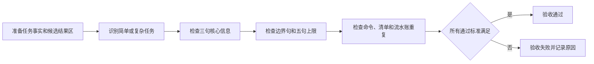

# reasoning-summary-structure-rules「结果与结论」适中详细度验收标准

结论：验收目标是确认“结果与结论”既不退化为单句确认，也不膨胀为执行流水；影响：最终输出在不同复杂度任务中保持可读、可复核和有边界；范围：三句核心信息、4–5 句扩展条件、句数上限、重复内容拦截和既有结构兼容性；非范围：不验收浏览器、接口、数据库、图片或其他 Skill 的行为；变化：把“稍微详细一些”转换成可执行的句数与内容断言；完成标准：所有适用场景按二值标准通过，失败样例被明确拒绝；术语说明：验收场景是给定任务事实和候选结果区文本后，对句数、信息覆盖和重复风险进行的可重复判断；验证状态：专项回归、Skill 校验、目标差异检查和敏感信息扫描已完成，验收标准逐项具备通过证据。

## 文档信息

| 项目 | 内容 |
|---|---|
| 来源需求 | [REQDOC-SUMMARY-DETAIL-001](../2-需求/2026-07-26_073000_reasoning-summary-structure-rules_结果与结论详细度调整.md) |
| 验收对象 | `reasoning-summary-structure-rules` 的结果区规则、模板、示例和专项回归 |
| 当前切片 | `SLICE-SUMMARY-DETAIL-001` |
| 验收环境 | Windows local 工作区与本地 Python 单元测试；不连接外部服务。 |
| 图片资产决策 | N/A + 原因：验收输入是文本样例和规则输出，不需要 UI 或截图；证据：场景表和本地测试矩阵。 |

图片资产决策：N/A + 原因：本验收不产生视觉产物，Mermaid 只表达判定流程；证据：正文没有图片引用。

## 验收场景

| 验收 ID | 场景 | 通过标准 | 失败标准 |
|---|---|---|---|
| `AC-SUMMARY-DETAIL-001` | 简单单点任务 | 结果区恰好 3 句，分别覆盖问题、方法和验证/完成状态。 | 少于 3 句、只写“已完成”或缺少任一核心信息。 |
| `AC-SUMMARY-DETAIL-002` | 普通多步骤任务 | 结果区使用 3–4 句，说明解决事项、主要落点、验证结论和必要影响。 | 句数超过 5，或用执行流水替代结论。 |
| `AC-SUMMARY-DETAIL-003` | 复杂、受限或存在边界 | 结果区使用 4–5 句，并明确限制、残留风险或确认范围。 | 无边界事实却凑满 5 句，或遗漏关键限制。 |
| `AC-SUMMARY-DETAIL-004` | 过短候选 | “已完成”“请查看文件”等无对象短句被拒绝。 | 过短候选被误判为通过。 |
| `AC-SUMMARY-DETAIL-005` | 冗长/重复候选 | 复制命令、测试清单、逐文件改动或流水账的候选被拒绝。 | 重复精确证据仍被判定为适中。 |
| `AC-SUMMARY-DETAIL-006` | 条件行和阻断边界 | Obsidian 沉淀句计入 5 句上限，阻断恢复计划只留在阻断收口。 | 条件行未计数，或结果区重复恢复计划。 |
| `AC-SUMMARY-DETAIL-007` | 既有结构兼容 | 标题、引用块、执行证据、验证、改动点和阻断 Owner 保持原顺序与职责。 | 为实现详细度而删除、重排或替换既有结构。 |

## 前置条件

| 前置条件 | 要求 | 证据 |
|---|---|---|
| 需求冻结 | `REQ-SUMMARY-DETAIL-001..007` 与 `RULE-SUMMARY-DETAIL-001..006` 已写入需求文档。 | 需求追踪附录。 |
| 样例准备 | 至少准备简单、复杂、过短、超长和重复五类文本样例。 | `TEST-SUMMARY-DETAIL-001..009` 样例表。 |
| 本地环境 | 使用仓库自带 Python 和测试入口，不使用真实密钥、外部服务或生产配置。 | 实施周期验证矩阵。 |

## 验收目标与判定原则

1. 每个场景必须同时记录输入类别、期望句数、核心信息覆盖、重复检查和二值结果。
2. “稍微详细”不能只靠人工感觉；通过标准必须能由测试断言或明确人工核对复现。
3. 结果区只概括验证结论，精确命令、测试列表和逐文件变更继续由原小节承载。
4. 当规则语义与既有保护语义冲突时，保护语义优先，当前场景判定为失败并停止放行。

## 异常分支场景

| 异常 ID | 条件 | 处理 | 通过标准 |
|---|---|---|---|
| `GAP-SUMMARY-DETAIL-001` | 只有静态检查而没有行为验证 | 结果区必须写“仅静态验证”，不得声称功能已验证。 | 候选文本明确证据等级，且句数仍在上限内。 |
| `GAP-SUMMARY-DETAIL-002` | 任务真实阻断 | 结果区概括阻断影响，恢复计划由任务阻断收口提供。 | 不重复阻断契约字段，且用户能看出未完成原因。 |
| `GAP-SUMMARY-DETAIL-003` | Obsidian CLI 未执行或被阻断 | 不输出沉淀成功句，轻量判断不计作沉淀事实。 | 候选文本没有伪造检索/沉淀成果。 |

## 范围外场景

| 范围外对象 | 处理 | 原因与证据 |
|---|---|---|
| Browser Use Cloud、浏览器页面或真实账号 | 不执行、不创建 session、不验收。 | 本需求只调整总结文本规则；证据：`BOUND-SUMMARY-DETAIL-005`。 |
| 数据库、HTTP/RPC 上游或生产配置 | 不连接、不写入、不作为验收证据。 | 本任务没有接口或数据变更；证据：本地测试矩阵。 |
| Skill description、二级标题和字典 | 不修改、不刷新。 | 需求冻结不改变触发输入；证据：`DEC-SUMMARY-DETAIL-004`。 |

## 验收流程

图形目的：展示从样例准备到结果区放行或驳回的判定顺序；关联 ID：`AC-SUMMARY-DETAIL-001` 至 `AC-SUMMARY-DETAIL-007`。

## 输入与预期结果

| 输入类型 | 样例数量 | 预期结果 | 证据 |
|---|---:|---|---|
| 简单任务 | 2 | 3 句且覆盖问题、方法、验证。 | `TEST-SUMMARY-DETAIL-001`、`TEST-SUMMARY-DETAIL-002` |
| 复杂/受限任务 | 2 | 4–5 句且只补关键边界。 | `TEST-SUMMARY-DETAIL-003`、`TEST-SUMMARY-DETAIL-004` |
| 过短/冗长/重复 | 3 | 全部拒绝并返回具体失败原因。 | `TEST-SUMMARY-DETAIL-005` 至 `TEST-SUMMARY-DETAIL-007` |
| 条件行/阻断 | 2 | 条件行计数正确，恢复计划不越界。 | `TEST-SUMMARY-DETAIL-008`、`TEST-SUMMARY-DETAIL-009` |

## 验收对象与通过门槛

| 对象 | 通过门槛 | 失败标准 |
|---|---|---|
| 规则正文 | 明确 3–5 句、核心三句、边界扩展和去重要求。 | 只写“适中”“详细一些”而无数字或内容断言。 |
| 模板和示例 | 正例覆盖简单/复杂，反例覆盖过短/冗长/重复。 | 模板、规则和示例出现不同句数口径。 |
| 自动化测试 | 所有正负样例通过，失败信息指向句数、覆盖或重复原因。 | 只检查文本存在，不检查行为判定。 |
| 兼容性 | 既有章节顺序、阻断和 Obsidian 条件语义无变化。 | 出现结构删除、重排或条件行伪造。 |

## 完成条件、停止条件与交付物

- 通过标准：`AC-SUMMARY-DETAIL-001..007` 全部 PASS；正例和反例断言均有证据；对应 `quick_validate.py` 和目标范围 `git diff --check` 通过。
- 失败标准：任一 P0 场景失败、出现未决 P0/P1、结果区超过 5 句、简单任务低于 3 句、或发现重复精确证据仍被放行。
- 停止条件：测试入口不可用且无法在本地恢复、工作树目标外文件被修改、或实现必须改变触发条件/标题结构。
- 交付物：更新后的规则、模板、条件说明、正反例、专项测试和本验收证据；不包含 Git 提交或外部服务运行。

## 追踪矩阵

| 需求 | 验收 | 周期 | 任务 | 测试 | 证据 |
|---|---|---|---|---|---|
| `REQ-SUMMARY-DETAIL-001`、`REQ-SUMMARY-DETAIL-002` | `AC-SUMMARY-DETAIL-001`、`AC-SUMMARY-DETAIL-002` | `CYCLE-SUMMARY-DETAIL-02` | `TASK-SUMMARY-DETAIL-02` | `TEST-SUMMARY-DETAIL-001..004` | `EVIDENCE-SUMMARY-DETAIL-RULE-001` |
| `REQ-SUMMARY-DETAIL-003`、`REQ-SUMMARY-DETAIL-004` | `AC-SUMMARY-DETAIL-003`、`AC-SUMMARY-DETAIL-006` | `CYCLE-SUMMARY-DETAIL-02` | `TASK-SUMMARY-DETAIL-02` | `TEST-SUMMARY-DETAIL-004`、`TEST-SUMMARY-DETAIL-008`、`TEST-SUMMARY-DETAIL-009` | `EVIDENCE-SUMMARY-DETAIL-BOUNDARY-001` |
| `REQ-SUMMARY-DETAIL-005`、`REQ-SUMMARY-DETAIL-006` | `AC-SUMMARY-DETAIL-004`、`AC-SUMMARY-DETAIL-005` | `CYCLE-SUMMARY-DETAIL-02` | `TASK-SUMMARY-DETAIL-02` | `TEST-SUMMARY-DETAIL-005..007` | `EVIDENCE-SUMMARY-DETAIL-NEGATIVE-001` |
| `REQ-SUMMARY-DETAIL-007` | `AC-SUMMARY-DETAIL-007` | `CYCLE-SUMMARY-DETAIL-03` | `TASK-SUMMARY-DETAIL-03` | `TEST-SUMMARY-DETAIL-009` | `EVIDENCE-SUMMARY-DETAIL-COMPAT-001` |

## 实施回指

- [实施总览](../3-实施/2026-07-26_073000_reasoning-summary-structure-rules_结果与结论详细度_实施总览.md)
- [实施周期 01：需求与验收冻结](../3-实施/2026-07-26_073000_reasoning-summary-structure-rules_结果与结论详细度_实施周期01_需求与验收冻结.md)
- [实施周期 02：规则、模板与回归](../3-实施/2026-07-26_073000_reasoning-summary-structure-rules_结果与结论详细度_实施周期02_规则模板与回归.md)
- [实施周期 03：审查、验收与收口](../3-实施/2026-07-26_073000_reasoning-summary-structure-rules_结果与结论详细度_实施周期03_审查验收与收口.md)

## 执行附录

- 验收命令由实施周期 02 和 03 冻结；当前通过状态仅引用已实际运行的专项回归、Skill 校验和目标差异证据。
- 真实行为测试只使用本地文本样例；没有 API key、Cookie、浏览器 profile、数据库或外部 HTTP 依赖。原因：验收对象是总结规则；证据：范围外场景表。

## 追踪附录

| 追踪层 | 稳定 ID 集合 | 回指 |
|---|---|---|
| 来源到需求 | `SRC-SUMMARY-DETAIL-001` -> `REQ-SUMMARY-DETAIL-001..007` | 需求来源与证据台账 |
| 需求到验收 | `REQ-SUMMARY-DETAIL-001..007` -> `AC-SUMMARY-DETAIL-001..007` | 验收场景与追踪矩阵 |
| 验收到实施 | `AC-SUMMARY-DETAIL-001..007` -> `CYCLE-SUMMARY-DETAIL-01..03` | 实施总览与周期文档 |
| 任务到证据 | `TASK-SUMMARY-DETAIL-01..03` -> `TEST-SUMMARY-DETAIL-001..009` -> `EVIDENCE-SUMMARY-DETAIL-*` | 周期验证矩阵 |
