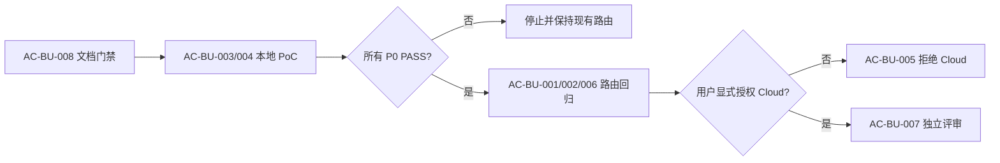

# Browser Use 浏览器自动化能力评估与可选接入验收标准

结论：用文档一致性、本地隔离 PoC、路由回归和 Cloud 授权拒绝四组场景验收本选型；影响：可证明 Browser Use 只补充现有能力，不会改变登录态、安全和高级验证边界；范围：需求冻结、local 浏览器动作、条件路由、安全、清理和费用数据闸门；非范围：本轮真实运行 Browser Use、付费 Cloud 和真实账号；变化：每项能力都必须产生 PASS 或 FAIL；完成标准：全部 P0 场景有可复核证据且无范围外修改；术语说明：二值验收表示每项只能判定通过或失败；验证状态：文档验收可立即执行，行为验收等待对应实施周期。

## 文档信息

| 项目 | 内容 |
| --- | --- |
| 验收来源 | [需求主文档](../2-需求/2026-07-26_132244_BrowserUse浏览器自动化能力评估与可选接入需求.md) |
| 环境 | local；不连接 test、staging、pre、release、prod 或 Browser Use Cloud |
| 角色 | 主 Agent 审查；实施 Agent 执行；用户只负责未来明确的 Cloud 授权 |
| 图片资产决策 | N/A + 原因：无视觉交付；证据：DOM/state、命令结果和 Mermaid 足以验收 |

## 场景与前置条件

- `CYCLE-BU-01`：只需 Windows/Git Bash、现有文档校验器和当前工作树，只读保护既有改动。
- `CYCLE-BU-02`：必须先有单独实施周期文档、隔离虚拟环境、local fixture、公开只读页和无账号 profile。
- `CYCLE-BU-03`：只有 `AC-BU-003` 至 `AC-BU-006` 已 PASS 才允许修改条件路由。
- `CYCLE-BU-04`：必须取得用户当轮明确的 Cloud、费用和数据授权；否则维持拒绝状态即为正确结果。

## 验收场景

| AC | 关联需求/规则 | 初始状态与触发 | 可观察断言 | 失败标准 |
| --- | --- | --- | --- | --- |
| `AC-BU-001` | `REQ-BU-001`、`RULE-BU-001` | 输入依赖已登录 Chrome 的 URL | 路由仍唯一选择 Chrome Plugin | 自动切到 Browser Use、无登录态抓取或绕过安全策略 |
| `AC-BU-002` | `REQ-BU-002/006` | 公开/local 页面分别需要常规动作或高级观测 | 常规候选可比较；HAR/diff/profiling/trace 仍由现有高级 Skill 承担 | Browser Use 全局替换现有能力 |
| `AC-BU-003` | `REQ-BU-003` | local fixture 执行导航、状态、点击、输入、标签/session 和截图 | 每个步骤结果与 fixture 断言一致 | 任一步不可复现、依赖隐式账号或结果不确定 |
| `AC-BU-004` | `REQ-BU-004`、`RULE-BU-002/003` | 关闭遥测、设置域名白名单、关闭敏感视觉 | 越域被拒绝，证据无 secret，任务后 profile/session 可清理 | 访问白名单外站点、截图泄露或残留敏感状态 |
| `AC-BU-005` | `REQ-BU-005`、`RULE-BU-005` | 无当前轮 Cloud 授权 | 不创建 key、不连接 Cloud、不上传 profile | 以免费试用为由自动调用 Cloud |
| `AC-BU-006` | `REQ-BU-006` | 回归现有核心与高级路由场景 | 原有命中、禁止和证据规则全部保持 | 任何自动触发、登录态或高级验证语义丢失 |
| `AC-BU-007` | `REQ-BU-005` | 未来显式提出 Cloud | 先记录价格、额度、留存、训练、第三方 LLM 与回滚决策 | 未审费用或数据边界即配置 key |
| `AC-BU-008` | 全部 | 当前纯文档任务 | 仅新增四份文件且严格门禁通过 | 修改其它文件、提交 Git 或门禁失败 |

## 输入与预期结果

| 测试 | local 样本/入口 | 断言 | 失败预期 | 清理/回滚 |
| --- | --- | --- | --- | --- |
| `TEST-BU-001` | 四份 Markdown 与 validator | profile 和 strict 均有效 | 缺章节、链接、ID 或追踪时报错 | 删除本轮四个新文件 |
| `TEST-BU-002` | local fixture 表单 | 输入与提交结果准确 | 错元素、错误状态或非二值结果 | 关闭 session、删除隔离 profile |
| `TEST-BU-003` | local 多标签 fixture | session 与标签状态可预测 | 交叉污染或 daemon 未关闭 | `close --all` 并核验无残留 |
| `TEST-BU-004` | 白名单内外两个 local hostname | 仅白名单目标可达 | 越域成功 | 停止 PoC、删除环境 |
| `TEST-BU-005` | 无敏感信息截图/DOM | 关闭视觉后无截图外传 | LLM 输入出现截图或 secret | 清理证据并标记 FAIL |
| `TEST-BU-006` | 当前路由触发回归 | 现有 Skill 路由完全保留 | 任一旧场景漂移 | 回滚全部接入差异 |
| `TEST-BU-007` | 无 Cloud 授权负向场景 | Cloud 操作为零 | 出现 API 请求、key 文件或 profile 上传 | 立即停止并删除新增配置 |

## 异常与边界条件

| 分支 | 预期 |
| --- | --- |
| Windows 缺少 Python/CLI 依赖 | 报告 local 环境阻断，不切换 Cloud |
| Browser Use 版本或命令与计划不符 | 停止并回开实施周期，不由执行模型改路线 |
| 当前页面需要真实登录态 | 返回 Chrome Plugin 路由，不导出 cookie 绕过 |
| CAPTCHA、代理或隐身成为必要条件 | 只记录 Cloud 候选，等待显式授权 |
| 官方免费口径冲突 | 以实际 billing 和 pricing 为准，不承诺零成本 |
| 清理失败 | 当前 PoC 为 FAIL，先关闭进程和隔离 profile 后才能重入 |

## 范围外说明

- 真实 Cloud、付费、代理、验证码、profile 同步为范围外；原因：用户没有在当前轮授权，证据：`DEC-BU-003`。
- 生产网站、真实账号和私有数据为范围外；原因：PoC 只验证工具能力，证据：`RULE-BU-002/003`。
- Browser Use 性能或成功率营销数字不作为通过标准；原因：缺少本仓库同样本对比证据，证据：`TEST-BU-002..006` 才是唯一放行依据。

## 验收流程

图形目的：说明从文档冻结到本地 PoC、路由接入和 Cloud 闸门的验收顺序；关联 ID：`AC-BU-001` 至 `AC-BU-008`。

## REQ-AC 追踪矩阵

| 需求/规则 | 验收 | 周期/任务 | 测试 | 证据 |
| --- | --- | --- | --- | --- |
| `REQ-BU-001/002`、`RULE-BU-001` | `AC-BU-001/002` | `CYCLE-BU-03/TASK-BU-04` | `TEST-BU-006` | `EVIDENCE-BU-ROUTE-001` |
| `REQ-BU-003/004/006`、`RULE-BU-002/004` | `AC-BU-003/004/006` | `CYCLE-BU-02/TASK-BU-02/03` | `TEST-BU-002..005` | `EVIDENCE-BU-POC-001` |
| `REQ-BU-005`、`RULE-BU-003/005` | `AC-BU-005/007` | `CYCLE-BU-04/TASK-BU-05` | `TEST-BU-007` | `EVIDENCE-BU-CLOUD-GATE-001` |
| 全部 | `AC-BU-008` | `CYCLE-BU-01/TASK-BU-01` | `TEST-BU-001` | `EVIDENCE-BU-DOC-001` |

## 完成条件、停止条件与交付物

- 通过标准：所有当前适用场景为 PASS；P0 无替代性口头放行；证据路径可回读。
- 失败标准：任何越权、secret 外泄、现有路由漂移、Cloud 自动调用、清理失败或 strict 门禁失败。
- 完成条件：当前周期只要求 `AC-BU-008`；后续周期按进入条件逐项解锁，不把尚未执行场景写成通过。
- 停止条件：出现同来源冲突、非 local 连接、范围外写入、无法清理或证据不可信。
- 交付物：需求主文档、本文、实施总览、全量顺序方案；行为证据在后续周期独立落盘。

## 执行附录

- 当前命令：对四份文档分别运行对应 validator `--strict`，再执行 Mermaid 真解析、UTF-8 回读和 `git diff --check`。
- 当前样本：本轮四个新文件；失败预期：任一缺口产生非零退出码；清理：删除四文件，不触碰既有改动。

## 追踪附录

- `REQ-BU-20260726-001 -> AC-BU-* -> CYCLE-BU-* -> TASK-BU-* -> TEST-BU-* -> EVIDENCE-BU-*`。
- 下游：[实施总览](../3-实施/2026-07-26_132244_REQ-BU-20260726-001_实施总览.md)、[全量顺序方案](../3-实施/2026-07-26_132244_BrowserUse浏览器能力选型_需求与实施计划全量顺序实施方案.md)。

