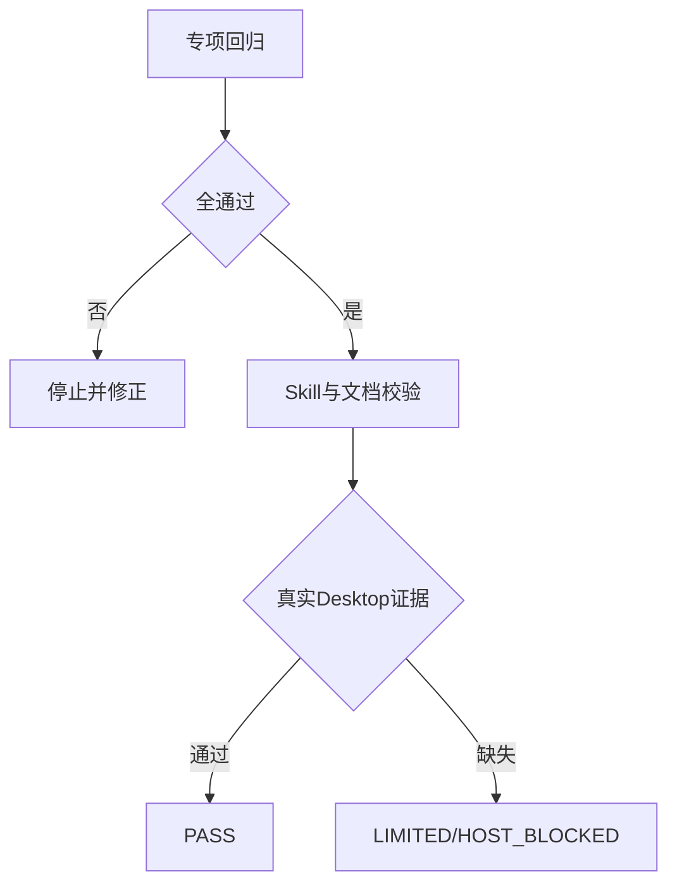

# Plan Mode 计划出口修复验收标准

结论：验收以 Plan/等待/压缩/Default 四类消息契约为准；影响：计划出口和总结路由；范围：本 Bug 规则与测试；非范围：Desktop 产品源码；变化：唯一 Owner；完成标准：自动门禁通过；术语说明：`WAITING_DECISION` 表示未决等待；验证状态：验收准备中；图片资产决策：`N/A + 原因 + 证据`，验收只核对文本输出和测试消息，不需要业务图片。

## 文档信息

| 项目 | 内容 |
|---|---|
| 来源需求 | `REQDOC-PLAN-OUTPUT-001` |
| 验收对象 | 计划/总结 Skill 路由、等待闸门、压缩恢复和测试夹具 |
| 图片资产 | `N/A`：行为契约由 Mermaid 和消息 fixture 表达 |

## 验收场景

| ID | 场景 | 通过标准 | 失败标准 |
|---|---|---|---|
| `AC-PLAN-001` | Plan Mode 命中 | 不含总结 Skill | 总结 Skill 进入命中列表 |
| `AC-PLAN-002` | 无未决计划 | 恰好一对完整标签 | 总结型 `final_answer` 或标签不闭合 |
| `AC-PLAN-003` | 空/部分答案 | 保持等待并重发同一问题 | 自动取消、默认代选或输出总结 |
| `AC-PLAN-004` | Default Mode | 普通总结继续可用 | 非 Plan Mode 被误伤 |
| `AC-PLAN-005` | 压缩恢复 | 不产生可见总结，恢复原计划 | 出现 `final_answer` 或总结模板 |

## 前置条件

- 使用脱敏 fixture；Python 3 可用；仓库为 local 工作区。
- 不连接数据库、缓存、消息队列、HTTP/RPC 上游或生产服务。
- 真实 Desktop 新 Plan 会话可操作时执行宿主验证；不可操作则记录 `LIMITED/HOST_BLOCKED`。

## 验收目标与判定原则

自动测试必须全通过；三个相关 Skill 的 `quick_validate.py` 必须通过；文档 profile 必须 `valid=true`；真实宿主证据缺失时不得升级为 PASS。

## 范围外场景

不验收 Codex Desktop 产品源码、后台定时器、其它会话投影和 Git 历史；原因：这些内容不在本 Bug 的授权范围内，且无 local 可复验入口。

## 异常与边界条件

空答案、部分答案、隐式超时和压缩恢复均不得推进或输出总结；真实宿主不可用时只允许记录 `LIMITED/HOST_BLOCKED`，不得用静态结果替代用户可见证据。

## 完成条件、停止条件与交付物

- 完成：规则、测试、字典、文档、审查均通过，且真实宿主验证通过或明确保持受限。
- 停止：出现未决决策、规则 Owner 冲突、测试失败、文档 profile 失败或宿主证据缺失。
- 交付：规则窄补丁、脱敏 fixture、需求/实施/验收文档、审查记录和验证报告。

## 验收对象与通过门槛

| 需求 | 规则 | 门槛 |
|---|---|---|
| `REQ-PLAN-001..003` | `RULE-PLAN-001..004` | 自动回归全通过 |
| `REQ-PLAN-004..005` | `RULE-PLAN-005..006` | Default Mode 兼容、压缩无总结 |

## 验收流程图

图形目的：表达从自动回归到宿主验收的闸门；关联 ID：`AC-PLAN-001..005`。

