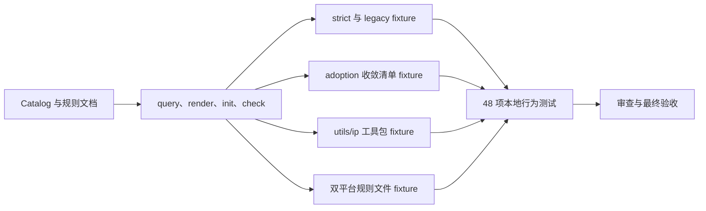

# 代码位置目录规则 V2 最终验收

结论：本轮正式验收通过；影响：开发者可以唯一查询、初始化和检查数据存储连接、持久化模型和独立字段 SQL，且旧项目无需迁移；范围：规则文本、Catalog、CLI、测试、审查与研发文档；非范围：业务仓库迁移、数据库和外部服务、真实网络 RPC、前端工具目录和 Git 历史；变化：`database/connection/` 承载关系型数据库、Redis 和 Mongo 的连接初始化，`database/model/` 固定为 `db/`、`redis/`、`mongo/`，Java 物理映射同步落入这三个叶子目录，字段 SQL 固定为 `field/{create,update,delete}/`，公开 `database-*` artifact 名称与 Catalog 内部字段保持兼容；完成标准：适用验收项均通过且 strict/adoption 不写入样本；术语说明：strict 是拒绝违规目录的只读检查模式；验证状态：48 项本地行为测试、Python 编译、审查与关键 CLI 查询全部通过。图片资产决策：N/A。原因：本轮没有界面或视觉验收对象。证据：范围仅包含本地规则与命令行行为。

## 文档信息

| 项目 | 内容 |
|---|---|
| 验收对象 | `REQ-PSR-V2-001`、`REQ-PSR-UTILS-001`、`REQ-PSR-IP-001`、`REQ-PSR-GOVERNANCE-001`、`REQ-PSR-BUSINESS-RPC-004`、`REQ-PSR-ADOPT-001` 的目录规则、CLI 与本地测试资产。 |
| 验收方式 | 本机 Windows Python 3.14 执行本地 unittest、文档 profile、Skill 快速校验和只读审查。 |
| 验收范围 | 规则文本、Catalog、CLI、收敛清单、相邻微业务隔离规则和研发文档。 |
| 范围外 | 业务仓库迁移、数据库迁移、外部服务调用、浏览器页面、真实网络 RPC 与 Git 历史。 |

## 验收场景

图形目的：展示目录规则、收敛清单与只读检查形成的最终验收链路。
关联 ID：`AC-PSR-UTILS-001` 至 `AC-PSR-UTILS-005`、`AC-PSR-IP-001` 至 `AC-PSR-IP-002`、`AC-PSR-GOVERNANCE-001` 至 `AC-PSR-GOVERNANCE-002`、`AC-PSR-RPC-001` 至 `AC-PSR-RPC-003`、`AC-PSR-ADOPT-001` 至 `AC-PSR-ADOPT-003`。

| 场景 | 输入 | 通过标准 | 失败标准 |
|---|---|---|---|
| 新项目目录规则 | `utils/`、源码根 `util/` 与业务域 `rpc/` 的正反向 fixture。 | 唯一查询、合法初始化与 strict 只读检查通过。 | 禁止路径、非法子目录或混放内容被放行。 |
| IP 工具包 | `utils/ip/address.<ext>` 与根 `utils/<file>.<ext>` fixture。 | IP 条目唯一、显式 init 才创建、包内源码通过 strict。 | 根文件被放行，或 IP 包吸收代理/业务策略边界。 |
| 双平台规则文件 | 五个必需 Markdown 文件、条件 `PROJECT_STYLE.md` 与不同正文 fixture。 | Catalog 唯一、完整渲染；init 创建五项必需文件；strict 拒绝正文漂移；`--target both` 以 `AGENTS.md` 同步 `CLAUDE.md`。 | 将文件建成目录、漏建必需文件、批量创建条件文件、覆盖正文、漂移被放行或同步后正文不一致。 |
| 旧项目渐进采用 | 已采纳 V2 目录、遗留源码快照与错误收敛清单 fixture。 | 仅快照内容可维护；新 V2 路径通过；检查哈希不变。 | 新增遗留源码、目录、未登记路径或无效清单被放行。 |
| 跨业务边界 | 合规 `orders -> users/rpc` 与三类私有层导入 fixture。 | 仅精确目标域 `rpc/` 导入通过。 | `service`、`entity` 或 `util` 私有层导入通过。 |
| 数据存储与独立 SQL | 连接源码、`model/{db,redis,mongo}`、五个 SQL 叶子目录与反向 fixture。 | 每项唯一查询、显式初始化和 strict 只读检查通过。 | 模型根文件、模型 SQL、SQL 非 `.sql`、SQL 子目录或迁移 SQL 被放行。 |

## 前置条件

1. 需求、实施、测试和审查材料均已落盘，并可由本文件的输入材料清单回查。
2. 验收仅使用本地规则仓库、临时 fixture、Windows Python 3.14 和 CodeGraph 本地索引。
3. 不连接数据库、缓存、消息队列、第三方 API 或非 local 环境。

## 验收目标与判定原则

- 验收目标：确认三类项目目录规则、`utils/ip/`、双平台规则文件和旧项目渐进采用对同一输入给出唯一、可解释且只读的结果。
- 通过标准：48 项本地行为测试全部成功；适用文档 profile 和目标 Skill 快速校验通过；没有 P0/P1 审查问题。
- 失败标准：任一 Catalog、CLI、收敛清单、严格检查或无写入断言不一致，或必需文档质量门禁失败，即不得正式放行。

## 异常与边界条件

| 情形 | 预期处理 | 验收结论 |
|---|---|---|
| 收敛清单缺失、越界、重复、嵌套或项目/语言不符 | `adoption` 返回稳定错误，且不改写 fixture。 | 负向断言通过。 |
| 浏览器和第三方验证 | 本轮没有页面、网络调用或外部服务。 | 不适用；原因：验收范围没有浏览器或外部服务接口；证据：48 项测试仅调用本地 CLI、Git Bash 与临时 fixture。 |
| YAML 依赖缺失的 WSL Python | 文档 profile 不以该环境作为放行入口；使用同机 Windows Python 3.14。 | 受限环境不替代本地验证。 |

## 范围外说明

范围外：不迁移或重构任何真实业务项目，不执行真实数据库迁移，不连接外部服务，不生成真实 Swagger/OpenAPI 文档，也不提交 Git 历史。原因：`REQ-PSR-ADOPT-001` 的最大推进边界仅覆盖规则资产、公开 CLI、文档与本地 fixture；证据：所有行为验证均在临时目录内完成。

## 输入材料清单

| 类型 | 材料 | 状态 |
|---|---|---|
| 需求 | `doc/2-需求/2026-07-28_014412_代码位置目录规则V2.md` | 已通过 requirement profile |
| 实施 | `doc/3-实施/2026-07-28_014412_代码位置目录规则V2_实施总览.md` | 已通过 implementation_overview profile |
| 测试 | `doc/5-tests/2026-07-28_014412_代码位置目录规则V2/README.md` 与 48 项 unittest | 已通过 test profile 与本地行为测试 |
| 审查 | `doc/6-审查/2026-07-28_014412_代码位置目录规则V2_实现审查.md` | 审查结论为通过，无 P0/P1 |

## 前置条件检查

| 检查项 | 结果 | 依据 |
|---|---|---|
| 实施周期顺序 | 通过 | `CYCLE-05` 至 `CYCLE-13` 已按顺序收口 |
| 最小任务闭环 | 通过 | `TASK-05-01` 至 `TASK-13-03` 均有实现、测试、审查和验收记录 |
| 功能与回归验证 | 通过 | 48 项本地 unittest 覆盖双平台规则文件 query/render/init/strict/bootstrap、IP query、legacy、普通 YAML adoption、无写入、JSON 响应、跨域导入以及数据存储目录与字段 SQL。 |
| 审查完成 | 通过 | 当前改动审查未发现 P0/P1 |
| 需求是否失效 | 否 | 本轮验收前未出现推翻 `utils`、源码根 `util` 或 RPC 边界的新决策 |

## 门禁适用性

| 阶段 | 判定 | 依据 |
|---|---|---|
| 审查 | 适用且通过 | 本轮公开 CLI 与规则资产已完成实现审查 |
| 验收 | 适用且通过 | 本地行为测试覆盖全部冻结验收条件 |
| 浏览器联调 | 不适用 | 本轮没有页面或浏览器交互，依据 `BOUND-PSR-003` |
| 第三方验证 | 不适用 | 本轮不连接数据库、缓存、消息队列或第三方 API，依据 `BOUND-PSR-003` |

## 逐条验收判定

| 验收项 | 结果 | 证据 |
|---|---|---|
| 三类目录树及根工具边界 | 通过 | `render --all`、`utils` 与源码根 `util` 的严格检查 fixture |
| 服务发现与高关联工具函数 | 通过 | Polaris、Nacos、四语言 `source-util` 查询均唯一 |
| IP 工具包 | 通过 | `utils/ip` 唯一查询、完整渲染、显式 init、包内源码 strict 正向样本与根文件负向样本均通过 |
| 双平台规则文件 | 通过 | 三类 `CLAUDE.md` 均可唯一查询与渲染；五个必需文件由 init 创建，strict 拒绝正文漂移，`--target both` 同步后字节一致 |
| 自动迁移与独立 SQL 分离 | 通过 | CRUD 条目和混放负向测试通过 |
| 数据存储连接、模型与字段 SQL | 通过 | `database/connection`、`model/{db,redis,mongo}`、五个 SQL 叶子目录和公开 `database-*` 查询均通过 |
| strict 只读 | 通过 | fixture 检查前后哈希一致，legacy 仅告警 |
| 业务域 RPC 路径与初始化 | 通过 | `business-rpc` 唯一查询、显式初始化、扁平目录和扩展名断言通过 |
| 微业务私有层隔离 | 通过 | `orders -> users/rpc` 通过；`service/entity/util` 在确定性检查与 CodeGraph 审查中失败 |
| 统一 JSON 响应 | 通过 | 成功、非法 JSON、校验失败和业务失败均包含 `code`、`status`、`message`、`data` |
| 旧项目渐进采用 | 通过 | 已采纳目录和遗留快照通过；新增遗留源码、目录、未登记路径和无效清单失败且不写入 fixture |
| 文档和 Skill 门禁 | 通过 | 五个文档 profile、Skill 字典、两个 `quick_validate.py` 目标均通过 |

## 实施闭环证据

| 周期 | 闭环结论 | 核心证据 |
|---|---|---|
| `CYCLE-05`、`CYCLE-06` | `utils` 与源码根 `util` 已收口 | Catalog、CLI、四语言映射、严格检查与无写入测试 |
| `CYCLE-07`、`CYCLE-08` | 业务域 JSON RPC 已收口 | `business-rpc`、隔离脚本、CodeGraph 导入节点与 JSON fixture |
| `CYCLE-09` | 旧项目渐进采用已收口 | 收敛清单 Schema、adoption CLI、嵌套遗留根负向 fixture 与哈希 |
| `CYCLE-10` | IP 工具包已收口 | `backend.utils.ip`、query/render/init/strict 断言和 34 项本地行为测试 |
| `CYCLE-11` | 后端根治理文件已收口 | `backend.root.*` 文件节点、query/render/init 断言和 37 项本地行为测试 |
| `CYCLE-12` | 双平台规则文件已收口 | 三类 `*.root.claude`、strict 无写入、Git Bash `--target both` 与 41 项本地行为测试 |

## 遗留项与阻断项

- 遗留项：无。
- 阻断项：无。

## 验收结论

验收状态：`PASS`。本轮所有适用的本地规则、CLI、隔离检查和文档门禁均通过；浏览器与第三方验证不适用，原因：本轮没有页面、外部服务或网络调用，证据：验证范围仅包含本地规则仓库与临时 fixture，因此不构成阻断。

## 重验触发条件

- 若修改双平台规则文件、根 `utils/`、`utils/ip/`、源码根 `util/`、业务域 `rpc/`、收敛清单契约、CLI 参数或跨业务导入白名单，必须重新执行本轮 48 项测试、审查与最终验收。
- 若修改 `database/connection/`、`database/model/{db,redis,mongo}/`、`database/sql/field/{create,update,delete}/`、Java 模型物理映射或 `database-*` 查询兼容，必须重新执行本轮 48 项测试、审查与最终验收。

## 完成条件、停止条件与交付物

| 类型 | 内容 |
|---|---|
| 完成条件 | 所有适用验收场景通过，48 项本地测试、文档 profile、Skill 快速校验和审查证据一致，且 `check` 全程只读。 |
| 停止条件 | 任一严格检查写入 fixture、收敛清单扩大遗留范围、跨业务私有层被放行，或必需门禁失败。 |
| 交付物 | `package-structure-rules` 规则、Catalog、CLI、收敛清单契约、测试 README、实现审查与本最终验收文档。 |

## REQ-AC 追踪矩阵

| 需求 / 规则 | 验收项 | 实现与测试证据 | 结果 |
|---|---|---|---|
| `REQ-PSR-UTILS-001`、`REQ-PSR-SOURCE-UTIL-002`、`REQ-PSR-CLI-003` | `AC-PSR-UTILS-001` 至 `AC-PSR-UTILS-005` | Catalog、`placement_catalog.py`、`test_query_render.py`、`test_init_check.py`。 | 通过。 |
| `REQ-PSR-IP-001`、`RULE-PSR-IP-002` | `AC-PSR-IP-001`、`AC-PSR-IP-002` | `backend.utils.ip`、`test_catalog_schema.py`、`test_query_render.py`、`test_init_check.py`。 | 通过。 |
| `REQ-PSR-GOVERNANCE-001`、`RULE-PSR-GOVERNANCE-002` | `AC-PSR-GOVERNANCE-001`、`AC-PSR-GOVERNANCE-002` | `backend.root.*`、`command_init`、`test_catalog_schema.py`、`test_query_render.py`、`test_init_check.py`。 | 通过。 |
| `REQ-PSR-CLAUDE-001`、`RULE-PSR-CLAUDE-002` | `AC-PSR-CLAUDE-001`、`AC-PSR-CLAUDE-002` | 三类 `*.root.claude`、`check_required_file_content_contracts`、`bootstrap_agents.sh`、三个 V2 测试文件。 | 通过。 |
| `REQ-PSR-BUSINESS-RPC-004` | `AC-PSR-RPC-001` 至 `AC-PSR-RPC-003` | `business-rpc` 条目、隔离脚本、CodeGraph fixture、`test_business_rpc.py`。 | 通过。 |
| `REQ-PSR-ADOPT-001` | `AC-PSR-ADOPT-001` 至 `AC-PSR-ADOPT-003` | 收敛清单 Schema、`load_adoption_manifest`、`check_adoption_path`、`test_adoption_check.py`。 | 通过。 |

## 证据索引

| 证据 ID | 任务 | 证据 |
|---|---|---|
| `EVD-TASK-09-03-IMPL` | `TASK-09-03` | 收敛清单 Schema、`placement_catalog.py` 的 adoption 解析与只读检查实现。 |
| `EVD-TASK-09-03-TEST` | `TASK-09-03` | 30 项本地 `unittest`、普通 YAML 清单、正反向 fixture 和无写入哈希。 |
| `EVD-TASK-09-03-REVIEW` | `TASK-09-03` | 实现审查与当前改动审查均未发现 P0/P1。 |
| `EVD-TASK-09-03-ACCEPT` | `TASK-09-03` | 本最终验收、五个文档 profile 与目标 Skill 快速校验通过。 |
| `EVD-TASK-10-01-IMPL` | `TASK-10-01` | `utils/ip/` 规则、Catalog 唯一条目和 CLI 通用条目解析。 |
| `EVD-TASK-10-02-TEST` | `TASK-10-02` | 34 项本地 `unittest`、IP query、render、显式 init 与 strict 无写入断言。 |
| `EVD-TASK-11-01-IMPL` | `TASK-11-01` | 五个根治理文件的 Catalog 文件节点、目录树、正文 Owner 与 `command_init` 文件初始化。 |
| `EVD-TASK-11-02-TEST` | `TASK-11-02` | 37 项本地 `unittest`、根文件 query/render、必需与条件 init 断言、Python 编译和无写入检查。 |
| `EVD-TASK-12-01-PLAN` | `TASK-12-01` | `SRC/DEC/REQ/RULE/AC/CHG-PSR-CLAUDE-006`、三类项目范围和实施任务。 |
| `EVD-TASK-12-02-IMPL` | `TASK-12-02` | 三类 Catalog 文件节点、CLI 内容一致性检查与显式 `--target both` 同步。 |
| `EVD-TASK-12-03-TEST` | `TASK-12-03` | 41 项本地 `unittest`、三类 query/render/init、strict 无写入、bootstrap 幂等、Python 编译和五类文档 profile。 |
| `EVD-TASK-12-03-REVIEW` | `TASK-12-03` | 当前实现审查、两个目标 Skill 快速校验、字典刷新与 `git diff --check`。 |
| `EVD-TASK-12-03-ACCEPT` | `TASK-12-03` | 本最终验收对双平台规则文件的逐条 PASS 结论。 |
| `EVD-TASK-13-01-IMPL` | `TASK-13-01` | 数据存储目录树、Catalog 条目、引用契约与公开查询兼容。 |
| `EVD-TASK-13-02-TEST` | `TASK-13-02` | 48 项本地 `unittest`、显式初始化、正反 strict、无写入哈希、Java 模型叶子目录映射和三个公开 `database-*` 查询。 |
| `EVD-TASK-13-03-REVIEW` | `TASK-13-03` | 当前实现审查未发现 P0/P1，Python 编译和 `git diff --check` 通过。 |
| `EVD-TASK-13-03-ACCEPT` | `TASK-13-03` | 本最终验收对三条数据库验收条件逐条 PASS。 |

## 执行附录

- 仅使用本机 Windows Python 3.14、临时 fixture、CodeGraph 本地索引和规则仓库。
- 未连接数据库、缓存、消息队列、第三方 API 或非 local 环境；未执行网络 RPC、HTTP 调用或真实服务间通信；未提交 Git 历史。

## 追踪附录

- 来源与验收：`REQ-PSR-V2-001`、`REQ-PSR-UTILS-001`、`REQ-PSR-SOURCE-UTIL-002`、`REQ-PSR-CLI-003`、`REQ-PSR-IP-001`、`REQ-PSR-GOVERNANCE-001`、`REQ-PSR-CLAUDE-001`、`REQ-PSR-BUSINESS-RPC-004`、`REQ-PSR-ADOPT-001`、`REQ-PSR-DATABASE-002`、`AC-PSR-UTILS-001` 至 `AC-PSR-UTILS-005`、`AC-PSR-IP-001` 至 `AC-PSR-IP-002`、`AC-PSR-GOVERNANCE-001` 至 `AC-PSR-GOVERNANCE-002`、`AC-PSR-CLAUDE-001` 至 `AC-PSR-CLAUDE-002`、`AC-PSR-RPC-001` 至 `AC-PSR-RPC-003`、`AC-PSR-ADOPT-001` 至 `AC-PSR-ADOPT-003`、`AC-PSR-DATABASE-001` 至 `AC-PSR-DATABASE-003`。
- 实施与证据：`CYCLE-05` 至 `CYCLE-13`、`TASK-05-01` 至 `TASK-13-03`、`TEST-PSR-UTILS-001` 至 `TEST-PSR-UTILS-004`、`TEST-PSR-IP-001`、`TEST-PSR-GOVERNANCE-001`、`TEST-PSR-CLAUDE-001`、`TEST-PSR-RPC-001` 至 `TEST-PSR-RPC-003`、`TEST-PSR-ADOPT-001`、`TEST-PSR-DATABASE-001` 至 `TEST-PSR-DATABASE-003`。
