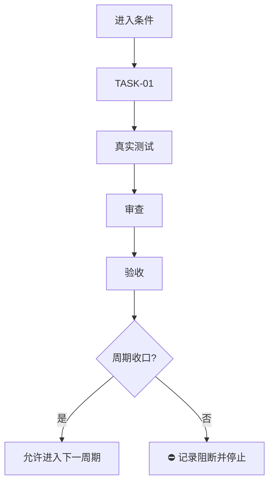

# 实施周期模板：可直接执行版

> 一个周期只做一个清晰目标。普通模型只能执行当前周期中当前顺序的 `TASK-*`，不得跨周期、跨任务猜测或顺手扩散。

## 文档信息

```yaml
schema_version: 1
doc_id: "IMP-CYCLE-YYYYMMDD-01"
doc_type: implementation_cycle
source_ids: ["REQ-...", "AC-...", "CYCLE-01"]
status: draft
version: v1.0
current_slice: "SLICE-..."
updated_at: "YYYY-MM-DD HH:mm:ss"
```

## 当前周期目标

- 周期 ID / 期次定位：`CYCLE-01` / 第一期
- 只做这一件事：
- 对应需求、验收和实施总览：
- 本周期不做：

## 进入条件与收口条件

| 类型 | 条件 | 证据/命令 | 状态 |
| --- | --- | --- | --- |
| 进入 | 需求和验收已确认 |  |  |
| 收口 | 所有任务四项闭环通过 |  |  |



图形目的：说明周期内单任务闭环和收口门禁。关联 ID：`CYCLE-01`、`TASK-01`。

## 当前代码基线

- 分支 / 提交：
- 已核实文件和符号：
- 依赖版本与 local 配置：
- 与计划不一致时的停止规则：发现符号不存在、接口已变化或基线不一致，立即停止并回写 `GAP-*`，不得猜测替代落点。

## 周期内最小任务执行顺序

| 顺序 | 任务 ID | 唯一目标 | 前置依赖 | 允许文件 | 禁止触碰区 | 状态 |
| ---: | --- | --- | --- | --- | --- | --- |
| 1 | `TASK-01` |  |  |  |  | planned |

## 文件与符号操作契约

| 任务 | 文件路径 | 符号/区段 | 操作 | 修改前职责 | 修改后职责 | 调用方影响 | 兼容要求 |
| --- | --- | --- | --- | --- | --- | --- | --- |
| `TASK-01` | `path/to/file` | `FunctionOrType` | 新增/修改/删除 |  |  |  |  |

## 真实测试与断言

| 测试 ID | 对应任务 | 精确命令 | local 依赖 | fixture/数据 | 断言 | 失败预期 | 清理 |
| --- | --- | --- | --- | --- | --- | --- | --- |
| `TEST-01` | `TASK-01` |  |  |  |  |  |  |

## 回滚与停止条件

- `ROLLBACK-*`：逐步写明撤销文件、数据、配置和部署的顺序。
- 停止条件：命令失败、断言失败、依赖不可用、数据不符合前置、计划落点不存在或发现安全/数据损坏风险。
- 恢复路径：回到哪个任务/skill/文档，补什么证据后才能重启。
- 当前 agent 最大推进边界：

## 周期追踪矩阵

| `REQ-*` / `RULE-*` | `AC-*` | `TASK-*` | 文件/符号 | `TEST-*` | `EVIDENCE-*` | 闭环状态 |
| --- | --- | --- | --- | --- | --- | --- |
|  |  |  |  |  |  |  |

## 周期自审

- 每个任务是否只承载一个目标：
- 是否按实现 -> 真实测试 -> 审查 -> 验收逐个闭环：
- 是否存在未决决策或模糊落点：
- 图形、表格和正文是否一致：
