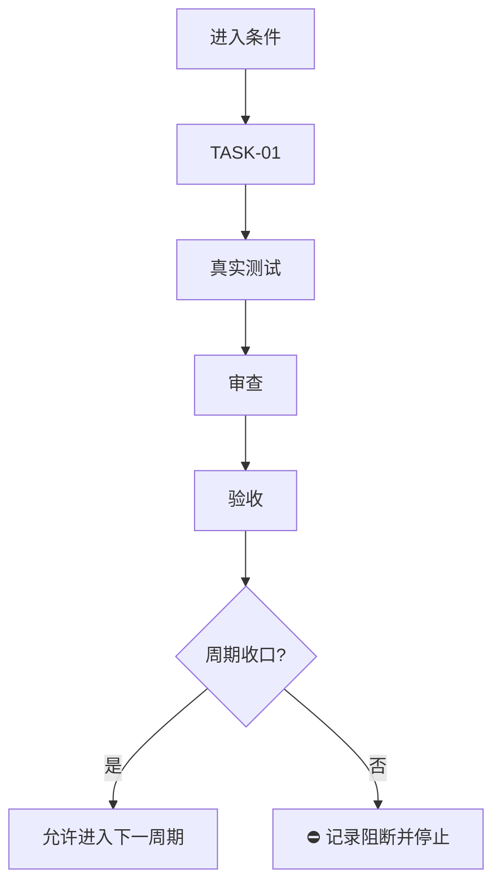

# 实施周期模板：可直接执行版

> 一个周期只做一个清晰目标。普通模型只能执行当前周期中当前顺序的 `TASK-*`，不得跨周期、跨任务猜测或顺手扩散。

## 文档信息

```yaml
schema_version: 1
doc_id: "IMP-CYCLE-YYYYMMDD-01"
doc_type: implementation_cycle
source_ids: ["REQ-...", "AC-...", "CYCLE-01"]
status: draft
version: v1.0
current_slice: "SLICE-..."
updated_at: "YYYY-MM-DD HH:mm:ss"
```

## 当前周期目标

- 周期 ID / 期次定位：`CYCLE-01` / 第一期
- 只做这一件事：
- 对应需求、验收和实施总览：
- 本周期不做：

## 周期图片资产决策与边界

- 图片资产决策：`需要` 或 `N/A + 原因 + 证据`。仅在 UI/原型、截图证据、视觉对比、真实产物、空间布局、外观基线或 Mermaid 无法准确表达时选择需要图片。
- Mermaid 边界：任务依赖、流程、时序、状态、数据关系和周期门禁仍必须使用 Mermaid；图片不能替代任务依赖图、流程图、时序图或其它既有门禁。
- 生成与引用：真实生成走 `imagegen`，目标为 `doc/data/images/<document_stem>.<asset-slug>-v<number>.<ext>`；正文只允许 `/` 分隔相对路径（例如 `../data/images/<document-stem>.login-state-v1.png`），禁止绝对/越界/远程/HTML/Base64/反斜杠路径及旧 `doc/data/<file>` 路径。
- 格式校验：PNG 用于 UI/截图/文字密集图，JPEG 用于照片，WebP 仅在渲染器兼容性有证据时允许；扩展名必须与文件签名一致。

## 周期图片资产清单

| 图片 ID | 用途 / 生成输入 | 来源 | 相对路径 | 版本 | 关联 REQ/RULE / AC / CYCLE / TASK | 引用章节 | 敏感状态 | 版权状态 |
| --- | --- | --- | --- | --- | --- | --- | --- | --- |
| `IMG-*` |  | `imagegen` / 用户提供 / N/A | `../data/images/<document-stem>.<asset-slug>-v<number>.<ext>` | `v1` | `REQ-* / AC-* / CYCLE-* / TASK-*` |  | `无敏感信息/需脱敏` | `已确认/待确认`

## 进入条件与收口条件

| 类型 | 条件 | 证据/命令 | 状态 |
| --- | --- | --- | --- |
| 进入 | 需求和验收已确认 |  |  |
| 收口 | 所有任务四项闭环通过 |  |  |



图形目的：说明周期内单任务闭环和收口门禁。关联 ID：`CYCLE-01`、`TASK-01`。

## 当前代码基线

- 分支 / 提交：
- 已核实文件和符号：
- 依赖版本与 local 配置：
- 与计划不一致时的停止规则：发现符号不存在、接口已变化或基线不一致，立即停止并回写 `GAP-*`，不得猜测替代落点。

## 周期内最小任务执行顺序

| 顺序 | 任务 ID | 唯一目标 | 前置依赖 | 允许文件 | 禁止触碰区 | 状态 |
| ---: | --- | --- | --- | --- | --- | --- |
| 1 | `TASK-01` |  |  |  |  | planned |

## 文件与符号操作契约

| 任务 | 文件路径 | 符号/区段 | 操作 | 修改前职责 | 修改后职责 | 调用方影响 | 兼容要求 |
| --- | --- | --- | --- | --- | --- | --- | --- |
| `TASK-01` | `path/to/file` | `FunctionOrType` | 新增/修改/删除 |  |  |  |  |

## 任务图片资产执行契约

每个涉及图片的 `TASK-*` 必须冻结以下字段；不涉及图片时填写 `N/A + 原因 + 证据`：

| 任务 | 图片决策 | 生成输入与 imagegen 命令 | 目标资产路径 | Markdown 相对引用 | `IMG-*` / 版本 | 资产清单与引用章节 | Mermaid 不替代说明 |
| --- | --- | --- | --- | --- | --- | --- | --- |
| `TASK-01` | `需要` / `N/A + 原因 + 证据` |  | `doc/data/images/<document_stem>.<asset-slug>-v<number>.<ext>` | `../data/images/<file>` |  |  |  |

## 真实测试与断言

| 测试 ID | 对应任务 | 精确命令 | local 依赖 | fixture/数据 | 断言 | 失败预期 | 清理 |
| --- | --- | --- | --- | --- | --- | --- | --- |
| `TEST-01` | `TASK-01` |  |  |  |  |  |  |

## 回滚与停止条件

- `ROLLBACK-*`：逐步写明撤销文件、数据、配置和部署的顺序。
- 停止条件：命令失败、断言失败、依赖不可用、数据不符合前置、计划落点不存在或发现安全/数据损坏风险。
- 恢复路径：回到哪个任务/skill/文档，补什么证据后才能重启。
- 当前 agent 最大推进边界：

## 周期追踪矩阵

| `REQ-*` / `RULE-*` | `AC-*` | `TASK-*` | 文件/符号 | `TEST-*` | `EVIDENCE-*` | 闭环状态 |
| --- | --- | --- | --- | --- | --- | --- |
|  |  |  |  |  |  |  |

## 周期自审

- 每个任务是否只承载一个目标：
- 是否按实现 -> 真实测试 -> 审查 -> 验收逐个闭环：
- 是否存在未决决策或模糊落点：
- 图形、表格和正文是否一致：
