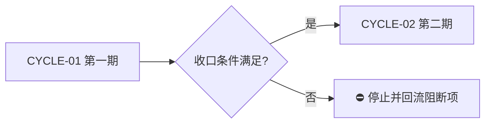

# 实施总览模板：零决策交接版

> 本模板用于 `implementation_overview`。它负责冻结整体技术决策、周期顺序和追踪关系；普通模型执行时必须进入具体周期的最小任务卡，不得从总览自行推导实现细节。

## 文档信息

```yaml
schema_version: 1
doc_id: "IMP-OVERVIEW-YYYYMMDD-001"
doc_type: implementation_overview
source_ids: ["REQ-...", "AC-..."]
status: draft
version: v1.0
complexity: L1|L2|L3|L4
current_slice: "SLICE-..."
baseline_commit: "commit-or-N/A-with-reason"
template_version: "implementation-overview-v1"
updated_at: "YYYY-MM-DD HH:mm:ss"
```

## 当前计划最终方案简要说明

用 1-3 句冻结推荐方案、主落点和选择原因；不得只写“按需求实现”。

## Agent 对当前问题的理解

- 问题 / 目标：
- 本轮范围：
- 非范围：
- 当前优先闭环：
- 关键假设 / 待确认点：
- `unresolved_decisions`：无，或逐项列 `DEC-*`、等级、阻断原因和升级路径。

## 已冻结决策与方案比较

| ID | 决策问题 | 候选方案 | 选定方案 | 排除原因 | 影响面 | 回滚 | 证据 |
| --- | --- | --- | --- | --- | --- | --- | --- |
| `DEC-*` |  |  |  |  |  | `ROLLBACK-*` | `SRC-*` |

## 系统边界与现状基线

必须列出已核实的目录、模块、依赖版本、关键符号、接口和提交基线。涉及代码时附代码落点目录树：

```text
repo/
├── path/to/module/       # 已存在模块；列出职责和关键符号
└── path/to/new_file      # 新增文件；列出唯一用途
```

## 实施周期总览

| 顺序 | 周期 ID | 期次定位 | 单一周期目标 | 进入条件 | 收口条件 | 依赖 | 文档 |
| --- | --- | --- | --- | --- | --- | --- | --- |
| 1 | `CYCLE-01` | 第一期 |  |  |  |  | `./..._实施周期01_...md` |

周期必须按 `01 -> 02 -> ...` 顺序推进；前一周期没有实现、真实测试、审查、验收四项闭环，不得进入下一周期。



图形目的：说明周期门禁和不可跳期规则。关联 ID：`CYCLE-01`、`CYCLE-02`。

## 阶段计划

每个阶段只承载一个目标，必须写输入、动作、输出、验证门槛和归属周期。阶段不是可替代最小任务的执行单位。

| 阶段 | 周期 | 唯一目标 | 输入 | 输出 | 验证门槛 |
| --- | --- | --- | --- | --- | --- |
| `PHASE-01` | `CYCLE-01` |  |  |  |  |

## 最小任务清单与追踪矩阵

| 周期内顺序 | 任务 ID | 垂直切片目标 | 预计文件数 | 文件/符号契约 | 真实测试 | 完成条件 | 停止条件 |
| --- | --- | --- | ---: | --- | --- | --- | --- |
| 1 | `TASK-01` |  |  | `minimum-task-execution-contract.md` | `TEST-01` |  |  |

每个 `TASK-*` 只能归属一个 `CYCLE-*`，默认不超过 5 个文件；超出时必须拆分或记录不可拆分的证据。任务必须逐个完成“实现 -> 真实测试 -> 审查 -> 验收”。

| 来源/验收 | 周期 | 任务 | 文件/符号 | 测试 | 证据 | 状态 |
| --- | --- | --- | --- | --- | --- | --- |
| `REQ-*` / `AC-*` | `CYCLE-01` | `TASK-01` | `path:Symbol` | `TEST-01` | `EVIDENCE-*` |  |

## 真实测试安排

每个行为变更任务必须写独立测试入口、local 环境、样本/fixture、断言、失败预期、清理方式和证据位置。`build`、`lint`、静态检查、人工阅读不算真实测试。

| 测试 ID | 任务 | 命令/入口 | local 环境 | 样本 | 断言 | 失败预期 | 清理 | 证据 |
| --- | --- | --- | --- | --- | --- | --- | --- | --- |
| `TEST-01` | `TASK-01` |  |  |  |  |  |  | `EVIDENCE-*` |

## 风险、阻断、回滚与最大推进边界

| ID | 风险/阻断 | 触发证据 | 当前措施 | 恢复路径 | 禁止动作 |
| --- | --- | --- | --- | --- | --- |
| `GAP-01` / `ROLLBACK-01` |  |  |  |  |  |

- 任务完成条件：
- 任务停止 / 结束条件：
- 当前 agent 最大推进边界：
- 是否已获得用户开始实施授权：`是/否`（计划本身不构成授权）。

## 自审结论

- 零决策交接：
- 文件/符号落点：
- 需求/验收/任务/测试覆盖率：
- 周期顺序与闭环：
- 图形语义与 Mermaid 解析：
- 占位词和 N/A 证据：
- 用户确认状态：
