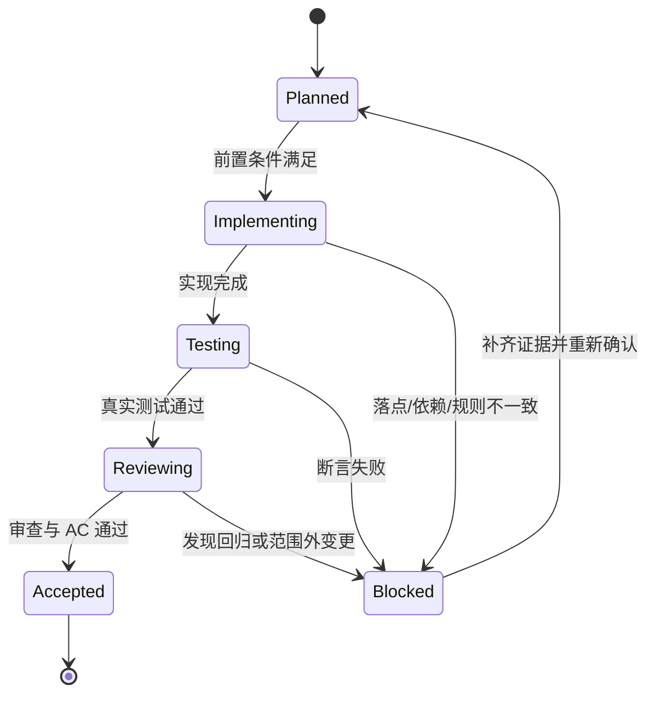

# 最小任务执行契约

最小任务是普通模型的唯一执行入口。任务卡必须足够具体，使执行者无需重新决定业务规则、文件落点、测试口径、回滚方式或下一步范围。

## 必填字段

| 字段 | 合格要求 |
| --- | --- |
| `TASK-*` 与周期 | 唯一 ID，只归属一个 `CYCLE-*`，有周期内顺序 |
| 唯一目标 | 一句话只能描述一个垂直切片结果 |
| 前置条件 | 需求/验收 ID、代码基线、依赖、数据和配置 |
| 允许文件 | 精确相对路径，默认不超过 5 个 |
| 符号操作 | 类、函数、字段、路由、SQL 区段或配置键 |
| 操作类型 | 新增、修改、删除、迁移，写清修改前后职责 |
| 禁止触碰区 | 明确不得改动的文件、接口、数据和范围 |
| 实施步骤 | 有序、一次只做一个动作，每步有验证点 |
| 真实测试 | 命令、local 环境、fixture、断言、失败预期、清理 |
| 审查与验收 | 审查入口、`AC-*`、证据路径和通过标准 |
| 回滚 | `ROLLBACK-*`，写清代码、数据、配置和顺序 |
| 完成条件 | 可观察状态，不用“基本完成” |
| 停止条件 | 失败、偏差、风险或未决信息出现时立即停止 |
| 最大推进边界 | 当前任务结束后不得自动做什么 |

## 执行状态机

图形目的：限制任务状态只能按闭环推进。关联 ID：`TASK-*`、`TEST-*`、`AC-*`、`ROLLBACK-*`。

## 禁止写法

- “修改相关模块”“补充必要校验”“按现有方式处理”。
- 只给文件名，不给符号或区段。
- 只写 `build` / `lint` / 静态检查，不写真实行为测试。
- 多个任务先全部实现，最后统一测试或验收。
- 发现计划与代码不一致后自行换实现路径。
