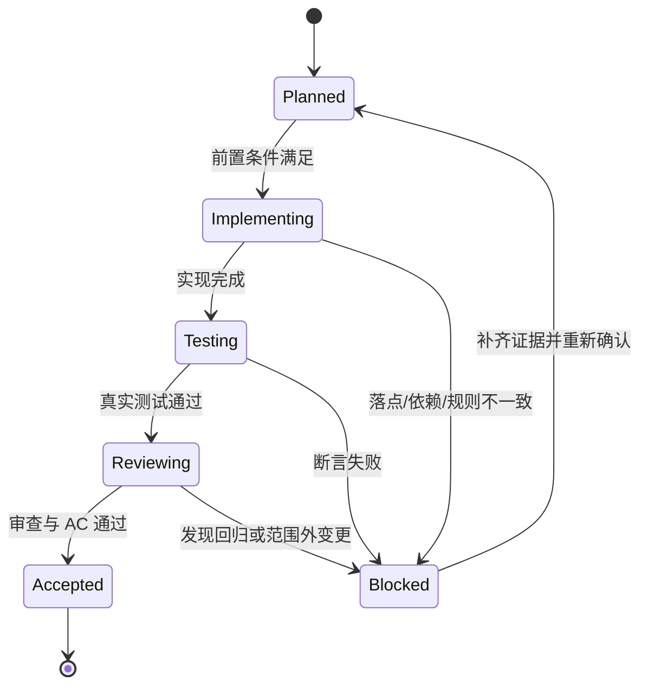

# 最小任务执行契约

结论：最小任务是普通模型唯一可执行的入口；影响：执行者无需重新决定规则、落点、测试或回滚；范围：覆盖一个垂直切片的前置条件、操作、验证和停止边界；非范围：不包含其他任务、周期或未确认的业务决定；变化：任务结果先用普通中文说明，操作与追踪信息后置；完成标准：任务按实现、真实测试、审查和验收完成闭环；术语说明：无技术术语需要解释；验证状态：执行时按 local 环境的真实结果确认。

## 白话正文与附录

任务卡 H1 后的固定摘要说明本任务的结果、影响和完成标准。保留任务卡原有标题和字段顺序；ID、文件、命令、样本、回滚和证据字段归入文末连续的执行附录与追踪附录，不能塞进白话开场。审查、验收和外部条件按 `review_acceptance_gates` 判断，不适用不阻断；生成文档保留 `appendix_policy: preserve_existing_or_one_terminal_appendix`。

## 必填字段

| 字段 | 合格要求 |
| --- | --- |
| `TASK-*` 与周期 | 唯一 ID，只归属一个 `CYCLE-*`，有周期内顺序 |
| 唯一目标 | 一句话只能描述一个垂直切片结果 |
| 前置条件 | 需求/验收 ID、代码基线、依赖、数据和配置 |
| 允许文件 | 精确相对路径，默认不超过 5 个 |
| 符号操作 | 类、函数、字段、路由、SQL 区段或配置键 |
| 操作类型 | 新增、修改、删除、迁移，写清修改前后职责 |
| 禁止触碰区 | 明确不得改动的文件、接口、数据和范围 |
| 实施步骤 | 有序、一次只做一个动作，每步有验证点 |
| 真实测试 | 命令、local 环境、fixture、断言、失败预期、清理 |
| 审查与验收 | 审查入口、`AC-*`、证据路径和通过标准 |
| 回滚 | `ROLLBACK-*`，写清代码、数据、配置和顺序 |
| 完成条件 | 可观察状态，不用“基本完成” |
| 停止条件 | 失败、偏差、风险或未决信息出现时立即停止 |
| 最大推进边界 | 当前任务结束后不得自动做什么 |

## 图片资产字段（涉及图片时强制）

任务涉及 Markdown 图片时，除上表字段外必须明确以下执行契约；若明确不需要图片，必须填写 `N/A + 原因 + 证据`，不得留空：

| 字段 | 合格要求 |
| --- | --- |
| 图片决策 | 写 `图片资产决策：需要`，或 `N/A + 原因 + 证据`；需要时列出具体场景 |
| Mermaid 边界 | 说明图片补充的视觉信息及其不能替代的流程、时序、状态、依赖、数据关系 Mermaid 图 |
| 生成输入 | 给出真实生成提示词/参考输入、`imagegen` 入口和失败阻断预期；禁止程序绘图或占位图 |
| 目标资产路径 | 固定为 `doc/data/images/<document_stem>.<asset-slug>-v<number>.<ext>`，首次有图时创建目录 |
| 格式与签名 | PNG 用于 UI/截图/文字密集图，JPEG 用于照片，WebP 仅在渲染器兼容性证据通过后允许；扩展名必须与文件签名一致 |
| Markdown 引用 | 从当前 Markdown 位置计算 `/` 分隔相对路径；非空 alt 必须包含 `IMG-*`；禁止绝对、远程、Base64、HTML、越界、反斜杠和旧 `doc/data/<file>` |
| 资产清单 | 登记 `IMG-*`、用途、来源、相对路径、版本、关联 `REQ/RULE`、`AC`、`CYCLE`、`TASK`、引用章节、敏感状态和版权状态 |
| 真实验证 | 验证文件存在、扩展名与签名一致、引用可解析、图片非空且非孤儿；imagegen 不可用时记录阻断并停止 |

## 执行状态机

图形目的：限制任务状态只能按闭环推进。关联 ID：`TASK-*`、`TEST-*`、`AC-*`、`ROLLBACK-*`。

## 禁止写法

- “修改相关模块”“补充必要校验”“按现有方式处理”。
- 只给文件名，不给符号或区段。
- 只写 `build` / `lint` / 静态检查，不写真实行为测试。
- 多个任务先全部实现，最后统一测试或验收。
- 发现计划与代码不一致后自行换实现路径。

## 执行附录

- local 环境、逐步操作、精确命令、样本、日志、SQL、接口报文、清理与回滚：填写单个任务的可执行细节。
- 任务卡引用的文件、符号和测试参数必须在本附录中可复核，但不得替代“必填字段”的完整约束。

## 追踪附录

- 稳定 ID、需求和验收来源、审查与验收证据、追踪矩阵、机器可读定位：填写单个任务的可追溯细节。
- 附录维护规则：执行附录在前、追踪附录在后；两者连续位于文档末尾，后面不得再写业务正文。
