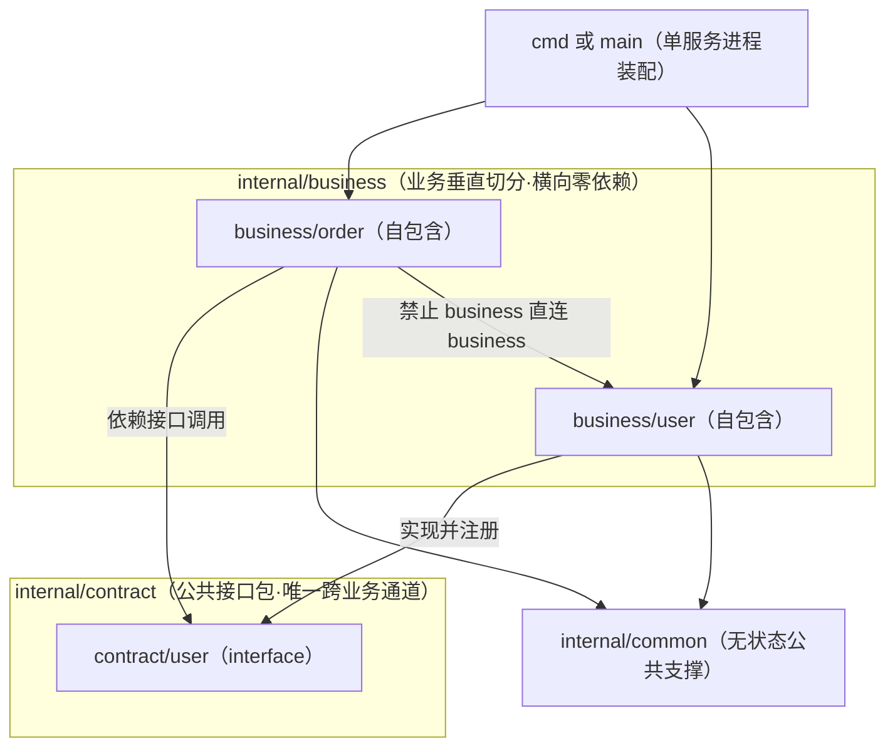

# 微业务目录布局

## 用途

用于判断微业务架构下「业务目录包 + 公共接口包」这一层的目录落点：每个业务如何自包含成一个互不横向依赖的业务包，跨业务如何统一经公共接口包通信，无状态公共支撑如何独立于业务存在，以及装配入口如何组装各业务。

本文档只补「business 横向隔离 + contract 通信」这一层。业务包内部的分层落点（`handler`/`logic`/`store`、`router`/`controller`/`service`/`repository`/`model` 等层内职责与命名）沿用 `package-structure-rules` 的 `structure-general.md` 与 `go-package-layout.md`，本文档不重写分层规则，也不改写这些层的命名口径。

所有 doc 产物路径与命名一律引用 `artifact-storage-rules`，本文档不自定义任何 doc 目录。

## 语言无关通用总则

- **业务垂直切分**：每个业务是一个自包含目录包，内部含自己的入口、逻辑、模型和存储访问；按业务域纵向切，不按技术层横向堆。
- **业务包自包含**：业务包内部持有该业务私有的实现、数据模型与存储访问；业务包之间禁止直接 import 对方任何内部路径（横向零依赖）。
- **公共接口包唯一跨业务通道**：需要跨业务调用时，只经公共接口包（`contract`）以接口形式通信——被调用方在接口包暴露接口并实现、注册，调用方依赖接口调用（依赖倒置）；接口包只为真实存在的跨业务调用点建立，无跨业务调用的业务包不预建接口（服从 `code-readability-rules` 反单实现接口判定）。
- **无状态公共支撑独立于业务**：工具、常量等无业务状态的公共支撑独立成包，可被任意业务依赖，但自身不反向依赖任何业务包。
- **新增即新包**：新业务 = 新开一个业务目录包（按需再加一个接口包目录），旧业务包不被改动。
- **单业务可读**：每个业务包自带统一 README，AI 读「全局业务索引 → 目标业务包 README + 该包代码」即可完成分析，无需扫全仓。

## Go 优先目录布局（示例）

```text
<project-root>/
├── internal/
│   ├── business/                 # 各业务包根（业务垂直切分，互不横向依赖）
│   │   ├── README.md             # 【全局业务包索引】业务清单 + 一句话职责 + 状态
│   │   ├── order/                # 业务包：订单（自包含）
│   │   │   ├── README.md         # 【统一业务包说明】职责/入口/对外接口/依赖
│   │   │   ├── handler/          # 该业务入口层
│   │   │   ├── logic/            # 该业务领域逻辑
│   │   │   ├── model/            # 该业务私有数据结构
│   │   │   └── store/            # 该业务私有存储访问
│   │   └── user/                 # 业务包：用户（自包含，结构同 order）
│   │       └── README.md         # 【统一业务包说明】结构同上
│   ├── contract/                 # 【公共接口包】跨业务通信唯一通道
│   │   ├── README.md             # 【公共接口契约清单】谁暴露/谁实现/谁调用
│   │   ├── order/                # order 对外暴露的接口定义（仅当存在真实跨业务调用）
│   │   └── user/                 # user 对外暴露的接口定义（仅当存在真实跨业务调用）
│   └── common/                   # 无状态公共支撑（工具/常量），非业务，可被任意业务依赖
└── cmd/ 或 main.go               # 单服务进程入口，装配各业务与接口实现注册
```

说明：

- `internal/business/README.md` 是**全局业务索引**：列出全部业务包 + 每个一句话职责 + 状态（活跃/冻结），是 AI 进入项目后的第一入口。
- 每个业务包目录下的 `README.md` 是**统一业务包说明**：职责、边界、目录结构、对外接口（引用 `contract/<self>`）、依赖的其他业务接口（引用 `contract/<other>`）、私有模型入口、关键链路。
- `internal/contract/README.md` 是**公共接口契约清单**：逐条记录每个跨业务接口的暴露方业务、实现方、调用方业务和用途。
- `internal/common/` 承载无状态公共支撑；若项目已有 `pkg/`、`global/` 等等价公共层，沿用项目既有命名，不强行改名。
- 装配入口默认为项目根目录 `main.go`；仅当项目确实存在多个独立二进制入口时才引入 `cmd/`（沿用 `go-package-layout.md` 的入口规则）。

## 隔离与通信（依赖方向）

- **允许**：`business/*` → `contract/*`；`business/*` → `common/*`；装配入口（`cmd`/`main.go`）→ `business/*` 与 `contract/*`。
- **禁止**：`business/A` → `business/B`（对方任何内部路径）；`contract/*` → `business/*`；`common/*` → `business/*`。
- **通信范式**：`contract/b` 定义 `interface`；`business/b` 实现该接口并在装配入口注册；`business/a` 通过注入的 `contract/b` 接口调用，不感知 `business/b` 内部实现。

## Java / Node / Python 目录映射

以下映射只对齐「业务包 + 接口包 + 公共支撑」这一层，包内分层沿用各语言在 `package-structure-rules` 下的既有约定。

### Java

- 业务包：`com.<org>.business.<域>`（如 `com.<org>.business.order`），包内自含 `handler`/`logic`/`model`/`store` 等子包。
- 公共接口包：`com.<org>.contract.<域>`，只放跨业务接口定义。
- 无状态公共支撑：`com.<org>.common`，可被任意业务包依赖，不反向依赖业务。
- 装配入口：Spring 启动类 / 配置类完成各业务实现注册与依赖注入。

### Node / TS

- 业务包：`src/business/<域>/`（如 `src/business/order/`），目录内自含入口/逻辑/模型/存储访问与 `README.md`。
- 公共接口包：`src/contract/<域>/`，只放跨业务接口（`interface`/抽象类型）定义。
- 无状态公共支撑：`src/common/`，可被任意业务依赖。
- 装配入口：`src/main.ts` 或应用启动文件完成业务组装与接口实现注册。

### Python

- 业务包：`app/business/<域>/`（如 `app/business/order/`），含 `__init__.py`、入口/逻辑/模型/存储访问与 `README.md`。
- 公共接口包：`app/contract/<域>/`，只放跨业务接口（`Protocol`/抽象基类）定义。
- 无状态公共支撑：`app/common/`，可被任意业务依赖。
- 装配入口：`app/main.py` 完成业务组装与接口实现注册。

## 图：目录关系

目的：表达业务包、公共接口包、无状态公共支撑与装配入口之间的依赖方向与隔离边界。关联 §3.2 目录布局与 §3.3 隔离与通信。



## 边界声明

- **层内落点交给 `package-structure-rules`**：业务包内部的 `handler`/`logic`/`store`、`router`/`controller`/`service`/`repository`/`model` 等分层职责与命名，全部沿用 `structure-general.md` 与 `go-package-layout.md`，本文档不重复、不覆盖这些规则。
- **本文档只补一层**：即「business 横向隔离 + contract 通信」——业务如何切分成互不横向依赖的目录包，跨业务如何唯一经公共接口包通信。
- **路径与命名交给 `artifact-storage-rules`**：涉及 doc 产物的路径与命名一律引用其单一真相源，不在本文档自定义 doc 路径。
- **接口抽象服从 `code-readability-rules`**：`contract/` 接口只在存在真实跨业务调用点时建立，禁止为单实现预建接口。
