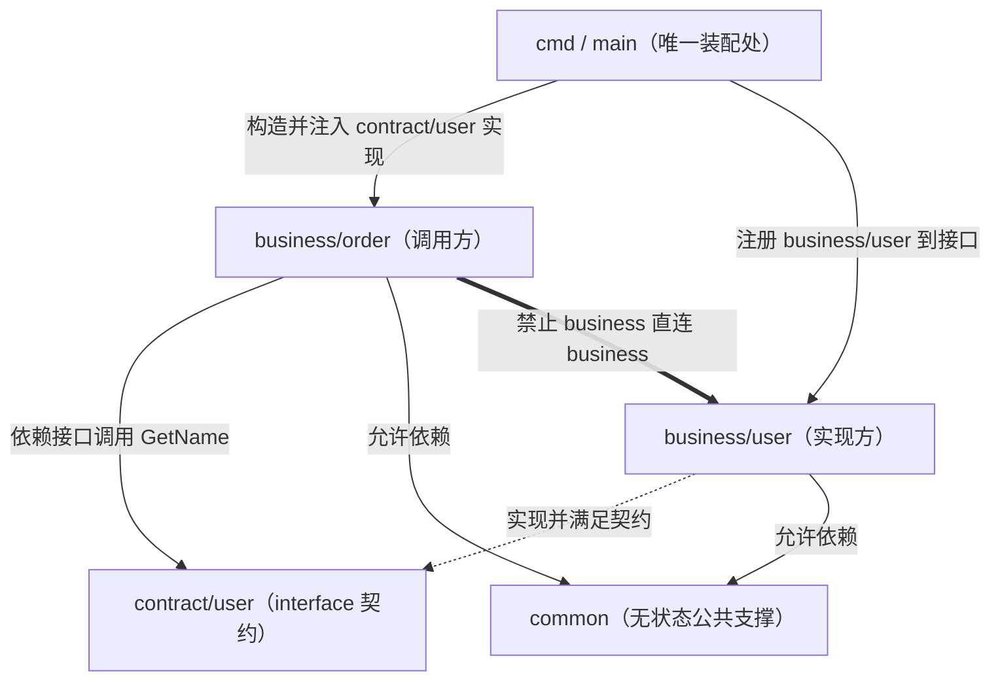

# 微业务隔离与通信契约

本文件定义微业务架构中「业务包隔离」与「公共接口包（contract）通信契约」两条核心规则，并显式与 `code-readability-rules` 的反单实现接口约束对齐，避免规则冲突。

- 分层落点（handler/logic/store 等层内规则）交给 `package-structure-rules`，本文件不重写分层。
- 目录与命名的单一真相源为 `artifact-storage-rules`，本文件不自定义路径。
- 本文件只负责「业务横向隔离 + contract 跨业务通信 + 接口按需」这一层。

## 隔离核心原则

1. 业务垂直切分：每个业务是一个自包含目录包（`internal/business/<name>/`），内部含自己的入口、逻辑、模型、存储访问。
2. 横向零依赖：业务包 A 禁止直接 import 业务包 B 的任何内部路径。
3. 受控通信：跨业务调用只经公共接口包 `contract/`，通过依赖倒置注入完成。
4. 接口按需：`contract/` 接口只为真实存在的跨业务调用点建立；无跨业务调用者的业务包不建接口。
5. 新增即新包：新业务 = 新开 `business/<new>/`（按需 `contract/<new>/`），旧业务包不被改动。

## 依赖方向白 / 黑名单

依赖方向是隔离规则的硬约束，`scripts/micro_business.py check` 按此表校验。

### 允许（白名单）

| 起点 | 终点 | 说明 |
|---|---|---|
| `business/*` | `contract/*` | 业务包通过公共接口包声明的 interface 调用其他业务（依赖倒置） |
| `business/*` | `common/*` | 业务包可依赖无状态公共支撑（工具 / 常量 / 通用类型） |
| `cmd` | `business/*` | 单服务进程入口装配各业务实现 |
| `cmd` | `contract/*` | 入口在装配处把业务实现注册到对应接口 |

### 禁止（黑名单）

| 起点 | 终点 | 违规类型 | 说明 |
|---|---|---|---|
| `business/A` | `business/B`（任何内部路径） | 业务包直连 | 破坏横向零依赖，跨业务必须改走 `contract/B` |
| `contract/*` | `business/*` | contract 反向依赖业务 | 公共接口包必须是纯契约层，不得回指任何业务实现 |
| `common/*` | `business/*` | common 依赖业务 | 公共支撑必须无业务耦合，否则会把业务隐式串联 |

> 判定要点：只看依赖方向的「配置归属 / import 路径归属」，不看调用是否恰好在同进程；即使物理同进程，`business/A` 直接 import `business/B` 内部路径仍是违规。

## 跨业务通信范式

跨业务调用固定为「契约声明 → 业务实现 → 装配注册 → 依赖倒置调用」四步：

1. 被调用业务 B 在 `contract/b/` 定义 interface（只放接口与其入参 / 出参契约类型，不放实现）。
2. `business/b` 实现该 interface。
3. 单服务进程入口 `cmd`（装配处）构造 `business/b` 实现，并注册到调用方所需的 `contract/b` 接口。
4. 调用方业务 A 只依赖注入进来的 `contract/b` 接口，不感知 `business/b` 的存在（依赖倒置）。

Go 极简示意（分文件展示归属，省略错误处理与包内细节）：

```go
// contract/user/user.go —— 公共接口包：只声明契约，禁止依赖任何 business
package user

// Reader 是 user 业务对外暴露的跨业务查询契约
type Reader interface {
    GetName(id int64) (string, error)
}

// business/user/service.go —— user 业务实现契约，不感知调用方
package user

type Service struct{ /* user 私有依赖 */ }

func (s *Service) GetName(id int64) (string, error) {
    // user 业务私有逻辑
    return "alice", nil
}

// business/order/service.go —— order 业务只依赖 contract/user 接口
package order

import contractuser "example.com/app/internal/contract/user"

type Service struct {
    users contractuser.Reader // 注入的跨业务接口，不 import business/user
}

func (s *Service) Describe(userID int64) (string, error) {
    name, err := s.users.GetName(userID) // 依赖倒置调用
    if err != nil {
        return "", err
    }
    return "order of " + name, nil
}

// cmd/main.go —— 唯一装配处：把 business 实现注册给 contract 接口
package main

import (
    orderbiz "example.com/app/internal/business/order"
    userbiz "example.com/app/internal/business/user"
)

func main() {
    userSvc := &userbiz.Service{}         // 构造 user 实现
    orderSvc := &orderbiz.Service{}        // 构造 order 业务
    _ = orderSvc                           // orderSvc.users = userSvc（满足 contract/user.Reader）
    _ = userSvc
}
```

关键点：`business/order` 只出现 `import .../internal/contract/user`，绝不出现 `import .../internal/business/user`；实现与调用方的绑定只发生在 `cmd` 装配处。

## 接口按需原则（与 code-readability-rules 对齐）

本规则不要求「业务间一律抽接口」。`contract/` 接口只在能写出真实调用方（真实跨业务调用边界）时才建立；单业务无外部调用者时禁止预建接口。

- 只有一个业务、当前无任何其他业务调用它时：直接写具体实现，不建 `contract/<self>`。
- 出现第一个真实跨业务调用点时，才为被调用业务补 `contract/<callee>` 接口，并按上一节范式改造。
- 禁止以「以后可能扩展」「看起来更规范」「方便测试 mock」为由，在无真实调用边界时预建单实现接口。

本规则服从 `code-readability-rules` 的深模块 / 反浅封装 / 反单实现接口判定：

- `code-readability-rules` 明确「大多数代码默认不需要抽象接口；抽接口前必须能写出现有或本轮即将落地的第二实现与调用边界；列不出时接口层只会制造跳转成本」。
- 因此 `contract/` 接口天然满足其判定：接口存在的唯一理由是「已经存在真实的跨业务调用边界」，这正是可写出真实调用方的场景，不属于被禁止的「仅为解耦 / 可测试 / 以后扩展的单实现接口」。
- 当两条规则出现张力时，以 `code-readability-rules` 的反浅封装判定为准：若某个 `contract/` 接口找不到真实调用方，应删除该接口、由调用侧直接使用具体类型，而不是为了满足「统一走 contract」的形式感保留空接口。

## 违规与修复

`scripts/micro_business.py check` 会扫描各业务包源码 import，按依赖方向黑名单自动校验；违规时退出码非 0 并打印违规文件与 import 行。

| 违规类型 | 典型表现 | 修复方向 |
|---|---|---|
| 业务包直连 | `business/order` 直接 `import .../internal/business/user/...` | 在 `contract/user` 定义所需接口，`business/user` 实现，`cmd` 注册，`business/order` 改为依赖 `contract/user` 接口 |
| contract 反向依赖业务 | `contract/user` `import .../internal/business/...` | 把实现类型 / 逻辑移出 contract，contract 只保留 interface 与契约入参出参类型 |
| common 依赖业务 | `common/util` `import .../internal/business/...` | 把耦合业务的逻辑退回对应 `business/<name>`；common 只保留无业务状态的通用能力 |
| 预建单实现接口 | 建了 `contract/x` 但全仓无任何跨业务调用方 | 按接口按需原则删除该接口，调用侧改用具体类型（服从 `code-readability-rules`） |

修复通用顺序：先定位违规 import → 判断是「该走 contract」还是「本就不该跨业务」→ 需要跨业务则补契约 + 装配注册，不该跨业务则收敛回本业务包 → 重跑 `check` 直到退出码 0。

## 图：跨业务通信流程

目的：展示一次 `order` 业务调用 `user` 业务时，依赖如何全程经 `contract/user` 接口与 `cmd` 装配处完成，业务包之间不产生直连。关联 ID：REQ-2（跨业务只经公共接口包通信）、AC-2（contract 通信范式）。



> 图中双线粗边（`==>`）标注的是被禁止的 `business/order → business/user` 直连路径；合规调用必须走 `A → contract/user`（接口）与 `cmd` 的注入 / 注册，实现方 `B` 只负责满足契约。
