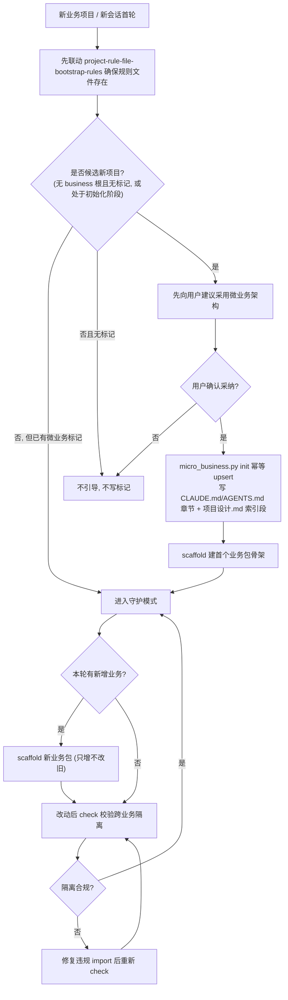

# 微业务触发与标记

本文件定义 `micro-business-architecture-rules`（下称「本 skill」）的三件事：**新仓库如何判定、微业务标记如何写入、标记存在后如何守护**。核心口径与 `boundaries.md` 一致：本 skill 的自动触发发生在**用户新建的业务项目**里，而不是本 skill 的存放仓库 `luode-skills`。

阅读顺序建议：先看「触发发生地」明确作用对象，再看「新仓库判定标准」明确何时算候选，再看「标记确认流程」明确「先建议、后确认、再写入」的硬约束，最后看「守护流程」明确标记落地后的持续校验。

---

## 一、触发发生地

本 skill 的自动触发发生在**用户新建的业务项目**里，触发链路为：harness 全局加载所有 skill → `skill-hit-check-rules` 每轮据本 skill 的 `description` 关键词命中 → 命中后检测当前是否为新/空仓库 → 判定为候选新项目时向用户建议采用微业务架构。

必须区分两个仓库，二者不得混淆：

- `luode-skills` 仓库（即当前 `D:\luode\luode-skills`）：只是**开发与存放**本 skill 的地方。它自身不是微业务业务项目，本 skill **不得**在这个仓库里对「是否采用微业务架构」发起引导或写标记。
- 用户未来新建的业务项目仓库：才是本 skill 真正的触发发生地与作用对象，判定、建议、写标记、守护都只发生在这里。

因此，在 `luode-skills` 仓库里编辑、测试、注册本 skill，与本 skill 在业务项目中被命中触发，是两件不同的事。本文件后续所说的「目标项目 / 目标仓库」一律指用户新建的业务项目，不指 `luode-skills`。

---

## 二、新仓库判定标准

进入一个业务项目仓库后，满足以下**任一**条件即视为「候选新项目」：

1. **无业务根且无既有标记**：仓库中不存在 `internal/business/`（或等价业务根目录），且不存在既有微业务标记（`CLAUDE.md` / `AGENTS.md` 无 `## 微业务架构约束` 章节，`项目设计.md` 无微业务业务索引段）。
2. **处于初始化阶段**：仓库处于初始化阶段，没有实质业务代码目录（只有脚手架、README、配置或空目录，尚未落地任何业务实现）。

判定由**规则描述 + 脚本辅助**两条路径给出，且两者结论必须一致：

- 规则描述路径：本文件上述两条标准，供 agent 阅读判断。
- 脚本辅助路径：`scripts/micro_business.py check --detect-new`，据同一套标准（无 `business` 根 + 无标记，或无实质业务代码目录）做机器判定。

规则描述与脚本判定不得给出相互矛盾的结论；若不一致，以当前仓库真实结构为准并复核脚本判定逻辑。

> 判定要求「无 business 根**且**无标记」正是为了避免误伤：只要仓库已经存在业务代码骨架或已经写过标记，就不再重复发起引导。

---

## 三、标记确认流程

本节是本 skill 的关键约束，顺序固定为「先建议、后确认、再写入」，任何一步都不得跳过或提前。

### 3.1 先做规则文件自举

新会话首轮先联动 `project-rule-file-bootstrap-rules`（规则文件）与 `project-memory-file-bootstrap-rules`（项目记忆四件套），确保目标项目的规则文件（`CLAUDE.md` / `AGENTS.md`）与项目记忆四件套已存在。通用规则文件自举由 `project-rule-file-bootstrap-rules` 负责，本 skill 只在其完成之后接续微业务专项判断，不侵入其脚本。

### 3.2 检测为候选新项目 → 先向用户建议

当第二节判定当前仓库为「候选新项目」时，本 skill **先向用户建议**采用微业务架构（说明「业务包隔离 + contract 通信」的收益与适用性），交由用户决定是否采纳。这一步只输出建议，**不做任何写入**。

### 3.3 经用户确认后 → 才由脚本幂等写标记

只有在**用户确认采纳**之后，才由 `scripts/micro_business.py init` 执行幂等 upsert，向目标项目写入两处标记：

- 向目标项目 `CLAUDE.md` / `AGENTS.md` 写入受管章节 `## 微业务架构约束`（核心规则摘要 + 指向本 skill）。
- 向根目录 `项目设计.md` 写入「微业务架构与业务包索引」段。

### 3.4 未经确认不得写入

未经用户确认，**不得**写入任何标记；即使第二节已判定为新仓库，也**只先建议、不写标记**。判定为新仓库不构成写入授权，用户确认才是唯一写入前提。这是缓解「触发误伤」的核心机制：判定过宽最多打扰一次建议，绝不会未经同意改动用户仓库文件。

---

## 四、标记形态

微业务标记由两处构成，二者共同表示「该项目已采纳微业务架构」：

1. **`CLAUDE.md` / `AGENTS.md` 的 `## 微业务架构约束` 章节**：受管章节，含核心规则摘要（业务垂直切分、横向零依赖、跨业务经 `contract/` 通信、新增即新包）与指向本 skill 的引用。
2. **`项目设计.md` 的业务索引段**：「微业务架构与业务包索引」段，作为业务包清单与公共接口契约索引的入口。

写入语义：`init` 采用**按 `## 标题` 定位的幂等 upsert**——按 `## 微业务架构约束` 这个标题在目标文件中定位；存在则替换该章节内容，不存在则追加。因此**重复运行 `init` 不会重复堆叠**同名章节。该 upsert 复用 `project-rule-file-bootstrap-rules` 内 `bootstrap_agents.sh` 的 header upsert 语义（定位替换 / 追加），但由本 skill 自有脚本 `micro_business.py` 实现，**不侵入、不修改** 该脚本。所有写入均为 UTF-8 编码。

---

## 五、守护流程

标记存在后，项目进入**守护模式**，本 skill 的职责从「引导」转为「持续校验」：

- **据标记逐轮检查**：每轮据 `## 微业务架构约束` 标记检查后续改动是否仍符合微业务约束（业务横向隔离、跨业务只经 `contract/`）。
- **新增业务走 scaffold**：新增业务时走 `scripts/micro_business.py scaffold <业务名>`，创建 `internal/business/<业务名>/` 骨架 + 套 README 模板 + 基础子目录（按需 `internal/contract/<业务名>/`），只新增不改动旧业务包。
- **改动后 check 校验**：改动后用 `scripts/micro_business.py check` 校验跨业务隔离，检测是否存在 `business/A` 直连 `business/B` 内部路径的非法横向 import。
- **违规必须修复**：`check` 报出违规（退出码非 0 并打印违规文件与 import 行）时，必须修复到隔离合规，不得放行带违规的改动。

---

## 六、流程图：触发 → 判定 → 建议 → 确认 → 写标记 → 守护

下图串联本文件的完整链路，节点标签均以双引号包裹，语法可解析。

