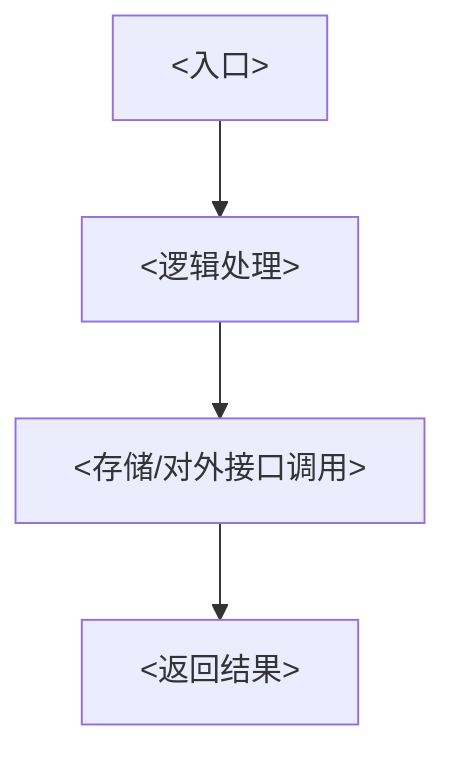

<!-- 本文件是模板：复制到 internal/<域>/README.md 后，按各处 <...> 占位符填空。 -->

# <业务名> 业务域

## 业务职责

<一句话职责：这个业务域对内对外承担什么核心职责>

- <职责要点 1>
- <职责要点 2>
- <职责要点 3>

## 边界

本域**做什么**：

- <本域负责的事 1>
- <本域负责的事 2>

本域**不做什么**：

- <明确不由本域承担的事 1，指出应由哪个业务域/公共包承担>
- <明确不由本域承担的事 2>

## 目录结构

> 层内落点沿用 `package-structure-rules` 分层规则，本域只在其上补「业务横向隔离 + 版本目录」这一层。

```text
internal/<域>/
├── README.md         # 本文件：业务域统一说明
├── init.go           # 域初始化入口：全量注册本域所有版本路由，/v1、/v2 前缀区分
├── api/              # <域内 API 调用>
├── base/             # <业务基础结构>
├── constant/         # <域常量>
├── util/             # <业务私有辅助能力>
├── router/           # <路由装配目录；版本目录承载随版本变化的路由注册>
│   └── v1/           # <版本目录，v1 起递增；包名用 v1router 别名引用>
├── controller/       # <输入与响应映射目录；版本目录承载随版本变化的转换逻辑>
│   └── v1/           # <版本目录；包名用 v1controller 别名引用>
├── entity/           # <领域实体目录；不同版本的实体会变化>
│   └── v1/           # <版本目录；包名用 v1entity 别名引用>
└── service/          # <业务流程目录；版本目录承载随版本变化的业务流程>
    └── v1/           # <版本目录；包名用 v1service 别名引用>
```

## 版本目录

| 版本 | 业务差异 | 说明 |
|---|---|---|
| v1 | <v1 承载的业务逻辑> | <演进说明> |

## 依赖的其他业务

本业务域是否依赖其他业务域；业务域之间禁止直连，共享结构仅走根 `common/` 与 `global/`。

<!-- 若本域不依赖任何其他业务域，写「无」。 -->

## 私有数据模型入口

<指向本域 `entity/<v?>/` 的说明：本业务的私有数据结构集中在 `internal/<域>/entity/v1/`，仅供本域内部使用，不对外暴露。列出关键模型入口文件或类型。>

## 关键链路

<用一句话描述本业务主流程，例如「<入口触发> → <逻辑处理> → <存储/接口交互> → <结果返回>」。>

<!-- 可选：主流程复杂时补一张 Mermaid 时序/流程图，示例：

-->
