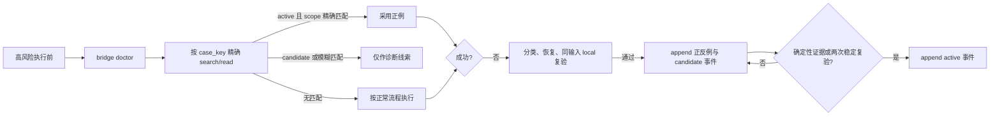

# 执行失败正反例笔记契约

本文件定义跨命令、编码、JSON、路径、工具契约、API、浏览器、安装器、生成器和测试入口的持续学习格式。它是 `obsidian-knowledge-flow` 的动态案例契约；领域 skill 仍拥有自己的恢复逻辑和案例解释，Obsidian 只负责跨任务索引、追加式记录和精确复用。

## 触发与排除

`learn` 在以下情况自动触发：

- 已执行的命令、API、MCP、浏览器、安装器、生成器或测试入口出现非预期错误、失败、异常退出、编码损坏、JSON 解析失败、参数/路径错误，或退出码为 0 但产物不符合成功标准。
- 失败已完成分类、根因确认、修复动作和同输入 local 复验，且复验使用与原失败相同的成功标准。
- 本轮形成可供后续执行前预检使用的正确动作和明确禁止动作。

以下情况不创建可复用案例：

- 预期负向测试、用户主动取消、权限/授权未提供、业务 Bug（转交 `bug-*`）、一次性网络抖动或没有根因证据的猜测。
- 仅静态阅读、构建、lint 或人工推断，没有真实执行成功证据。
- bridge doctor、search、read、create、append 自身失败；此时按 bridge 阻断处理，不写 vault，不能用文件系统 fallback。

## 固定落点与 frontmatter

执行案例统一落在 `知识库/20-Knowledge/execution-failure-cases/<owner>/<case>.md`，文件名使用不含敏感值的稳定 `case_key`。每篇笔记使用通用 frontmatter，并补齐以下字段：

```yaml
---
id: 20260714-120000-exec-case-<slug>
type: knowledge
knowledge_kind: execution_case
title: "<可读的失败主题>"
aliases: ["<错误码或稳定别名>"]
tags: [execution-case, <category>]
status: candidate
case_key: "<owner>|<category>|<tool-major>|<error-signature>|<input-fingerprint>|<scope>"
owner_skill: "<唯一负责解释和恢复的 skill>"
category: command
environment: local
tool_or_model: "<工具或模型名称>"
tool_major: "<主版本或 unknown>"
error_signature: "<稳定错误码/短特征，不含动态值>"
input_fingerprint: "sha256:<脱敏后最小输入摘要>"
scope: "<平台、调用入口、适用边界>"
confidence: medium
created: 2026-07-14
updated: 2026-07-14
source_sessions: []
source_refs: []
related: []
entities: []
topics: [执行失败持续学习]
---
```

`status` 只表示创建时的缓存状态；当前状态以正文中最后一条“状态事件”为权威，检索时不得只看 frontmatter。`case_key` 必须由 owner、类别、工具主版本、规范化错误特征、脱敏后的最小输入摘要和 scope 组成；动态 request id、时间戳、随机 nonce、绝对本机路径、业务数据和凭据不得参与去重键。

## 正文结构与追加式规则

每篇案例保持以下章节顺序，后续只追加新证据和事件，不删除旧反例、正例或用户手写内容：

```markdown
## 失败特征
- 可观察错误码、退出状态、产物缺陷和触发条件。

## 反例
- 错误动作：
- 为什么失败：
- 禁止复用条件：

## 正例
- 正确动作：
- 预期成功标准：
- 适用范围：
- 明确禁止动作：

## 验证证据
- local 输入摘要、执行入口、复验次数、结果和证据引用。

## 状态事件
### 2026-07-14T12:00:00+08:00 | candidate | created
- status: candidate
- event: created
- 原因：
- 证据：
```

- `append` 是唯一更新方式；不得用 `create` 覆盖已有 `case_key`，不得重写整篇笔记或删除历史事件。
- 写入前必须 `search`/`search-context`，命中同一 `case_key` 时只向原笔记追加证据或状态事件；没有命中才允许 `create`。
- 任何 `create`/`append` 都必须取得 `verified=true` readback；没有 readback 的响应只能记为失败，不能宣称案例已保存。
- 案例内容应记录最小可复现摘要和成功标准，不记录完整命令中可能包含的 secret、完整响应、业务数据或大段日志。

## 正反例和验证门禁

正例必须来自已验证的恢复动作，不得把“看起来合理”的建议写成正确方案。最低门禁如下：

1. 失败特征和根因已由 owner skill 分类，且不是排除项。
2. 使用与原失败相同的脱敏输入摘要、local 环境和成功标准复验通过。
3. 记录执行入口、工具主版本、成功产物或可观察断言，并保留来源会话/测试引用。
4. 新案例先写 `candidate`。若存在确定性契约证据，或在同一 scope 内完成两次独立、稳定的成功复验，才追加 `active` 状态事件。
5. 复验失败、环境/版本变化或适用范围不再成立时，追加 `stale`；有互相矛盾的未裁决证据时追加 `conflicted`；被新案例替代时追加 `superseded`；确认方案错误时追加 `rejected`。这些状态不得进入自动 prevent。

## 状态事件与允许转换

状态事件格式为标题 `时间 | 状态 | 事件类型`，并在事件块内写入机器可读的 `status: <状态>` 与 `event: <事件类型>`；事件只追加不覆盖。允许转换：

| 当前状态 | 可追加状态 | 触发条件 |
| --- | --- | --- |
| `candidate` | `active` | 确定性证据或两次稳定 local 复验 |
| `candidate` | `stale` / `conflicted` / `rejected` | 证据过期、冲突未裁决或方案被证伪 |
| `active` | `stale` / `conflicted` / `superseded` | 版本/范围变化、冲突或被新方案替代 |
| `stale` | `active` | 重新按当前 scope 完成同输入 local 复验 |
| `conflicted` | `active` / `rejected` | 权威证据裁决其中一方 |
| `superseded` / `rejected` | 不自动恢复 | 需要创建新的 `case_key` 或人工裁决 |

状态事件必须说明原因、证据、验证时间和 scope；不得只追加一个孤立状态词。

## 自动检索与沉淀流程



- 预检必须先 doctor，再检索 `knowledge_kind=execution_case` 和稳定 `case_key`。只有 `active`、环境/工具主版本/输入摘要/scope 全部精确匹配的案例允许自动采用正例。
- `candidate`、`stale`、`conflicted`、`superseded`、`rejected` 或仅有模糊匹配的案例只能返回诊断线索，不得静默替换当前执行计划。
- 失败恢复由唯一 owner skill 执行；Obsidian skill 在恢复成功后负责脱敏、去重、append 和 readback。bridge 写入失败时停止沉淀，保留脱敏诊断，不重试无变化请求。

## 脱敏与安全边界

- 写入前先扫描 API key、token、密码、cookie、私钥、连接串、Authorization、完整 URL 查询参数、绝对 Windows/WSL 路径、个人身份信息、完整请求/响应和大段日志；用 `[REDACTED]`、`<PROJECT_ROOT>`、`<REQUEST_ID>` 等稳定占位符替换。
- 敏感原值不得出现在标题、文件名、alias、tag、wikilink、`case_key`、input fingerprint 或状态事件中。若脱敏后无法唯一表达问题，拒绝写入并只保留人工诊断结论。
- 只允许 `environment: local` 的验证证据进入 active；不得使用 test、staging、pre、release 或 production 连接信息。

## Bridge-only 与失败处理

- vault 内的 `search`、`search-context`、`read`、`create`、`append` 和 readback 只能通过 `scripts/obsidian_cli_bridge.py` 的 allowlist 完成；不得用 `rg`、`Get-Content`、`Set-Content`、PowerShell 直接写 vault 或访问未注册 root 伪造成功。
- bridge doctor、selector、路径、参数、超时或 readback 失败时，状态为 `阻断`：不创建、不追加、不把本地临时文件当作 vault 事实；向调用方返回错误码、固定 root 和恢复动作。
- bridge 应用不可达只能按 `cli-operations.md` 的有限一次恢复策略执行；不要把失败案例沉淀流程变成无限重试。

## 反例与正例示例

| 类别 | 反例（不可复用） | 正例（可复用前提） |
| --- | --- | --- |
| JSON | 把带动态日志和完整响应直接塞进 prompt，未校验字段 | 先用结构化解析校验必填字段，再按同输入 local fixture 复验 |
| 编码 | 用系统默认编码写入中文文件 | 显式指定 UTF-8，读回字节和内容均与预期一致 |
| 路径 | 把绝对 vault 路径或 `..` 直接传给 CLI | 只传 `知识库/` 前缀的相对 path，并由 bridge 做越界校验 |
| 命令 | 失败后无变化地无限重试 | 根据稳定错误码执行一次有界恢复；仍失败即阻断并记录证据 |

这些示例只用于说明字段和边界；没有真实失败、修复和 local 复验证据时，不得直接创建 `active` 案例。
