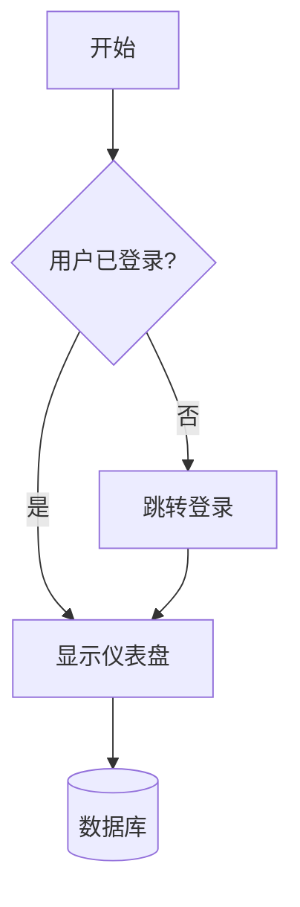
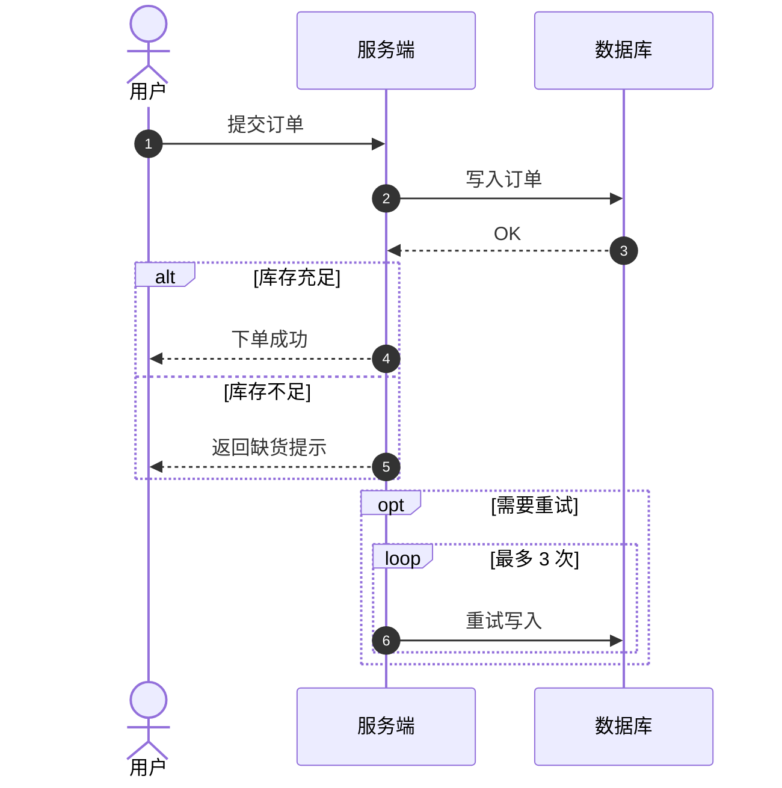
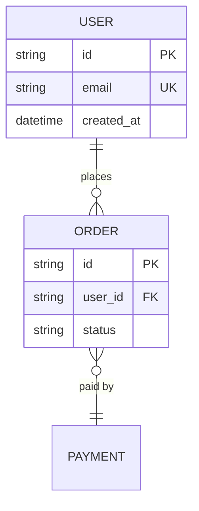
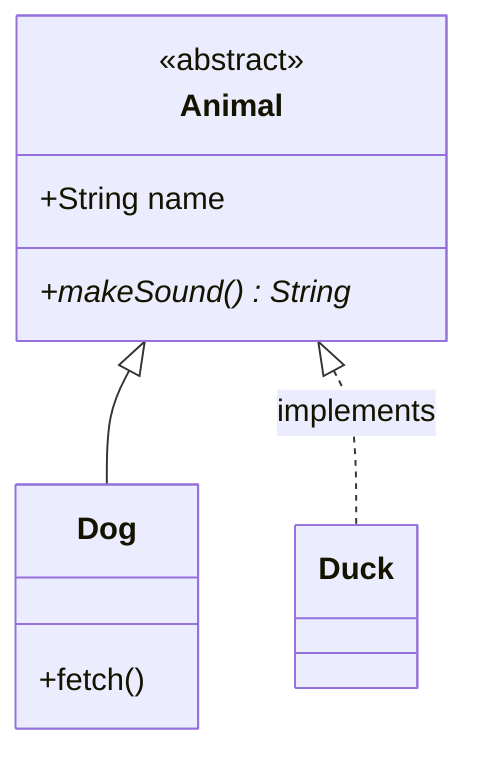
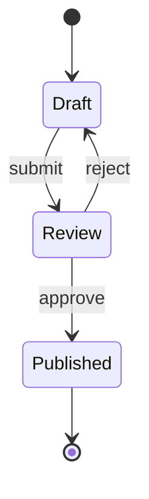
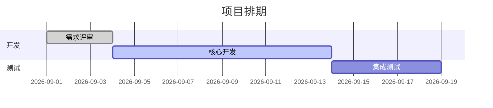
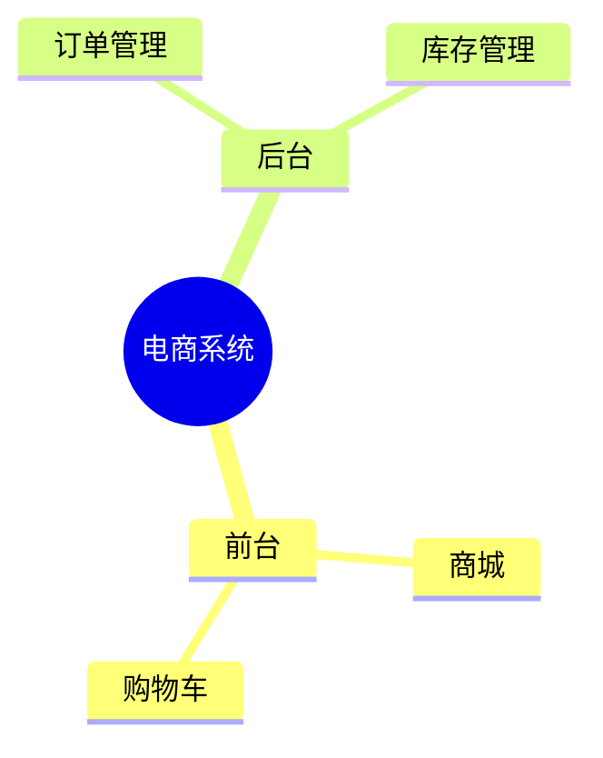
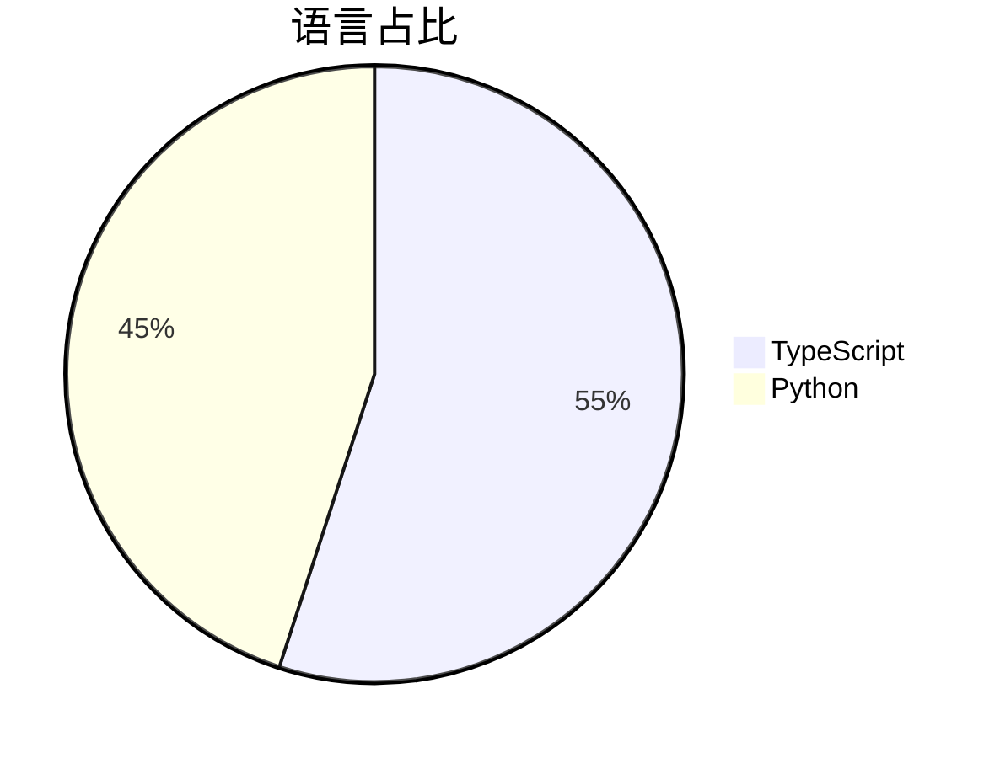
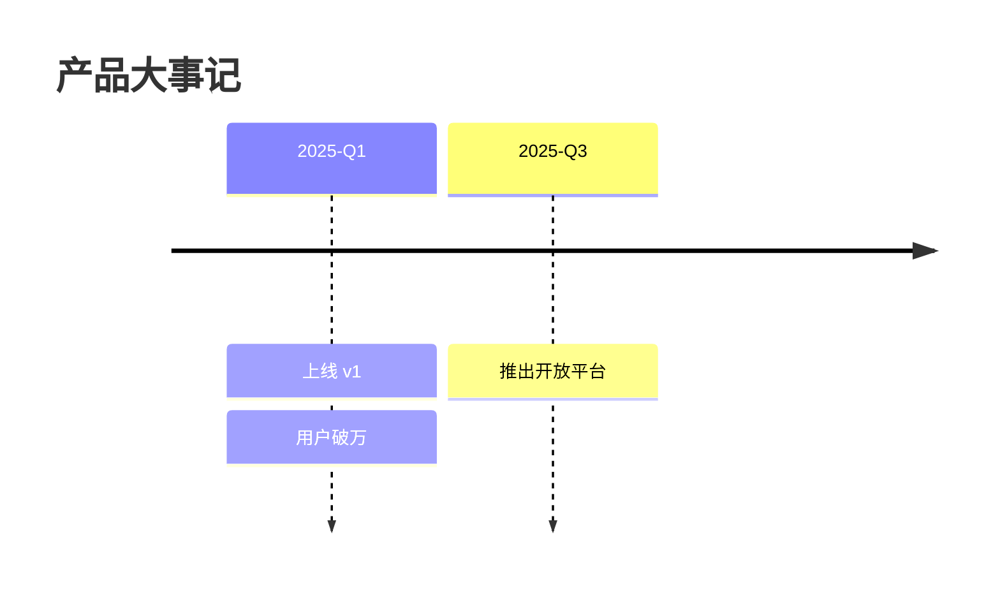
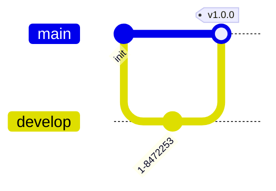

# Mermaid 语法参考

> 文档编写类 skill（需求、Bug、实施、计划、总结等）共用此参考，避免各 skill 分散定义 Mermaid 语法细节。
>
> 本文件不替代图类型选择规则——图类型选择由各 skill 自身的语义匹配表决定（如 `implementation-planning-rules/references/visualization-standard.md` 的语义匹配表、`reasoning-summary-structure-rules` 的图形化适用性表）。
>
> 本文件只负责「怎么写」——语法正确、转义正确、避免常见陷阱。

## 流程图（Flowchart）

- **方向**：`TD`/`TB` 从上到下、`LR` 从左到右、`BT` 从下到上、`RL` 从右到左
- **节点形状**：`[矩形]`、`(圆角)`、`{菱形=判断}`、`[(数据库)]`、`([stadium])`、`[[subroutine]]`、`>异步]`、`((circle))`
- **边形式**：`-->` 实线箭头、`---` 无箭头、`-.->` 虚线、`==>` 粗线、`-- 文字 -->` 带文字、`-->|文字|` 带文字简写
- **Subgraph**：`subgraph 标题 ... end`；子图内可用 `direction LR` 控制方向

## 时序图（Sequence）

- 实线箭头 `->>`、虚线回复 `-->>`；激活/停用 `S->>+DB:` … `DB-->>-S:`
- 块结构：`alt/else/end`、`opt/end`、`loop/end`、`par/and/end`、`break/end`、`critical/option/end`
- 分组：`box ... end` 包裹参与者
- `autonumber` 自动编号；`actor` 表示人类，`participant` 表示系统

## ER 图（Entity Relationship）

- **基数符号**：`||` 恰好一个、`|o` 零或一个、`}o` 零或多个、`}|` 一个或多个；左对 = 源端，右对 = 目标端
- **属性标注**：`PK` 主键、`FK` 外键、`UK` 唯一约束；属性后可用双引号加注释

## 类图（Class）

- **关系**：`<|--` 继承、`*--` 组合、`o--` 聚合、`-->` 关联、`<..` 依赖
- **可见性**：`+` 公开、`#` 保护、`-` 私有
- **抽象/接口**：`<<abstract>>`、`<<interface>>`；抽象方法 `*` 后缀

## 状态图（State）

- 起始/终止用 `[*]`；状态迁移用 `-->` 加可选标签
- 分支用 `state choice1 <<choice>>` 接 `if/else` 风格迁移
- 复合状态用嵌套块

## 甘特图（Gantt）

- **状态标记**：`done` 已完成（灰色）、`active` 进行中（高亮）、`crit` 关键路径（红色）；无标记为默认
- **日期格式**：`dateFormat YYYY-MM-DD` 常用；`after <id>` 表示依赖前一个任务

## 思维导图（Mindmap）

- 缩进定义层级；形状同流程图节点
- **限制**：mindmap 文本中不能包含 `(` `)`，除非在根节点的形状语法中

## 饼图（Pie）

- `pie title <标题>` 单独一行；数据行：`"标签" : 数值`

## 时间线（Timeline）

- `title <标题>` 可选；`<时间点> : <事件>` 结构

## Git 图（GitGraph）

- `commit`、`branch`、`checkout`、`merge` 为基础命令
- `commit id: "xxx"` 自定义提交 ID；`merge tag: "xxx"` 合并标签

## 常见陷阱（必读）

> 输出的 Mermaid 代码块无法通过解析器时，先按以下清单逐项排查。

1. **特殊字符**：标签包含 `()`、`[]`、`{}`、`:`、`;`、`"` 时，必须用双引号包裹：`A["风控(规则引擎)"]`。双引号内不能嵌套双引号，用「」或单引号替代。
2. **冒号在标签中**：`a1["形态: IDE 插件"]` 必须引号包裹；未引号冒号在某些渲染器上会断行。
3. **保留字作 ID**：`end`、`o`、`x`、`default`、`graph` 不能作为节点 ID；用有意义 ID（`auth`、`db`、`gw`）并分离显示文本：`auth[认证服务]`。
4. **`end` 关键字**：小写 `end` 在节点标签中会提前结束子图/块。大写 `End` 或加引号：`A["end"]`。
5. **未闭合块**：每个 `alt/opt/loop/par/critical/subgraph` 必须有对应的 `end`；输出前数一遍。
6. **Mindmap 无箭头**：mindmap 缩进决定层级，禁止用箭头语法。
7. **比较运算符**：标签内 `<`、`>`、`<=`、`>=` 会被误判为 HTML 标签，必须转义为 `&lt;`、`&gt;` 或替换为文字表达（如 `≠`、"不等于"）。
8. **Emoji/CJK 宽度**：标签中可使用，但节点 ID 建议用纯 ASCII。
9. **HTML ` ` 陷阱**：Mermaid 代码块中勿写 ` `，浏览器会先解析为真实元素导致 Mermaid 读取 textContent 时丢失换行。如需换行用 `&lt;br/&gt;` 或缩短标签文字。
10. **Class 图 `<|--` 转义**：`<` 在部分渲染器中需要转义，但 `-->` 中的 `>` 是安全的。

## 可读性约束

可读性约束（节点数、文字长度、方向、字号、subgraph 分组）由 `reasoning-summary-structure-rules` 的「图形渲染通道与可读性约束」节定义，本文件不重复。