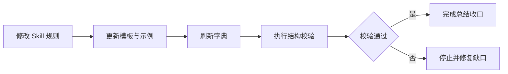

# 输出正反例

## 正例（有改动、有验证）

````markdown
---
# 📋 本轮总结

**命中检查:通过** · skill-compliance-gate:PASS ✅

> 一句话结论：将 Bug 主动侦察收敛到 `bug-intake-rules` 的 `discovery-and-gap` 条件路由。

## 📊 图形化总览

图形目的：展示 Bug 主动侦察规则从迁移、归域到验证的执行链。
关联 ID：`REQ-BUG-DISCOVERY-001`、`AC-BUG-DISCOVERY-001`


## 🛠 执行证据

- 命中 skill：`reasoning-summary-structure-rules`、`skill-execution-compliance-gate-rules`
- 关键动作：迁移 route references，刷新字典并核验归域。

## 🎯 要解决的问题

| 维度 | 内容 |
|---|---|
| 用户原始需求 | bug 也能像需求一样主动侦察查问题 |
| 模型理解的需求 | 在现有 Bug 主入口内增加对称的主动侦察条件路由，支持看代码 / 只读连本地库 / 读截图 |
| 是否一致 | ✅ 一致 |

## 🔧 方案与根因

- 方案：以 `bug-intake-rules` 的 `discovery-and-gap` 条件路由承接 Bug 域侦察前置，相邻 skill 让路 / 回流。
- 根因：原 Bug 主入口缺少“追问前先主动取证”的条件路由。
- Obsidian 检索：已通过 `obsidian-knowledge-flow` 读取 `20-Knowledge/bug-domain/active-debug-flow.md` 作为历史规则证据。

## ✅ 验证

- 字典已刷新且 `planned_missing 0`，主动侦察归入 Bug 主入口条件路由。

## 📌 结果与结论

> 本次解决的问题：在 Bug 主入口内补齐“先主动侦察再定位”的能力。
> 采用的方法：以 `bug-intake-rules` 的 `discovery-and-gap` 条件路由承接侦察规则。
> 结果确认：用户要的主动侦察能力已落地，并可继续向下游定位链路流转。
> Obsidian 沉淀：已通过 `obsidian-knowledge-flow` 更新 `20-Knowledge/bug-domain/active-debug-flow.md`。

## 📦 改动点

| 文件 | 改动 |
|---|---|
| `bug-intake-rules/references/discovery-and-gap.md` | 承接 Bug 主动侦察条件路由与迁移资源 |
| `编码skill.md` | Bug 域表格登记一行 |
````

## 正例（无改动、无验证）

```markdown
---
# 📋 本轮总结

**命中检查:通过**

> 一句话结论：已按统一结构给出本轮问题的结构化结论。

## 🛠 执行证据

- 命中 skill：`reasoning-summary-structure-rules`
- 关键动作：按模板完成结构化总结。

## 🎯 要解决的问题

| 维度 | 内容 |
|---|---|
| 用户原始需求 | 给出本轮问题的结构化结论 |
| 模型理解的需求 | 按固定顺序与视觉规范输出最终总结 |
| 是否一致 | ✅ 一致 |

## 🔧 方案与根因

- 方案：按固定顺序输出必填字段，并套用总结视觉容器。
- 根因：自由格式总结可读性和可复核性不足。

## 📌 结果与结论

> 本次解决的问题：统一最终总结的结构与视觉分界。
> 采用的方法：按固定模板输出并套用总结视觉规范。
> 结果确认：本轮总结已按统一结构收口，且能直接看出本次解决了什么问题。
```

## 反例（缺视觉分界，混在推理过程里）

```text
……（接着上面的工具叙述）所以最后总结一下：
命中 skill：reasoning-summary-structure-rules
做了：改了几个文件
结论：已完成。
```

不通过原因：

- 没有 `---` 分隔线，也没有 `# 📋 本轮总结` 容器，总结和推理过程糊在一起，无法一眼分辨。
- 用零散文本堆叠，没有标题层级、徽章、引用块和表格，关键结论不突出。
- 缺“用户原始需求 / 模型理解的需求 / 两者是否一致”对照层。

## 反例（标题层级缺失 / 改动点未放最后）

```markdown
---
**本轮总结**

命中检查 通过
**改动点**：改了 reasoning-summary-structure-rules
问题：总结样式调整
```

不通过原因：

- 主标题与小节用加粗文本冒充，没有用 `#` / `##` 标题语法，字号与正文无区分。
- 改动点放在了最前面，未按规范放到总结最后。
- 缺执行证据、需求对照、结果结论等必填项。

## 反例（WSL 项目下改动点直接输出 `/home/...`）

```markdown
## 📦 改动点

| 文件 | 改动 |
|---|---|
| /home/luode/code/ellipal_buysell_go/doc/2-需求/2026-07-03_160901_xxx接入.md | 新增需求文档 |
```

不通过原因：

- 项目代码在 WSL 文件系统内，用户从 Windows 桌面访问；`/home/...` 在用户当前客户端里不是可打开路径。
- agent 自身可能直接跑在 WSL 内执行、不需要 `wsl.exe` 包裹，但这不改变“面向用户的文件引用”规则——判定依据是用户查看环境，不是 agent 运行位置。
- 正确写法：`\\wsl.localhost\<distro>\home\luode\code\ellipal_buysell_go\doc\2-需求\2026-07-03_160901_xxx接入.md`，`<distro>` 用 `wsl.exe -l -v` 查看。


## 正例（复杂执行任务先图后文）

````markdown
---
# 📋 本轮总结

**命中检查:通过** · Skill合规闸门:PASS ✅

> 一句话结论：已完成规则升级，并通过结构校验与差异检查。

## 📊 图形化总览

图形目的：展示本轮“修改规则 → 刷新字典 → 执行验证 → 收口”的主执行链。
关联 ID：`REQ-SUMMARY-EXEC-001`、`AC-SUMMARY-EXEC-001`



## 🛠 执行证据

- 命中 skill：`reasoning-summary-structure-rules`
- 关键动作：更新规则、模板、条件字段和示例；运行结构校验。

## 🎯 要解决的问题

| 维度 | 内容 |
|---|---|
| 用户原始需求 | 复杂最终总结优先输出图形化内容 |
| 模型理解的需求 | 按内容选择 Mermaid 图形，并在执行证据前输出主链路 |
| 是否一致 | ✅ 一致 |
````

合格原因：图形位于执行证据之前，且图前有图形目的、关联 ID；图内步骤来自本轮真实执行链。

## 正例（简单单点任务不强制造图）

```markdown
---
# 📋 本轮总结

**命中检查:通过**

> 一句话结论：已完成单文件文字修正。

## 🛠 执行证据

- 命中 skill：`reasoning-summary-structure-rules`
- 关键动作：修正一个 Markdown 标题拼写。

## 🎯 要解决的问题

| 维度 | 内容 |
|---|---|
| 用户原始需求 | 修正一个 Markdown 标题拼写 |
| 模型理解的需求 | 只修改目标标题，不扩展其他内容 |
| 是否一致 | ✅ 一致 |

## 🔧 方案与根因

- 方案：直接修正目标标题文本。
- 根因：标题中存在单个拼写错误。

## 📌 结果与结论

> 本次解决的问题：单个标题拼写错误。
> 采用的方法：直接修正目标文本。
> 结果确认：已确认修改完成。
```

合格原因：内容只有单文件、单点修改，不存在需要图形表达的流程、依赖、状态或执行链，因此不强制生成图。

## 正例（复杂内容不适合可靠绘图时显式说明）

```markdown
## 📊 图形化总览

图形化表达：N/A
原因：本轮只有一组无法可靠归一化的外部截图尺寸对照，Mermaid 无法准确表达视觉像素差异。
证据：仅有截图文件和人工观察记录，没有可复核的结构化尺寸数据。
```

## 反例（存在执行链却只有长段文字）

```markdown
## 🛠 执行证据

先修改规则，然后更新模板，接着刷新字典，最后执行检查，检查通过后结束。
```

不通过原因：本轮存在明确的多步骤执行链，却没有在执行证据之前输出 `## 📊 图形化总览`，没有按内容优先规则展示流程。

## 反例（Mermaid 无图形目的和关联 ID）

````markdown
## 📊 图形化总览


````

不通过原因：图形前缺少“图形目的”和“关联 ID”，无法建立图形与需求、验收或执行证据之间的追踪关系。

## 反例（图形术语与正文漂移）

````markdown
图形目的：展示校验流程。
关联 ID：`AC-SUMMARY-TERM-001`


正文：本轮只执行了本地字典刷新和 Skill 结构校验。
````

不通过原因：图形虚构了“部署生产”步骤，且与正文的本地验证事实不一致。
