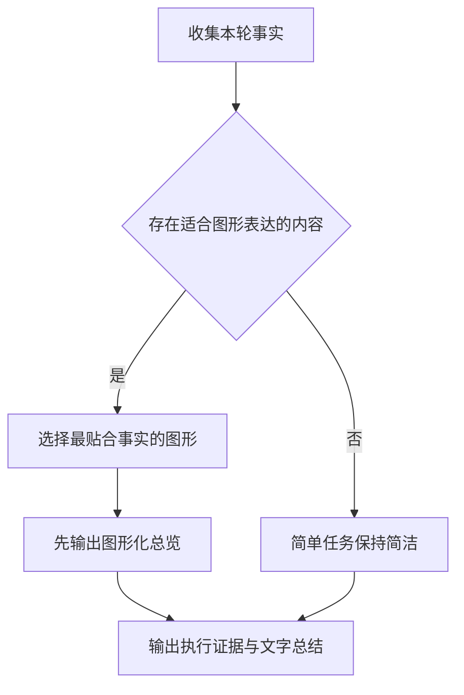
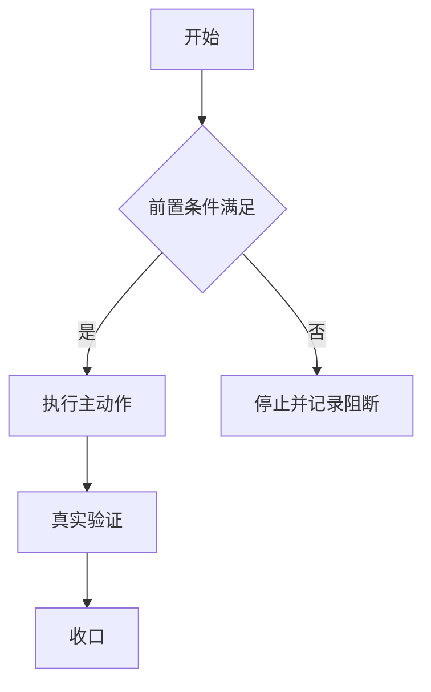
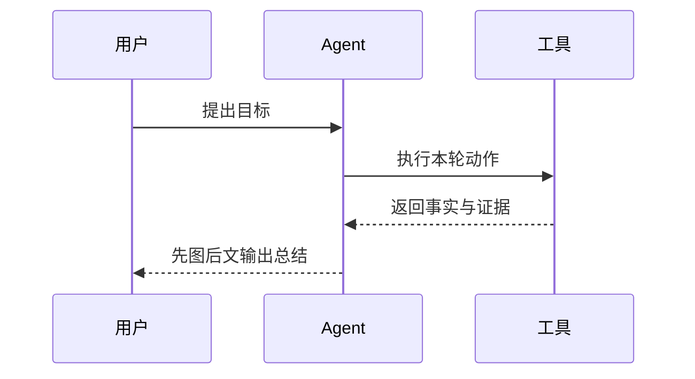
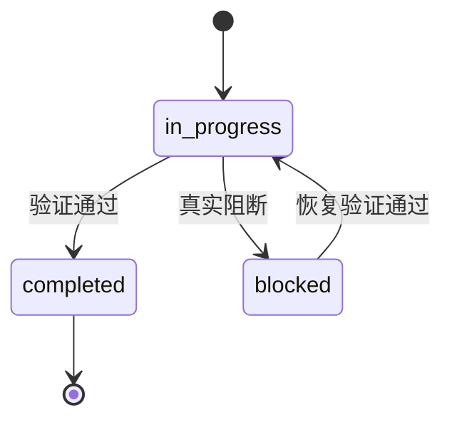

# 推理总结结构模板

最终总结按「总结视觉规范」排版：以 `---` 分隔线开场，用一级主标题 `# 📋 本轮总结` 作容器，二级标题 `##` 作小节，状态摘要和一句话结论之后优先输出图形化总览，再输出文字证据；字段顺序固定不变，与推理过程视觉分界。

## 标准样式（markdown）

````markdown
---
# 📋 本轮总结

**命中检查:通过** · <合规闸门>:PASS ✅

> 一句话结论：...

## 📊 图形化总览（内容适用时）

图形目的：展示本轮任务的主流程、关键分支和最终收口位置。
关联 ID：`REQ-SUMMARY-VISUAL-001`、`AC-SUMMARY-VISUAL-001`



## 🛠 执行证据

- 命中 skill：...
- 关键动作 / 产物 / 命令：...

## 🎯 要解决的问题

| 维度 | 内容 |
|---|---|
| 用户原始需求 | ... |
| 模型理解的需求 | ... |
| 是否一致 | ✅ 一致 / ⚠️ 偏差：... |

## 🔧 方案与根因

- 方案：...
- 根因：...
- Obsidian 检索（仅真实触发时）：已通过 `obsidian-knowledge-flow` 检索/读取 ...；未触发时省略本行。

## ✅ 验证（有验证时）

- ...

## 📌 结果与结论

> 本次解决的问题：...
> 采用的方法：...
> 结果确认：...
> Obsidian 沉淀（仅真实触发时）：已通过 `obsidian-knowledge-flow` 写入/更新 ...；未触发时省略本行。

## 后续内容（仅非阻断且合法时出现）

1. ...

## 📦 改动点（有改动时；真实阻断时置于最终状态区之前）

| 文件 | 改动 |
|---|---|
| ... | ... |

## ⛔ 任务阻断收口（仅真实 `blocked` / `manual_handoff` 时出现，必须放在最后）

> **任务已阻断。**

| 字段 | 内容 |
|---|---|
| 状态 | `blocked` / `manual_handoff` |
| 阻断阶段 | ... |
| 阻断依据与证据 | ... |
| 已尝试与停止条件 | ... |
| 影响 | ... |
| 恢复验证 / 重入点 | ... |

解决计划：

1. `<owner>`：<前置条件>；<动作>；完成判据：...；验证入口：...
2. ...
3. ...
````

## 图形选择模板

### 流程、闸门、分支和回滚

图形目的：展示步骤、分支、停止条件和回滚路径。
关联 ID：`REQ-SUMMARY-FLOW-001`、`RULE-SUMMARY-STOP-001`



### 跨角色、跨服务和异步调用

图形目的：展示参与者、调用顺序、结果回流和责任边界。
关联 ID：`REQ-SUMMARY-SEQUENCE-001`、`AC-SUMMARY-SEQUENCE-001`



### 状态迁移、阻断和恢复

图形目的：展示任务状态及其恢复重入点。
关联 ID：`REQ-SUMMARY-STATE-001`、`AC-SUMMARY-RECOVERY-001`



## 结构要求

- 固定顺序输出（命中检查与状态摘要 → 一句话结论 → 图形化总览（内容适用时）→ 执行证据 → 问题 → 方案根因 → 验证 → 结果结论 → 后续 → 改动点 → 任务阻断收口），不随意重排；无真实阻断时改动点放在总结最后，真实 `blocked/manual_handoff` 时“任务阻断收口”放在总结最后且改动点置于其前。
- 复杂任务存在流程、依赖、状态、执行链、跨角色交互或量化结果时，必须先做图形适用性判断；适用时先输出 1 张主图，必要时最多 2 张；简单单点任务可以省略图形化总览。
- 每个 Mermaid 图形前必须写“图形目的”和“关联 ID”；图形必须非空，图内术语、状态和结论必须与正文和证据一致。
- Mermaid 无法准确表达、数据不足或当前渲染能力不可靠时，写 `图形化表达：N/A`、`原因：...`、`证据：...`，不得使用无意义占位图。
- 必须以 `---` + 一级主标题 `# 📋 本轮总结` 开场，与推理过程、中间进度、工具叙述视觉分界。
- 小节用二级标题 `##`，标题字号大于正文且加粗，形成“主标题 > 小节标题 > 正文”三级层级；禁止用加粗文本冒充标题。
- 不再单列“函数注释核对”节点（由 `code-change-finalization-gate-rules` / `comment-completion-gate-rules` 闸门内部完成）。
- 状态用徽章：通过 ✅、警告 ⚠️、失败 ❌、阻断 ⛔；核心结论用 `>` 引用块突出。
- 多项对照（需求对照、多文件改动、状态对照）优先用 markdown 表格，不堆长串冒号列表。
- 总结中出现的项目内文件路径必须按 `windows-wsl-execution-rules` 的用户可访问路径规则输出：项目在 WSL 且用户从 Windows 桌面 / GUI 客户端访问时，一律使用 `\\wsl.localhost\<distro>\...`，不得输出 `/home/...`。
- 每一节至少 1 条可复核信息。
- `obsidian-knowledge-flow` 若真实检索过笔记，只在「方案与根因」补一行检索摘要；若真实沉淀过知识，只在「结果与结论」补一行沉淀摘要。未真实触发对应动作时不输出占位行。
- `Obsidian:不适用` 只说明本轮完成了轻量判断，不应在最终总结里写成检索或沉淀成果。
- 默认不输出“下一步状态 / 下一步建议”区块，直接在“结果与结论”处收口；真实阻断由本模板唯一渲染，不能同时输出“后续内容”。
- 禁止用“等待用户新指令 / 无需继续动作 / 当前无需补充动作”占位文案替代下一步区块。
- 只有非阻断状态下存在原执行计划内未完成必需项，或用户明确要求建议时，才输出 1-3 条后续内容；可选优化仅在用户明确要求 backlog 时出现。
- 触发“任务阻断收口”前，读取 `artifact-delivery-gate-rules/references/task-blocker-closure-contract.md`；不得重述或扩展契约字段，也不得从 `limited/not_applicable` 生成该区块。
