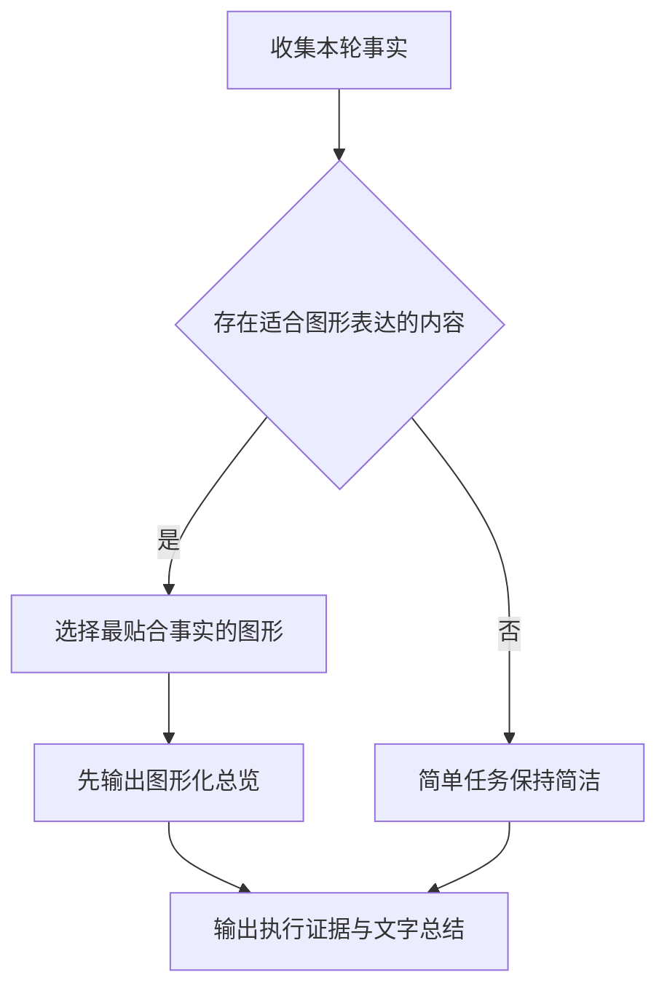
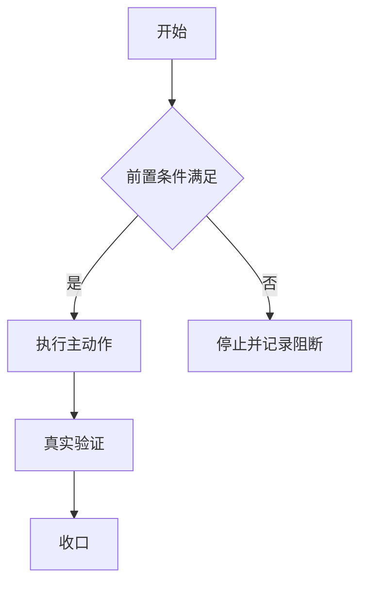
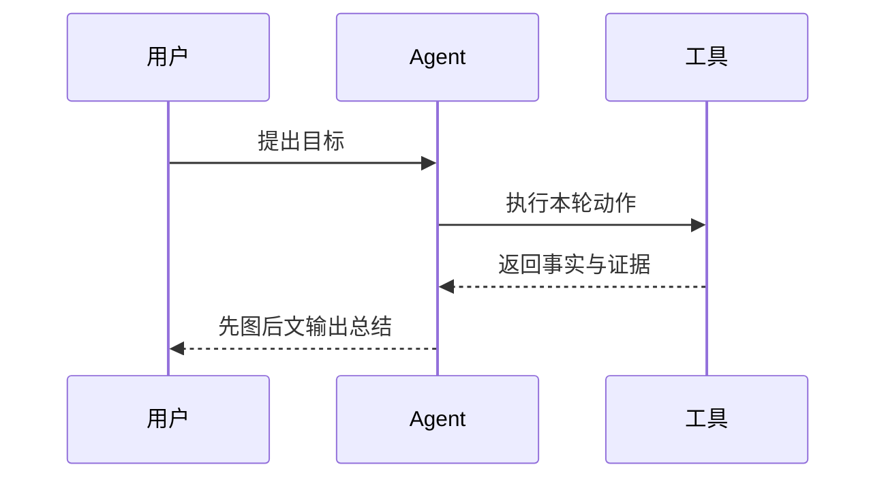
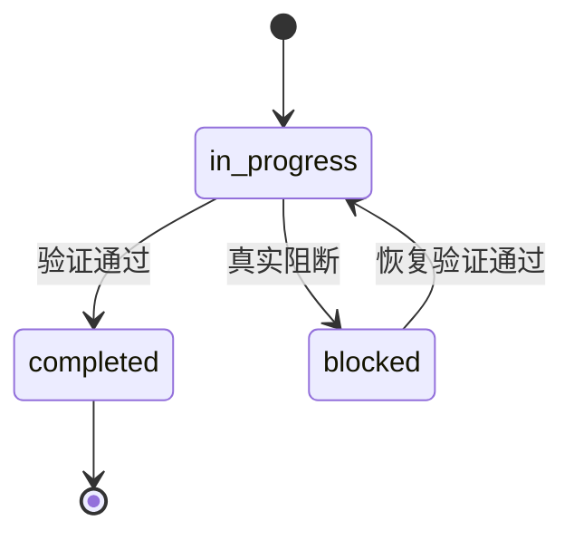

# 推理总结结构模板

适用边界：本模板仅适用于非 Plan Mode 最终总结。Plan Mode 下不得读取或生成本模板，正式计划必须由 `implementation-planning-rules` 输出完整 `<proposed_plan>`。

最终总结按「总结视觉规范」排版：以 `---` 分隔线开场，用一级主标题 `# 📋 本轮总结` 作容器，二级标题 `##` 作小节，状态摘要和一句话结论之后优先输出图形化总览，再输出文字证据；字段顺序固定不变，与推理过程视觉分界。

## 标准样式（markdown）

### 最小总结模板（简单单点任务）

适用于文档保存、只读分析、文件创建确认、简单配置说明、单文件文字修正等简单单点任务。该模板不强制输出 Mermaid，也不强制输出无验证区块；但只要本 skill 已触发，就必须保留总结容器和必填小节。

```markdown
---
# 📋 本轮总结

**命中检查:通过** · `reasoning-summary-structure-rules:PASS` ✅

> 一句话结论：<用一句话说明本轮用户目标已完成/已确认/仍阻断>。

## 🛠 执行证据

- 命中 skill：`reasoning-summary-structure-rules`
- 关键动作：<列出 1-3 条真实动作或证据>

## 🎯 要解决的问题

| 维度 | 内容 |
|---|---|
| 用户原始需求 | <用户原话的目标> |
| 模型理解的需求 | <本轮实际执行边界> |
| 是否一致 | ✅ 一致 / ⚠️ 部分一致并说明原因 |

## 🔧 方案与根因

- 方案：<本轮采用的处理方式>
- 根因：<为什么需要这样处理；若不是缺陷，写“需求原因”或“触发原因”>

## 📌 结果与结论

> 本次解决的问题：<具体说明用户问题，以及最终达到的状态>。
> 采用的方法：<说明关键方法或主要落点，不能只写“按要求处理”>。
> 结果确认：<说明可复核的验证状态、证据等级，或当前仍阻断的原因>。
> 范围边界或残留卡点（仅在确有必要时）：<用一句话说明未覆盖范围、限制或剩余风险>。

## 📦 改动点

| 文件 | 改动 |
|---|---|
| <有文件改动时填写；无改动则省略本节> | <核心改动> |

## 📚 知识引用

<仅引用台账非空时出现；台账为空时整节省略。简单单点任务若真实读写过笔记，同样输出本节>

**本轮引用**

| # | 笔记 | 本轮用途 |
|---|---|---|
| [1] | `<笔记文件名>` | <支撑了哪个结论> |
```

不合格写法：只回复“已保存到 <路径>”“已完成”“请查看文件”，但没有 `---`、`# 📋 本轮总结` 和必填小节。

````markdown
---
# 📋 本轮总结

**命中检查:通过** · <合规闸门>:PASS ✅

> 一句话结论：...

## 📊 图形化总览（内容适用时）

图形目的：展示本轮任务的主流程、关键分支和最终收口位置。
关联 ID：`REQ-SUMMARY-VISUAL-001`、`AC-SUMMARY-VISUAL-001`


```mermaid
flowchart TD
    A[收集本轮事实] --> B{存在适合图形表达的内容}
    B -->|是| C[选择最贴合事实的图形]
    B -->|否| D[简单任务保持简洁]
    C --> E[先输出图形化总览]
    E --> F[输出执行证据与文字总结]
    D --> F
```

## 🛠 执行证据

- 命中 skill：...
- 关键动作 / 产物 / 命令：...

## 🎯 要解决的问题

| 维度 | 内容 |
|---|---|
| 用户原始需求 | ... |
| 模型理解的需求 | ... |
| 是否一致 | ✅ 一致 / ⚠️ 偏差：... |

## 🔧 方案与根因

- 方案：...
- 根因：...

## ✅ 验证（有验证时）

- ...

## 📌 结果与结论

> 本次解决的问题：<具体说明用户问题，以及最终达到的状态>。
> 采用的方法：<说明关键方法或主要落点，不能只写“按要求处理”>。
> 结果确认：<说明可复核的验证状态、证据等级，或当前仍阻断的原因>。
> 范围边界或残留卡点（仅在确有必要时）：<用一句话说明未覆盖范围、限制或剩余风险>。

## 后续内容（仅非阻断且合法时出现）

1. ...

## 📦 改动点（有改动时；台账非空时紧邻知识引用之前，真实阻断时置于最终状态区之前）

| 文件 | 改动 |
|---|---|
| ... | ... |

## 📚 知识引用（引用台账非空时必须；无真实阻断时作为总结最后一节）

**本轮引用**

| # | 笔记 | 本轮用途 |
|---|---|---|
| [1] | `<笔记文件名>` | <支撑了哪个结论；笔记 status 为 stale/deprecated/retired/conflicted 时在句尾标 ⚠️ 与状态> |

**本轮沉淀**

| # | 笔记 | 操作 | readback |
|---|---|---|---|
| [1] | `<笔记文件名>` | 新建 / 追加 / 移动 / 删除 / 改属性 | verified ✅ |

## ⛔ 任务阻断收口（仅真实 `blocked` / `manual_handoff` 时出现，必须放在最后）

> **任务已阻断。**

| 字段 | 内容 |
|---|---|
| 状态 | `blocked` / `manual_handoff` |
| 阻断阶段 | ... |
| 阻断依据与证据 | ... |
| 已尝试与停止条件 | ... |
| 影响 | ... |
| 恢复验证 / 重入点 | ... |
| 用户授权操作 | 请直接回复：`同意授权` 或 请直接回复：`暂不授权`；仅授权最近一条、唯一有效、未解除的 `BLK-*` 记录列明的恢复动作，授权后走原验证入口，失败保持阻断 |

解决计划：

1. `<owner>`：<前置条件>；<动作>；完成判据：...；验证入口：...
2. ...
3. ...
````

## 图形选择模板

### 流程、闸门、分支和回滚

图形目的：展示步骤、分支、停止条件和回滚路径。
关联 ID：`REQ-SUMMARY-FLOW-001`、`RULE-SUMMARY-STOP-001`


```mermaid
flowchart TD
    A[开始] --> B{前置条件满足}
    B -->|是| C[执行主动作]
    B -->|否| D[停止并记录阻断]
    C --> E[真实验证]
    E --> F[收口]
```

### 跨角色、跨服务和异步调用

图形目的：展示参与者、调用顺序、结果回流和责任边界。
关联 ID：`REQ-SUMMARY-SEQUENCE-001`、`AC-SUMMARY-SEQUENCE-001`


```mermaid
sequenceDiagram
    participant User as 用户
    participant Agent as Agent
    participant Tool as 工具
    User->>Agent: 提出目标
    Agent->>Tool: 执行本轮动作
    Tool-->>Agent: 返回事实与证据
    Agent-->>User: 先图后文输出总结
```

### 状态迁移、阻断和恢复

图形目的：展示任务状态及其恢复重入点。
关联 ID：`REQ-SUMMARY-STATE-001`、`AC-SUMMARY-RECOVERY-001`


```mermaid
stateDiagram-v2
    [*] --> in_progress
    in_progress --> completed: 验证通过
    in_progress --> blocked: 真实阻断
    blocked --> in_progress: 恢复验证通过
    completed --> [*]
```

## 结构要求

- 固定顺序输出（命中检查与状态摘要 → 一句话结论 → 图形化总览（内容适用时）→ 执行证据 → 问题 → 方案根因 → 验证 → 结果结论 → 后续 → 改动点 → 知识引用 → 任务阻断收口），不随意重排；无真实阻断时按引用台账分流收尾：台账非空由知识引用收尾、改动点紧邻其前，台账为空由改动点收尾。真实 `blocked/manual_handoff` 时“任务阻断收口”放在总结最后，改动点与知识引用均置于其前。
- 复杂任务存在流程、依赖、状态、执行链、跨角色交互或量化结果时，必须先做图形适用性判断；适用时先输出 1 张主图，必要时最多 2 张；简单单点任务可以省略图形化总览。
- 每个 Mermaid 图形前必须写“图形目的”和“关联 ID”；图形必须非空，图内术语、状态和结论必须与正文和证据一致。
- Mermaid 无法准确表达、数据不足或当前渲染能力不可靠时，写 `图形化表达：N/A`、`原因：...`、`证据：...`，不得使用无意义占位图。
- 必须以 `---` + 一级主标题 `# 📋 本轮总结` 开场，与推理过程、中间进度、工具叙述视觉分界。
- 小节用二级标题 `##`，标题字号大于正文且加粗，形成“主标题 > 小节标题 > 正文”三级层级；禁止用加粗文本冒充标题。
- 不再单列“函数注释核对”节点（由 `code-change-finalization-gate-rules` / `comment-completion-gate-rules` 闸门内部完成）。
- 状态用徽章：通过 ✅、警告 ⚠️、失败 ❌、阻断 ⛔；核心结论用 `>` 引用块突出。
- 多项对照（需求对照、多文件改动、状态对照）优先用 markdown 表格，不堆长串冒号列表。
- 总结中出现的项目内文件路径必须按 `windows-wsl-execution-rules` 的用户可访问路径规则输出：项目在 WSL 且用户从 Windows 桌面 / GUI 客户端访问时，一律使用 `\\wsl.localhost\<distro>\...`，不得输出 `/home/...`。
- 每一节至少 1 条可复核信息。
- `knowledge-flow` 的检索与沉淀事实统一由「知识引用」小节的两张表承载：真实读取成功的笔记进「本轮引用」，真实写入（新建 / 追加 / 移动 / 删除 / 改属性）且回读校验通过的笔记进「本轮沉淀」；两张表都只列台账条目，不输出笔记正文或片段，也不在其它小节重复同一事实。
- 引用台账为空时整节省略，不输出空表或占位行；`search` 命中但未读取的笔记不得入表。
- `知识库:不适用` 只说明本轮完成了轻量判断，不应在最终总结里写成检索或沉淀成果。
- 「结果与结论」必须使用单个引用块，核心保持 3 个简短句子，依次回答“解决了什么、采用了什么方法、结果和验证状态如何”；简单任务默认 3 句，复杂、受限或存在关键边界时扩展到 4–5 句。
- 第 4 句只用于确有必要的范围边界、残留卡点或限制说明；不得为凑数添加空泛句子。
- 「结果与结论」禁止只写“已完成 / 已解决 / 请查看文件”，也禁止复制命令、完整测试清单、逐文件改动或执行流水账；详细证据分别留在对应小节。
- 默认不输出“下一步状态 / 下一步建议”区块，直接在“结果与结论”处收口；真实阻断由本模板唯一渲染，不能同时输出“后续内容”。
- 禁止用“等待用户新指令 / 无需继续动作 / 当前无需补充动作”占位文案替代下一步区块。
- 只有非阻断状态下存在原执行计划内未完成必需项，或用户明确要求建议时，才输出 1-3 条后续内容；可选优化仅在用户明确要求 backlog 时出现。
- 触发“任务阻断收口”前，读取 `artifact-delivery-gate-rules/references/task-blocker-closure-contract.md`；不得重述或扩展契约字段，也不得从 `limited/not_applicable` 生成该区块。
