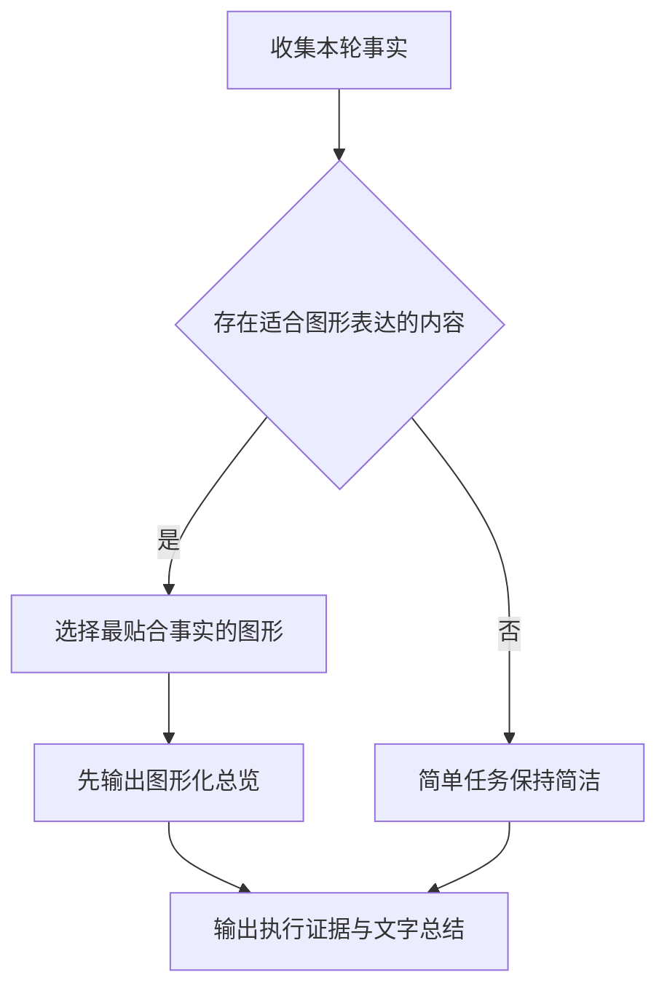
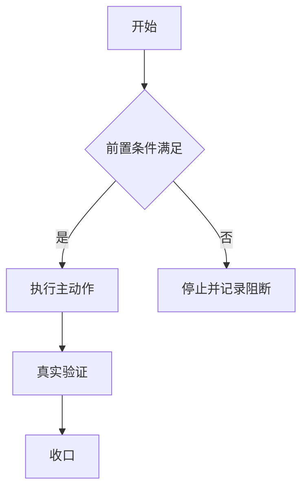
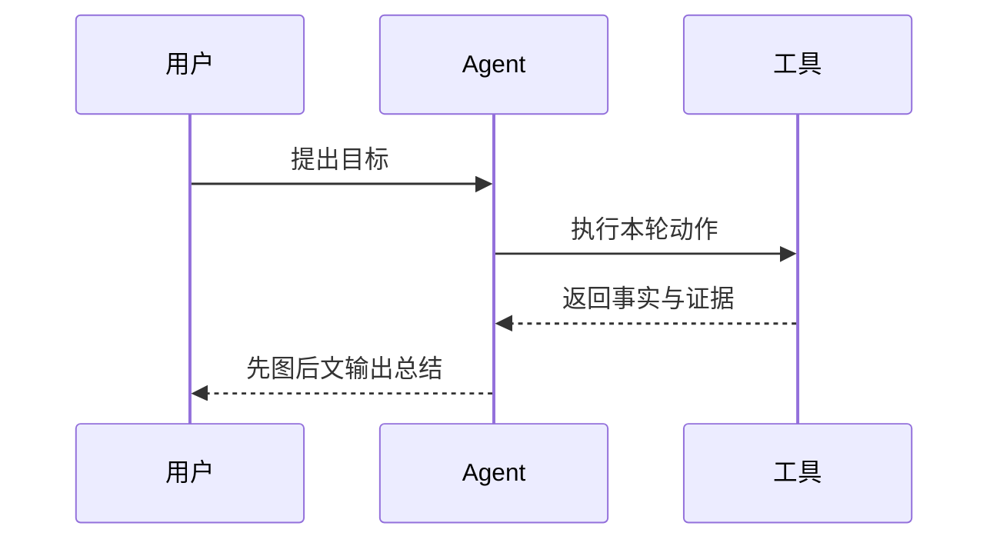
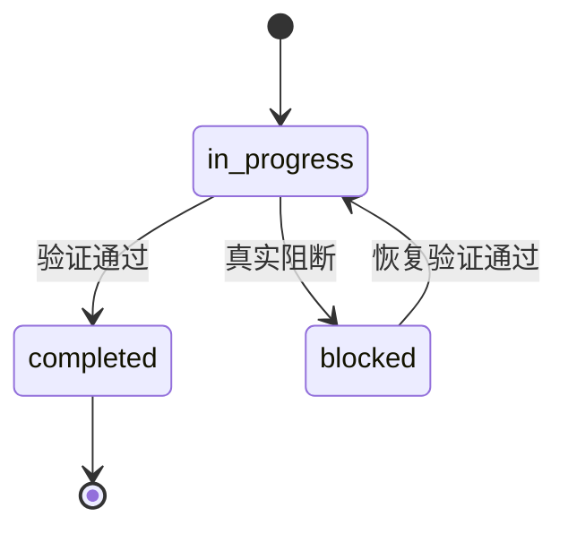

# 推理总结结构模板

适用边界：本模板仅适用于非 Plan Mode 最终总结。Plan Mode 下不得读取或生成本模板，正式计划必须由 `implementation-planning-rules` 输出完整 `<proposed_plan>`。

最终总结按「总结视觉规范」排版：以 `---` 分隔线开场，用一级主标题 `# 📋 本轮总结` 作容器，二级标题 `##` 作小节，与推理过程视觉分界。模板按档位分三套：T0 极简（单点任务，最短收口）、T1 标准（多步任务，主节 ≤ 4 个）、T2 完整（复杂/阻断/合规收口）；档位判定见 `SKILL.md` 的「档位判定（T0/T1/T2，强制）」。

## 标准样式（markdown）

### T0 极简模板（单点任务）

适用于单文件文字修正、简单保存（仅写一个文件并读回）、纯问答、单命令/单配置说明等 T0 单点任务。不输出执行证据、问题定义、方案与根因、结果与结论、图形化总览；条件尾节按「通用尾部顺序」仅在命中时输出。

```markdown
---
# 📋 本轮总结

**命中检查:通过** · `reasoning-summary-structure-rules:PASS` ✅

> 一句话结论：<结果 + 关键数字/文件 + 验证状态，如“已将分析写入 `项目.md` 并读回确认 ✅”>。

## 📦 改动点（有改动时）

| 文件 | 改动 |
|---|---|
| <文件路径> | <核心改动> |

## 📚 知识引用

<仅引用台账非空时出现；台账为空时整节省略>

**本轮引用**

| # | 笔记 | 本轮用途 |
|---|---|---|
| [1] | `<笔记文件名>` | <支撑了哪个结论> |
```

不合格写法：只回复“已保存到 <路径>”“已完成”“请查看文件”，但没有 `---`、`# 📋 本轮总结` 和当前档位必填小节；或一句话结论只有状态词、没有结果与关键对象。

### T1 标准档模板（多步任务，主节 ≤ 4 个）

适用于普通多步任务（2–5 个实质动作）。主节只有：一句话结论、执行证据、方案与结果（合并原“方案与根因”与“结果与结论”）、改动点；不输出图形化总览、独立问题定义与独立验证小节；条件尾节按「通用尾部顺序」在命中时输出。

```markdown
---
# 📋 本轮总结

**命中检查:通过** · <合规闸门>:PASS ✅

> 一句话结论：<结果 + 关键数字/文件 + 验证状态，如“迁移 6 个测试文件并通过全量回归 ✅”>。

## 🛠 执行证据

- 命中 skill：`reasoning-summary-structure-rules`<、其他命中的 skill>
- 关键动作：<1-3 条关键动作与证据，含关键验证动作与结果；不写流水账>

## 🔧 方案与结果

- 方案：<一句话写清采用的处理方式>
- 根因：<一句话写清根因或触发原因；非缺陷任务写“需求原因”>
- 结果：<一句话写清结果与验证状态；只写结论行未覆盖的增量信息>
- ⚠️ 需求理解偏差（仅存在偏差时）：<模型理解为 X，用户原意为 Y>

## 📦 改动点（有改动时）

| 文件 | 改动 |
|---|---|
| ... | ... |

## 📚 知识引用（引用台账非空时必须）

**本轮引用**

| # | 笔记 | 本轮用途 |
|---|---|---|
| [1] | `<笔记文件名>` | <支撑了哪个结论> |

**本轮沉淀**

| # | 笔记 | 操作 | readback |
|---|---|---|---|
| [1] | `<笔记文件名>` | 新建 / 追加 / 移动 / 删除 / 改属性 | verified ✅ |

## 🔄 后台异步任务（本轮启动了后台异步任务时必选；T1 无「结果与结论」小节时，位于一句话结论之后的首个条件尾节位置）

> 本轮同步主任务已完成，以下为后台异步任务状态，无需当作“未完成 / 阻断 / 后续”。

| 字段 | 内容 |
|---|---|
| 任务标识 | <任务 ID / CI run 编号 / 后台进程名> |
| 任务类型 | <轮询 / CI 等待 / 长任务> |
| 轮询节奏 | <如每 30s 一次> |
| 完成信号 | <预计完成条件或时间> |
| 结果回流渠道 | <系统通知 / 下一会话 / 用户指令> |
| 用户等待语义 | <无需等待，完成后另行通知 / 需要在本会话等结果> |
| 宿主任务列表 | <对应 `TaskCreate` 登记的条目名 / 任务列表 UI 查看位置；条目描述为「做什么 + 任务标识 + 何时查看」> |
```

### T2 完整档模板（复杂/阻断/合规收口）

适用于命中任一 T2 硬条件的任务（真实阻断、合规闸门、需图形化总览、跨模块改动、用户要求完整结构）。叠加反重复铁律：同一事实最多出现一次，结果区只写增量。

````markdown
---
# 📋 本轮总结

**命中检查:通过** · <合规闸门>:PASS ✅

> 一句话结论：...

## 📊 图形化总览（内容适用时）

图形目的：展示本轮任务的主流程、关键分支和最终收口位置。
关联 ID：`REQ-SUMMARY-VISUAL-001`、`AC-SUMMARY-VISUAL-001`


```mermaid
flowchart TD
    A[收集本轮事实] --> B{存在适合图形表达的内容}
    B -->|是| C[选择最贴合事实的图形]
    B -->|否| D[简单任务保持简洁]
    C --> E[先输出图形化总览]
    E --> F[输出执行证据与文字总结]
    D --> F
```

## 🛠 执行证据

- 命中 skill：...
- 关键动作 / 产物 / 命令：...

## 🎯 要解决的问题（1-2 行，禁止三行一致性对照表）

- 用户原始目标：<一句话>
- ⚠️ 需求理解偏差（仅存在偏差时）：<模型理解为 X，用户原意为 Y>

## 🔧 方案与根因

- 方案：...
- 根因：...

## ✅ 验证（有验证时）

- ...

## 📌 结果与结论（只写一句话结论未覆盖的增量信息）

> 范围边界 / 残留卡点 / 关键限制：<1-2 句，最多 3 句；不得复述结论行、方案或执行证据中的同一事实>。

## 🔄 后台异步任务（本轮启动了后台异步任务时必选，位于「结果与结论」之后、「后续内容」之前）

> 本轮同步主任务已完成，以下为后台异步任务状态，无需当作“未完成 / 阻断 / 后续”。

| 字段 | 内容 |
|---|---|
| 任务标识 | <任务 ID / CI run 编号 / 后台进程名> |
| 任务类型 | <轮询 / CI 等待 / 长任务> |
| 轮询节奏 | <如每 30s 一次> |
| 完成信号 | <预计完成条件或时间> |
| 结果回流渠道 | <系统通知 / 下一会话 / 用户指令> |
| 用户等待语义 | <无需等待，完成后另行通知 / 需要在本会话等结果> |
| 宿主任务列表 | <对应 `TaskCreate` 登记的条目名 / 任务列表 UI 查看位置；条目描述为「做什么 + 任务标识 + 何时查看」> |

## 后续内容（仅非阻断且合法时出现）

1. ...

## 📦 改动点（有改动时；台账非空时紧邻知识引用之前，真实阻断时置于最终状态区之前）

| 文件 | 改动 |
|---|---|
| ... | ... |

## 📚 知识引用（引用台账非空时必须；无真实阻断时作为总结最后一节）

**本轮引用**

| # | 笔记 | 本轮用途 |
|---|---|---|
| [1] | `<笔记文件名>` | <支撑了哪个结论；笔记 status 为 stale/deprecated/retired/conflicted 时在句尾标 ⚠️ 与状态> |

**本轮沉淀**

| # | 笔记 | 操作 | readback |
|---|---|---|---|
| [1] | `<笔记文件名>` | 新建 / 追加 / 移动 / 删除 / 改属性 | verified ✅ |

## ⛔ 任务阻断收口（仅真实 `blocked` / `manual_handoff` 时出现，必须放在最后）

> **任务已阻断。**

| 字段 | 内容 |
|---|---|
| 状态 | `blocked` / `manual_handoff` |
| 阻断阶段 | ... |
| 阻断依据与证据 | ... |
| 已尝试与停止条件 | ... |
| 影响 | ... |
| 恢复验证 / 重入点 | ... |
| 用户授权操作 | 请直接回复：`同意授权` 或 请直接回复：`暂不授权`；仅授权最近一条、唯一有效、未解除的 `BLK-*` 记录列明的恢复动作，授权后走原验证入口，失败保持阻断 |

解决计划：

1. `<owner>`：<前置条件>；<动作>；完成判据：...；验证入口：...
2. ...
3. ...
````

## 图形选择模板（仅 T2；T0/T1 省略图形化总览）

### 流程、闸门、分支和回滚

图形目的：展示步骤、分支、停止条件和回滚路径。
关联 ID：`REQ-SUMMARY-FLOW-001`、`RULE-SUMMARY-STOP-001`


```mermaid
flowchart TD
    A[开始] --> B{前置条件满足}
    B -->|是| C[执行主动作]
    B -->|否| D[停止并记录阻断]
    C --> E[真实验证]
    E --> F[收口]
```

### 跨角色、跨服务和异步调用

图形目的：展示参与者、调用顺序、结果回流和责任边界。
关联 ID：`REQ-SUMMARY-SEQUENCE-001`、`AC-SUMMARY-SEQUENCE-001`


```mermaid
sequenceDiagram
    participant User as 用户
    participant Agent as Agent
    participant Tool as 工具
    User->>Agent: 提出目标
    Agent->>Tool: 执行本轮动作
    Tool-->>Agent: 返回事实与证据
    Agent-->>User: 先图后文输出总结
```

### 状态迁移、阻断和恢复

图形目的：展示任务状态及其恢复重入点。
关联 ID：`REQ-SUMMARY-STATE-001`、`AC-SUMMARY-RECOVERY-001`


```mermaid
stateDiagram-v2
    [*] --> in_progress
    in_progress --> completed: 验证通过
    in_progress --> blocked: 真实阻断
    blocked --> in_progress: 恢复验证通过
    completed --> [*]
```

## 结构要求

- 按当前档位输出对应小节集：T2 基线主顺序为（命中检查与状态摘要 → 一句话结论 → 图形化总览（内容适用时）→ 执行证据 → 问题 → 方案根因 → 验证 → 结果结论 → 后台异步任务（本轮启动了后台异步任务时）→ 后续 → 改动点 → 知识引用 → 任务阻断收口），T0/T1 按各自紧凑结构执行；通用尾部顺序不随意重排：无真实阻断时按引用台账分流收尾：台账非空由知识引用收尾、改动点紧邻其前，台账为空由改动点收尾。真实 `blocked/manual_handoff` 时“任务阻断收口”放在总结最后，改动点与知识引用均置于其前。
- 仅 T2 做图形适用性判断：存在流程、依赖、状态、执行链、跨角色交互或量化结果时，适用时先输出 1 张主图，必要时最多 2 张；T0/T1 省略图形化总览，不需要形式化 N/A。
- 每个 Mermaid 图形前必须写“图形目的”和“关联 ID”；图形必须非空，图内术语、状态和结论必须与正文和证据一致。
- Mermaid 无法准确表达、数据不足或当前渲染能力不可靠时，写 `图形化表达：N/A`、`原因：...`、`证据：...`，不得使用无意义占位图。
- 必须以 `---` + 一级主标题 `# 📋 本轮总结` 开场，与推理过程、中间进度、工具叙述视觉分界。
- 小节用二级标题 `##`，标题字号大于正文且加粗，形成“主标题 > 小节标题 > 正文”三级层级；禁止用加粗文本冒充标题。
- 不再单列“函数注释核对”节点（由 `code-change-finalization-gate-rules` / `comment-rules` 闸门内部完成）。
- 状态用徽章：通过 ✅、警告 ⚠️、失败 ❌、阻断 ⛔；核心结论用 `>` 引用块突出。
- 多项对照（需求对照、多文件改动、状态对照）优先用 markdown 表格，不堆长串冒号列表。
- 总结中出现的项目内文件路径必须按用户可访问路径规则输出（原 `windows-wsl-execution-rules` 已删除，规则由 `AGENTS.md` 的「Windows / WSL 执行规则」内联摘要承接）：项目在 WSL 且用户从 Windows 桌面 / GUI 客户端访问时，一律使用 `\\wsl.localhost\<distro>\...`，不得输出 `/home/...`。
- 每一节至少 1 条可复核信息。
- `knowledge-flow` 的检索与沉淀事实统一由「知识引用」小节的两张表承载：真实读取成功的笔记进「本轮引用」，真实写入（新建 / 追加 / 移动 / 删除 / 改属性）且回读校验通过的笔记进「本轮沉淀」；两张表都只列台账条目，不输出笔记正文或片段，也不在其它小节重复同一事实。
- 引用台账为空时整节省略，不输出空表或占位行；`search` 命中但未读取的笔记不得入表。
- `知识库:不适用` 只说明本轮完成了轻量判断，不应在最终总结里写成检索或沉淀成果。
- 「结果与结论」（仅 T2）使用单个引用块，只写一句话结论未覆盖的增量信息（范围边界、残留卡点、关键限制），默认 1–2 句、最多 3 句；T1 由「方案与结果」的结果句承接同一口径；解决什么、采用什么方法、验证状态由一句话结论承载。
- 额外句子只用于确有必要的范围边界、残留卡点或限制说明；不得为凑数添加空泛句子。
- 「结果与结论」禁止只写“已完成 / 已解决 / 请查看文件”，禁止复述一句话结论中的同一事实（反重复铁律），也禁止复制命令、完整测试清单、逐文件改动或执行流水账；详细证据分别留在对应小节。
- 默认不输出“下一步状态 / 下一步建议”区块，直接在“结果与结论”处收口；真实阻断由本模板唯一渲染，不能同时输出“后续内容”。
- 禁止用“等待用户新指令 / 无需继续动作 / 当前无需补充动作”占位文案替代下一步区块。
- 只有非阻断状态下存在原执行计划内未完成必需项，或用户明确要求建议时，才输出 1-3 条后续内容；可选优化仅在用户明确要求 backlog 时出现。
- 「🔄 后台异步任务」是条件小节，不属于“后续内容”、不触发“下一步状态 / 下一步建议”区块，也不得升级为“任务阻断收口”；它只是把「同步已完成 + 异步在跑」两个状态显式分流的收口信号。启动异步任务时必须先用 `TaskCreate` 在宿主任务列表登记（条目描述三段式：做什么 + 任务标识 + 何时查看），「启动 / 等待 / 回收」三个阶段用 `TaskUpdate` 推进状态，本小节的「宿主任务列表」行必须回指登记条目。
- 触发“任务阻断收口”前，读取 `artifact-delivery-gate-rules/references/task-blocker-closure-contract.md`；不得重述或扩展契约字段，也不得从 `limited/not_applicable` 生成该区块。
