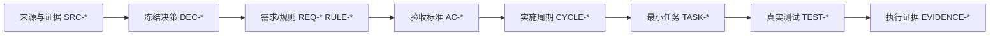

# 需求文档极致完整性标准

## 1. 目标

需求文档的读者可能不是提出需求的强推理模型，而是需要直接照文档执行的普通模型、研发、测试、审查和验收人员。因此需求文档必须把“为什么做、做什么、做到什么算完成、哪些情况绝不允许自行推断”全部固化到 Markdown 文件中，不能依赖聊天上下文补全。

本标准是 `requirement-intake-rules` 及其后续需求域 skill 的共同内容契约。它不要求每个需求都写同样长度的 prose，而要求所有结构完整、条件字段有证据、决策已冻结、图文和追踪关系可校验。

## 2. 完整性等级

| 等级 | 适用范围 | 强制产物 |
| --- | --- | --- |
| L1 基础 | 纯文案、静态内容、无运行行为 | 目标、范围、输入输出、验收、来源、一个主流程图 |
| L2 业务 | 页面、接口、业务规则、数据流 | L1 + 角色权限、状态、异常边界、时序图、追踪矩阵、术语附录 |
| L3 跨模块 | 多模块、多角色、持久化、外部依赖 | L2 + 依赖图、数据/状态图、兼容性、迁移、回滚、观测、风险台账 |
| L4 高风险 | 权限、资金、隐私、并发、不可逆操作、线上迁移 | L3 + 威胁/故障场景、决策记录、应急止损、审计证据、演练和反例 |

文档必须在“文档信息”中声明等级和判定依据。等级不能作为省略条件字段的理由；不适用项仍必须写 `N/A + 原因 + 证据`。

## 3. 零决策交接原则

- 强模型负责冻结业务规则、范围、优先级、接口和验证口径；普通模型只按文档执行。
- `unresolved_decisions` 章节必须存在。L1/L2 可为空，但要写“无未决项”；L3/L4 只要存在 P0/P1 未决项就阻断进入实施。
- 不允许出现“按现有逻辑”“适当处理”“合理返回”“视情况而定”“后续再补”等执行者需要自行解释的表达。
- 每个 `REQ-*` 必须明确触发条件、输入、判定规则、输出、异常、权限、可观测性和 `AC-*` 回指；缺失时写明不适用依据。
- 任何候选方案必须有 `DEC-*` 决策记录，包含候选、排除原因、选定方案、影响面、回滚方式和决策人/证据。

## 4. 强制章节与内容矩阵

需求主文档至少包含下列章节，并按复杂度追加章节：

| 章节 | 必答问题 | 典型稳定 ID |
| --- | --- | --- |
| 文档信息 | 谁维护、版本、状态、复杂度、来源、基线是什么 | `SRC-*` |
| 当前计划最终方案简要说明 | 推荐方向、主落点、选择原因是什么 | `DEC-*` |
| 需求来源与证据台账 | 每个结论来自哪里，证据是否可复核 | `SRC-*` |
| 目标与非目标 | 解决什么问题，明确不做什么 | `REQ-*`,`BOUND-*` |
| 角色、权限与责任 | 谁能做、谁不能做、谁负责兜底 | `REQ-*`,`RULE-*` |
| 功能需求 | 输入、规则、输出、异常和验收是什么 | `REQ-*` |
| 业务规则与优先级 | 冲突规则、优先级、默认值和例外是什么 | `RULE-*` |
| 数据与外部契约 | 字段、类型、单位、接口、错误码、兼容性是什么 | `REQ-*`,`RULE-*` |
| 状态、流程与时序 | 状态如何迁移，谁在什么条件下调用谁 | `REQ-*`,`SLICE-*` |
| 非功能与运营约束 | 性能、安全、可靠性、可观测性、部署和回滚是什么 | `REQ-*`,`RULE-*` |
| 风险、假设、依赖与阻断 | 哪些条件会阻断，如何恢复 | `GAP-*`,`BOUND-*` |
| 追踪矩阵 | 来源到需求、验收和实施是否 100% 覆盖 | `REQ-*`,`AC-*` |
| 未决决策与交接说明 | 普通模型禁止猜什么，遇到什么必须停 | `DEC-*` |
| 附录详解 | 术语、公式、状态表、反例、样例和证据详情 | 对应主文档 ID |

每个章节都必须有内容。没有触发条件的章节写 `N/A + 原因 + 证据`，不能只写“无”。

## 5. 需求条目最小字段

每条功能或质量需求至少使用以下字段，建议使用表格便于机器校验：

| 字段 | 要求 |
| --- | --- |
| ID / 标题 | 唯一稳定 `REQ-*`，标题可扫描 |
| 来源与证据 | 至少一个 `SRC-*` 或链接 |
| 角色与权限 | 发起者、被影响者、拒绝者、审计者 |
| 触发条件 | 前置状态、事件、时机 |
| 输入契约 | 字段、类型、单位、范围、是否必填、示例 |
| 处理规则 | 有序规则、优先级、默认值、幂等和并发口径 |
| 输出契约 | 成功结果、状态变化、持久化副作用、事件 |
| 异常与边界 | 错误码、用户可见结果、重试/降级/告警 |
| 安全与合规 | 鉴权、授权、脱敏、审计、数据保留 |
| 兼容与迁移 | 旧客户端、旧数据、灰度和回滚 |
| 验收回指 | 至少一个 `AC-*`，并能落到测试入口 |
| 不允许自行决定 | 列出执行模型不能改写的决策 |

## 6. 图形化标准

- L1 至少 1 张 `flowchart`；L2 至少 1 张 `flowchart` + 1 张 `sequenceDiagram`；L3/L4 追加与领域匹配的 `stateDiagram-v2`、`erDiagram` 或依赖 DAG。
- 每张图前必须写“图形目的”和关联稳定 ID；图内节点名称必须与正文术语、状态和任务 ID 一致。
- 业务分支用流程图，跨角色交互用时序图，状态迁移用状态图，数据关系用 ER 图；不要用一张万能图表达所有语义。
- 图形是可维护的 Mermaid 代码块；截图只能作为现状/设计证据，必须用 Markdown 图片语法引用并记录来源。
- 状态图、流程图中的每条异常边都必须在正文中有异常规则和 `AC-*`；图中孤立节点视为未收口。

## 7. 追踪与交接

必须维护以下双向关系，并在矩阵中展示覆盖状态：

任意一条需求、规则、验收或实施任务没有上下游回指，均视为阻断。稳定 ID 不得重复、复用或只出现在目录标题而不出现在正文矩阵。

## 8. 需求文档自审与放行

落盘前必须逐项确认：

1. 文档为 UTF-8，front matter 完整，`doc_id`、版本、状态和更新时间可解析。
2. 目标、非目标、角色、输入输出、异常、边界、权限、兼容、观测、回滚和验收均已填写或有 N/A 证据。
3. 无占位词、无未量化的“合理/尽量/正常”，无无法执行的模糊句。
4. 每个 `REQ-*` 至少对应一个 `AC-*`，每个 `AC-*` 都能继续回指实施计划或阻断原因。
5. Mermaid 图块闭合、语义匹配、节点与正文一致；链接、图片和附录引用存在。
6. `unresolved_decisions` 中没有 P0/P1 未决项；若有，文档状态必须是 `blocked`，不得进入验收或实施。

只有上述检查通过并完成用户确认，需求文档才允许交给 `acceptance-criteria-rules` 和 `implementation-planning-rules`。
