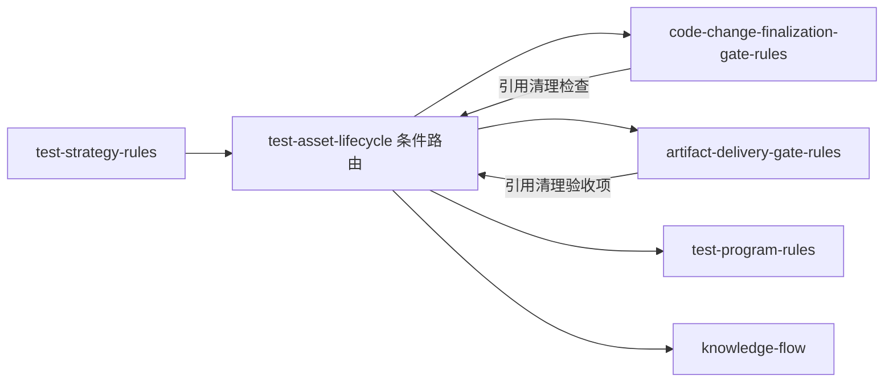

# 测试资产生命周期集成映射

## 集成关系总览



## 与各规则的集成点

### 1. `code-change-finalization-gate-rules`（代码变更收口闸门）

**集成方式**：在收口闸门的检查清单中增加"测试资产清理"检查项。

**新增检查项**：
- 本轮是否产生了临时测试数据？→ 若产生，确认是否已清理。
- `__pycache__` 是否已清理？→ 自动清理，无需确认。
- 收口时若不适用，写 `N/A + 无临时数据产生`。

**引用方式**：`code-change-finalization-gate-rules` 的检查项描述中引用 `test-asset-lifecycle` 条件路由。

### 2. `artifact-delivery-gate-rules`（交付闸门）

**集成方式**：在交付验收条件中增加"测试资产清理"验收项。

**新增验收项**：
- 本轮测试产出的临时数据是否已清理？
- 是否有遗留资产需要标记？
- 清理证据是否已记录到测试主文档或 `PROJECT_HISTORY.md`？

**引用方式**：`artifact-delivery-gate-rules` 的验收条件中引用 `test-strategy-rules` 的 `test-asset-lifecycle` 路由。

### 3. `test-strategy-rules` 测试进程生命周期

**集成方式**：将现有"测试进程生命周期"扩展为"测试进程+测试数据"双生命周期。

**扩展内容**：
- 现有：测试收口前关闭进程 + 核验状态
- 扩展：测试收口前关闭进程 + 核验状态 + 清理临时测试数据 + 清理 `__pycache__`

### 4. `test-program-rules`（测试程序规则）

**集成方式**：在 `test-program-rules` 中新增"临时测试资产"输出路径约定。

**新增约定**：
- 临时测试数据（fixture、生成文件）默认放在 `test/<skill>/temp/` 目录
- 该目录在收口时由 `test-asset-lifecycle` 清理
- 正式测试代码（`*_test.py`、`*_test.go`）放在 `test/<skill>/` 根目录，不在清理范围

### 5. `knowledge-flow`（知识库沉淀）

**集成方式**：清理记录沉淀到知识库。

**沉淀内容**：
- 重大清理事件（遗留资产清理、skill 退役清理）
- 清理策略变更记录

**不沉淀**：
- 每轮常规清理（`__pycache__` 自动清理）
- 单次测试的临时数据清理

### 6. `artifact-storage-rules / path-map.yaml`

**集成方式**：在 `path-map.yaml` 中新增以下映射：

```yaml
  test_temp_assets: "test/{skill}/temp"
  test_temp_assets_note: "临时测试数据目录，收口时由 test-asset-lifecycle 清理，不提交到 Git"
```

## 引用顺序

当命中 `test-asset-lifecycle` 条件路由时，按以下顺序读取引用文件：

1. `references/test-asset-lifecycle.md`（主规则，必读）
2. `references/cleanup-triggers.md`（触发条件判定，按需）
3. `references/cleanup-strategy.md`（清理策略，按需）
4. 本文件 `integration-map.md`（集成关系，定位集成点时读）

## 验证方式

集成正确性通过以下方式验证：

- 运行 `scripts/scan_stale_test_assets.py --dry-run` 确认扫描正常
- 运行 `scripts/cleanup_pycache.py --dry-run` 确认缓存扫描正常
- 检查 `code-change-finalization-gate-rules` 和 `artifact-delivery-gate-rules` 的引用链路正常