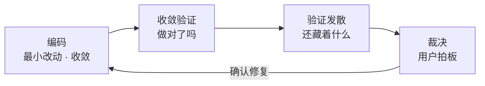

# 验证发散规则（verify-brainstorm-rules）

只在"代码或功能已经写完，需要主动往外挖隐患"时使用这个 skill。

如果当前争议是"这次改动到底做对了没有"，转交 `functional-validation-rules`；如果争议是"Bug 修好没有"，转交 `bug-validation-rules`；如果争议是"旧功能有没有被带坏"，转交 `test-regression-rules`；如果争议是"测试资源放哪里、按什么策略测"，转交 `test-strategy-rules`。

## 定位：编码收敛的对立面，但只在"发现问题"这一步发散

`code-quality-rules` 要求编码期**收缩改动范围、阻断顺手重构、拒绝发散**；本 skill 要求验证期**放开联想、多维度挑刺、主动找更多问题**。两者不是矛盾，而是同一条流水线上前后两个阶段：

关键切分点只有一句话：**发散只发生在"发现问题"这一步；一旦进入修复，立刻回到最小改动收敛。** 本 skill 永远不执行修复动作，也不以"顺手改掉"的方式让发散污染代码库。

## 铁律 1：只读发散，绝不顺手改码

- 本 skill 对代码库**只有读权限语义**：可以读代码、读 diff、读配置、跑只读查询与已有测试，但**不得新增、修改、删除任何源码、配置、测试或文档以外的产物**。
- 禁止"边验证边修"：即使发现的问题一眼可见、只改一行，也只能写进问题清单，交由用户裁决后走 `bug-intake-rules` 或编码域。
- 唯一允许的写入是**本 skill 自己的问题清单落盘**（见「执行结果归档要求」），落点不得与生产代码目录混淆。
- 违反此条视为本 skill 的驳回项：发散的价值在于"多找问题且不引入新风险"，自行改码会同时毁掉这两点。

## 铁律 2：发散有界，外扩受噪音上限约束

- **发散起点**：本轮改动点（diff 涉及的文件与符号）。
- **允许外扩**：沿**调用关系**与**数据流**向外最多一层——直接调用方、直接被调方、共享同一数据结构或同一接口契约的模块。
- **禁止无边界扩散**：不得升级为全项目扫描、不得纳入与改动无调用或数据关系的模块、不得把"顺手看看别的模块"当成发散。
- **噪音上限**：单轮发散产出的问题默认不超过 **15 条**；超出时按严重度截断，只保留 P0/P1 与高置信 P2，其余合并为"待观察"附注。
- 判定细则与外扩示例见 `references/scope-and-boundary.md`。

## 铁律 3：产物是问题清单，不是修改方案说明书

- 每条发现必须可定位、可触发、可判断：**位置（文件:行或符号）+ 维度 + 严重度 + 触发路径 + 影响 + 建议方向**。
- 严重度只分三级：**P0**（阻塞：资损、数据损坏、安全漏洞、崩溃）、**P1**（应修：逻辑错误、明显边界缺陷、性能退化）、**P2**（建议：健壮性、可观测性、体验与可维护性）。
- P0/P1 必须给出**具体触发路径**（什么输入、什么顺序、什么状态下会发生）；给不出触发路径的只能标 P2 并注明"未证实"。
- 禁止输出"整体看没什么问题""建议全面加固"这类无法验证的结论。
- **风格与格式类发现按"发现"处理、不按"判据"处理**：代码格式、命名、缩进、换行、注释颗粒度、文件落点属于本 skill 的发散维度（第 13 维），但**风格判据的权威仍在 `code-style-consistency-rules`**（含 `code-generation-style-rules` 的本轮风格契约与 `PROJECT_STYLE.md`）——本 skill 只指出"这里与项目既有写法不一致"，不重新定义风格规则、不发起全仓统一格式化，也不替代它 `6-review` 的 `STYLE: PASS / FIX_REQUIRED` 判定；风格类发现默认 P2，只有直接导致构建、CI 或工具链失败时才升为 P1。

## 铁律 4：先收敛验证，再发散挖掘

- 进入本 skill 前，先确认**收敛验证的结论已经存在**：功能是否符合当前需求（`functional-validation-rules`）、Bug 是否修复（`bug-validation-rules`，若本轮是修 Bug）、旧能力是否被带坏（`test-regression-rules`）。
- 收敛验证未通过或未执行时，**不得用发散结果替代收敛结论**，也不得据此宣称"功能可用"；此时应先把收敛验证补完，或在报告中明确标注"收敛验证缺失"这一前提缺口。
- 顺序不可颠倒：收敛验证回答"做对了没有"，本 skill 回答"还藏着什么"，后者建立在前者之上。

## 铁律 5：裁决权在用户手上

- 本 skill 只负责"捞问题"，**不负责决定修哪些**；每条发现的最终处置（修 / 不修 / 记技术债 / 转需求）由用户裁决。
- 报告收口时必须给出**建议优先级**，但必须与"用户裁决结论"分开呈现，不得把建议写成既定计划。
- 用户未裁决前，本 skill 不创建修复任务、不改代码、不代替用户关闭问题。

## 铁律 6：维度必须走矩阵，防止随机发散漏项

- 发散必须逐维度扫过 `references/divergence-dimension-matrix.md` 的 **13 个维度**：安全、性能、逻辑正确性、边界与空值、并发与竞态、异常与错误处理、数据精度与类型、资源与生命周期、兼容性、可观测性、配置与依赖、业务与用户视角、代码格式与风格。
- 每个维度都要给出"本维度结论"（有问题 / 无问题 + 依据），**不得只写有问题的维度**——没扫过的维度和扫过没问题的维度必须能区分开。
- 维度矩阵提供的是"追问清单"而非检查点清单：它的作用是触发联想，不是替代思考；允许在矩阵之外提出额外发现。

## 自动触发信号

- 用户说"验证功能""验证这个功能""验证刚刚改动的代码""验证一下""再检查一遍""再检查一下（改动）""检查一下""复查一下""再看看还有没有问题"或同义表达。
- **追问轮不豁免**：上一轮已做过收敛验证或留有"输出审查结论"等待办时，当前轮再出现上述表达仍必须命中本 skill，不得当作旧待办的延续直接收口；按 diff 逐项确认实现是否正确只算收敛验证，不算本 skill 已执行。
- **命中即执行**：前提（收敛验证已有结论）满足时直接进入只读发散，不向用户征求"要不要补做"；本 skill 全程只读，征求执行许可没有必要，用户裁决只发生在问题清单产出之后（铁律 5）。
- 编码完成、且收敛验证已给出通过或待确认结论，需要继续做一次主动隐患挖掘。
- 用户希望"发散一下、头脑风暴一下，看看还有什么问题没考虑到"。
- 用户明确要求从安全、性能、逻辑、边界等角度做一轮对抗式复查。
- 交付前需要一份可留痕的"已知风险与未覆盖项"清单。

## 进入后先做什么

1. 确认**发散对象**：本轮改动范围（diff 文件与符号）、来源对象（需求或 Bug 标识）、所属项目与分支。
2. 确认**收敛验证现状**：功能验证 / Bug 验证 / 回归验证是否已执行、结论是什么；缺失时按铁律 4 登记前提缺口。
3. 确认**外扩边界**：列出允许外扩一层的直接调用方、直接被调方与共享契约模块清单。
4. 读取 `references/divergence-dimension-matrix.md` 与 `references/scope-and-boundary.md`，确定本轮扫描范围与顺序。
5. 明确**不做什么**：不修代码、不做全项目扫描、不重新定义风格判据（第 13 维只做偏离发现）、不替代收敛验证结论。

## 默认执行流程

1. **建立事实基线**：读取改动 diff、涉及文件与配置；需要运行证据时只跑**只读**命令或**已有**测试（本地环境，遵守 `test-strategy-rules` 的测试隔离红线与测试进程生命周期）。
2. **逐维度发散**：按 13 维矩阵逐个维度走追问清单，记录"有问题 / 无问题 + 依据"；命中问题的即时记录位置、触发路径与严重度；其中代码格式与风格维度只做偏离发现，判据引用 `code-style-consistency-rules`。
3. **沿边界外扩一轮**：对直接调用方、直接被调方、共享契约模块重复关键维度追问；外扩结论必须标注"外扩发现"，与改动点自身的问题区分。
4. **去重与收敛**：合并同一根因的多条发现，按严重度排序，执行噪音上限截断。
5. **自检**：逐条核对是否可定位、是否可触发、是否有依据；P0/P1 缺触发路径的降级为 P2。
6. **落盘留痕**：按「执行结果归档要求」把问题清单写入文档，写明扫描范围、维度覆盖、未覆盖项与前提缺口。
7. **交接**：把清单交用户裁决；用户确认修复后，按问题性质转 `bug-intake-rules`（真缺陷）或回流编码域，**修复动作一律由 `code-quality-rules` 的最小改动收敛接管**。

## 权责边界与不负责事项

- 只负责"编码完成后的发散式隐患挖掘"，不负责判断改动是否正确（`functional-validation-rules`）、Bug 是否修复（`bug-validation-rules`）、旧功能是否被带坏（`test-regression-rules`）。
- 不负责测试策略、测试资产落点与测试执行通道设计（`test-strategy-rules`）。
- 不负责安全专项深度审计与漏洞定级标准（`code-security-audit-v2` 类安全审计 skill）；本 skill 只做安全维度的广度发现，命中深度需求时转交安全审计。
- 不负责修复实现，不负责 Bug 主文档维护（`bug-intake-rules`）。
- 覆盖代码格式与风格的偏离**发现**（第 13 维），但不持有风格判据权威——判据与 `6-review` 的 `STYLE: PASS / FIX_REQUIRED` 判定仍归 `code-style-consistency-rules`；本 skill 不主动发起全仓统一格式化或大面积风格清理。
- 不把"发散"扩张成全项目巡检；体系级问题应回到 `skill-audit-rules`，架构级问题回到架构文档域。

## 需要暂停并确认的条件

- 发散对象的改动范围无法确定（无 diff、无来源对象、分支基线不清）。
- 收敛验证结论缺失或本身处于待确认状态，继续发散会掩盖前提缺口。
- 外扩边界判定困难，候选模块过多或调用关系无法确认。
- 发现的问题指向需求本身的缺失或矛盾（应回流需求域，不在本 skill 内裁决）。
- 发现 P0 级问题（资损、数据损坏、安全漏洞、崩溃风险）：立即提示用户，不等待完整报告收口。

## 执行通过 / 驳回标准

- 通过：13 个维度均有明确结论（有问题 / 无问题 + 依据）；每条问题可定位、可触发、有严重度；外扩范围与"外扩发现"标注清晰；问题清单已按约定落盘；明确写明"本 skill 未修改任何代码"与前提缺口（如收敛验证缺失）。
- 驳回：跳过收敛验证直接发散并声称"功能可用"；问题无法定位或没有依据；只列有问题的维度而不写无问题维度的结论；把风格意见或不可验证的猜测当成缺陷；借发散之名修改了任何代码或配置；输出"整体没问题"这类无法验证的结论。

## 执行结果归档要求

- **优先复用同一轮测试主文档**：本轮已有 `doc/5-tests/` 测试主文档时，发散结论作为独立小节追加进该文档（遵循 `artifact-storage-rules` 的同一轮复用策略）。
- 无同一轮主文档时，在 `doc/5-tests/` 新建扁平 md，命名遵循 `../artifact-storage-rules/references/path-map.yaml` 的 `test_doc` 约定（`{datetime}_{中文主题}.md`），主题体现"验证发散"。
- 文档至少包含：发散对象、扫描范围与外扩边界、13 维覆盖结论、问题清单（按严重度排序）、未覆盖项与前提缺口、建议优先级、"未修改任何代码"声明。
- 模板与填写示例见 `references/finding-report-template.md`。
- 落盘后必须回读校验；未落盘不得判定发散验证完成。

## references 读取规则

- 默认先读 `references/divergence-dimension-matrix.md`（13 维追问清单）与 `references/scope-and-boundary.md`（发散范围、外扩判定与噪音上限）。
- 需要输出问题清单或判断落点时，读 `references/finding-report-template.md`，并对照 `../artifact-storage-rules/references/path-map.yaml` 与 `../artifact-storage-rules/references/update-policy.md`。
- 需要确认与相邻 skill 的分工、或判断某个发现该转交谁时，读 `references/skill-coordination.md`。
- 只要创建或修改发散记录文档，必须同时读取 `../artifact-delivery-gate-rules/references/plain-language-document-contract.md`，让结论、影响与范围先以白话开场，技术细节与证据进入附录。
- 发散依赖接口真实行为或页面真实交互取证时，按 `../test-strategy-rules/SKILL.md` 的接口测试执行通道与页面 UI 级测试执行通道执行，不在本 skill 重复定义。
