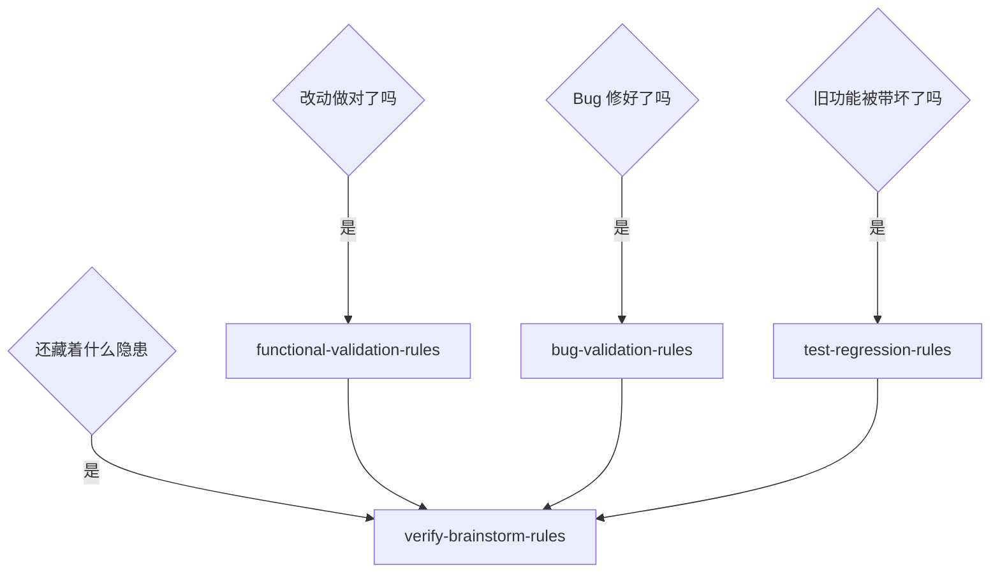

# 与相邻 skill 的分工与转交判据

> 归属 owner：`verify-brainstorm-rules`。用途：防止"什么验证都往发散上堆"，也防止该发散时被别的 skill 挡住。

## 1. 职责图谱

一句话记忆：**前三个问"做对了没有"，本 skill 问"还有什么没被发现"。** 前者是收敛判据，后者是广度挖掘。

## 2. 分工表

| 场景 | 归属 skill | 说明 |
|---|---|---|
| 改动是否符合当前需求与验收标准 | `functional-validation-rules` | 给通过 / 驳回 / 待确认结论 |
| Bug 修复是否闭环、是否引入副作用 | `bug-validation-rules` | 面向单个 Bug 的关闭判断 |
| 旧功能、上下游链路是否被带坏 | `test-regression-rules` | 兼容性与扩散影响 |
| 测试策略、覆盖优先级、用例设计方法 | `test-strategy-rules` | 测试域唯一策略入口 |
| 测试资产落点与生命周期 | `test-strategy-rules` 的 `test-asset-governance` 条件路由 | 本 skill 只引用不定义 |
| **编码完成后的多维度隐患发散** | **本 skill** | 只读、发散、产出清单 |
| 安全漏洞的深度定级与专项审计 | 安全审计类 skill（`code-security-audit` 等） | 本 skill 只做安全维度的广度发现 |
| 接口路由与契约基线一致性 | `project-interface-baseline-rules` | 本 skill 只消费其基线 |
| 问题录入、根因定位、修复方案 | `bug-intake-rules` → `bug-root-cause-rules` → `bug-fix-proposal-rules` | 本 skill 只负责把问题交出去 |
| 修复实现的最小改动与可读性 | `code-quality-rules` | 发散发现的问题一旦确认修复，由它收敛 |
| 命名、格式、注释密度等风格**判据与回归判定** | `code-style-consistency-rules` | 本 skill 可发现风格偏离并列入清单（第 13 维，默认 P2），但判据与 `6-review` 的 `STYLE: PASS / FIX_REQUIRED` 判定归它 |
| 多个 skill 职责重叠、体系级巡检 | `skill-audit-rules` | 本 skill 不外扩为体系巡检 |
| 交付前产物与证据门禁 | `artifact-delivery-gate-rules` | 本 skill 落盘后由其核验 |

## 3. 转交判据

满足下列任一条件时，把该条发现**转交**对应 owner，而不在本 skill 内继续推进：

| 发现特征 | 转交对象 | 本 skill 侧动作 |
|---|---|---|
| 是明确的既有功能缺陷 | `bug-intake-rules` | 在清单中标注"建议转 Bug 域" |
| 指向需求本身的缺失或矛盾 | 需求域（`requirement-intake-rules`） | 标注"前提缺口"，暂停该方向发散 |
| 需要专业安全定级或渗透视角 | 安全审计类 skill | 标注"建议安全专项复核" |
| 属于体系级、跨模块的同类写法 | `skill-audit-rules` 或专项重构 | 标注"超出外扩边界" |
| 风格与格式偏离（命名 / 缩进 / 换行 / 注释颗粒度 / 文件落点） | `code-style-consistency-rules` | 作为 **P2 发现**写入清单，并标注"判据归 `code-style-consistency-rules`"；不重新定义风格规则、不做全仓统一格式化 |
| 修复需要改动生产代码 | `code-quality-rules`（用户裁决后） | 本 skill 到此为止，不执行修改 |

## 4. 常见误判

| 误判 | 纠正 |
|---|---|
| "顺手验证一下旧功能" | 旧功能回归归 `test-regression-rules`，本 skill 只做外扩一层的关联发现 |
| "反正要测，把用例一起写了" | 用例设计与落点归 `test-strategy-rules` |
| "发现的问题我直接改掉更高效" | 违反只读铁律；一旦改码，发散与规避新风险两个价值同时失效 |
| "没问题就不用写报告" | 无问题也要落盘维度级结论与依据，否则等于没验证 |
| "多扫几个模块更保险" | 超出外扩边界，会稀释结论价值；确有传导证据才单条登记 |
| "既然是风格问题，顺手把全仓格式化一下" | 超出外扩边界；风格维度只发现本轮改动及其外扩范围内的偏离，判据与统一格式化都不归本 skill |
| "风格发现就是缺陷，得按 P1 报" | 风格类默认 P2 且注明判据归属；只有直接导致构建 / CI / 工具链失败才升 P1 |
