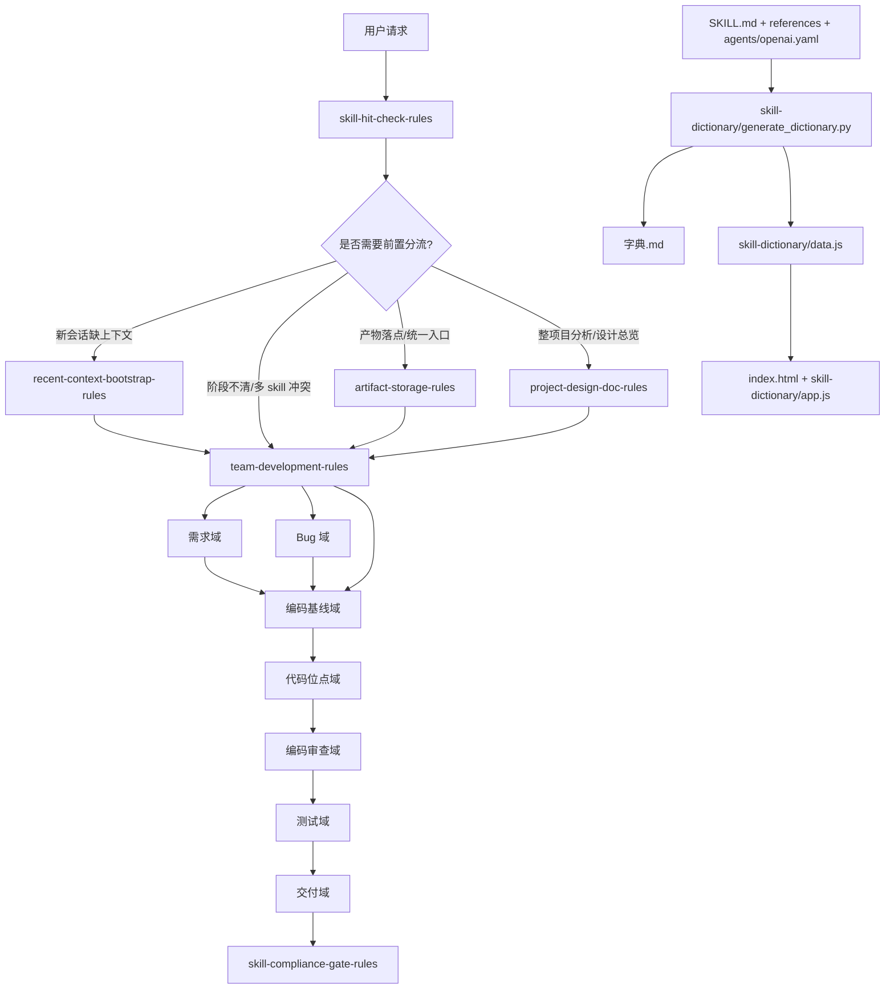

# 项目设计

## 1. 文档说明

- 文档用途：为当前仓库提供项目级总览，帮助快速理解项目定位、模块划分、核心链路、生成机制和当前约束。
- 当前可信度：中高。本文以真实目录结构、各 skill 目录中的 `SKILL.md` / `references` / `agents`、字典生成脚本、静态页面和最近 Git 变更为主依据；对历史规划文档仅作辅助参考。
- 最近同步时间：`2026-04-03 02:07:46`
- 主要依据：
  - 根目录说明文档：`README.md`
  - 主规划文档：`编码skill.md`
  - 当前可检索字典：`字典.md`
  - 字典生成链路：`skill-dictionary/generate_dictionary.py`
  - 静态展示入口：`index.html`、`skill-dictionary/app.js`、`skill-dictionary/data.js`
  - 近期 Git 提交：最近 3 天提交记录
- 弱参考说明：
  - `编码skill.md` 仍保留早期“规划阶段”表述，但仓库当前实际状态已进入“多数 skill 已落地并持续迭代”的阶段。
  - `skill-dictionary/data.js` 是生成产物，统计有参考价值，但刷新时间可能落后于最新提交。

## 2. 项目目标与范围

### 2.1 项目目标

本项目是一个面向团队研发协作的 skill 仓库，核心目标是让 AI 在参与研发任务时，能够按任务阶段和代码改动位置自动命中相应规则，而不是依赖人工临时拼接 skill。

这套体系重点覆盖以下阶段：

- 需求澄清与拆分
- Bug 录入、复现、定位、修复建议与验证
- 编码阶段的通用质量基线
- 按代码位点触发的细粒度实现规则
- 编码完成后的静态审查
- 测试策略、测试资源管理、功能验证与回归
- Git 协作与交付收口

### 2.2 当前服务对象

- 需要在项目内长期维护 AI 协作规则的团队
- 使用 Codex / 类 Codex 代理完成研发任务的开发者
- 需要把需求、Bug、编码、测试、交付流程沉淀为可复用规则资产的项目维护者

### 2.3 当前不覆盖的范围

- 不提供业务系统本身的后端服务或前端页面能力
- 不作为通用包管理仓库、数据库服务或独立 Web 服务运行
- 不直接替代具体项目中的业务需求分析、Bug 根因判断或测试执行，只提供规则与流程约束

## 3. 技术栈与运行形态

| 维度 | 当前形态 |
| --- | --- |
| 内容主体 | Markdown、YAML、CSV |
| 工具脚本 | Python |
| 展示层 | HTML + CSS + JavaScript 静态页面 |
| 运行形态 | 以本地仓库形式存在，由 AI 代理读取 skill 目录与说明文件 |
| 生成链路 | 使用 Python 脚本扫描 skill 目录并生成字典数据与说明文档 |
| 外部依赖 | 依赖运行时宿主加载 skill；部分 seed skill 依赖额外系统工具或 Python 包 |

补充说明：

- 仓库中没有看到典型业务项目常见的 `package.json`、`pyproject.toml`、`requirements.txt`、CI 配置或数据库配置文件。
- 这说明本项目的主价值不在“应用运行”，而在“规则资产组织 + 生成可检索索引 + 供代理运行时调用”。
- 个别 seed skill 带有工具脚本，例如：
  - `frontend-ui-visual-rules` 内置 UI 风格搜索与设计系统生成脚本
  - `doc` 内置 DOCX 渲染脚本，用于排版校验

## 4. 目录与模块总览

### 4.1 根目录职责

| 路径 | 职责 |
| --- | --- |
| `README.md` | 仓库对外说明、整体原则、已落地 skill 列表、维护建议 |
| `编码skill.md` | 体系级主规划文档，记录域划分、触发边界、总控逻辑和整体设计思路 |
| `字典.md` | 由脚本生成的可读字典文档，汇总各域 skill 与统计信息 |
| `skill-dictionary/` | 字典生成脚本、静态数据和页面资源 |
| `index.html` | 本地静态入口页，用于检索 skill 字典 |
| `*-rules/`、`frontend-*`、`test-*` 等目录 | 实际 skill 目录，是本仓库最重要的规则资产 |
| `.system/` | 当前工作区可见的系统级 skill 目录，但被 `.gitignore` 忽略，不属于当前仓库正式跟踪资产 |
| `项目设计.md` | 当前项目级总览主入口，用于沉淀本仓库的结构与主链路认知 |

### 4.2 skill 的标准骨架

本仓库中的大多数 skill 目录采用统一结构：

- `SKILL.md`：定义触发条件、职责边界、默认流程、通过标准
- `references/`：拆分细则、边界、模板、输出格式、示例
- `agents/openai.yaml`：提供显示名、短说明、默认 prompt 等代理接入元信息
- `scripts/`：少量具备可执行能力的 skill 才会包含
- `data/`：只有少数数据驱动型 skill 会包含

这意味着本仓库的维护核心，是围绕“规则说明的结构化拆分”而不是围绕“业务代码模块实现”。

### 4.3 域划分

| 域 | 主要职责 | 代表模块 |
| --- | --- | --- |
| 总控层 | 阶段分析、路由分流、冲突裁决、全局基础约定 | `team-development-rules`、`artifact-storage-rules`、`project-design-doc-rules`、`skill-hit-check-rules`、`skill-compliance-gate-rules` |
| 记忆域 | 新会话预热、历史回忆、项目时间线 | `recent-context-bootstrap-rules`、`history-recall-rules`、`project-timeline-rules` |
| 需求域 | 需求接入、缺口识别、边界、拆分、变更、计划、验收 | `requirement-*`、`implementation-plan-rules`、`acceptance-criteria-rules` |
| Bug 域 | Bug 录入、复现、静态定位、运行时诊断、修复建议、验证 | `bug-*` |
| 编码基线域 | 所有编码任务默认生效的基础质量规则 | `code-minimal-change-rules`、`code-readability-rules`、`code-style-consistency-rules`、`naming-rules`、`comment-placement-granularity-rules`、`comment-completion-gate-rules` |
| 代码位点域 | 按改动位点附加实现规则 | `package-structure-rules`、`database-*`、`api-*`、`logging-trace-rules`、`frontend-*` |
| 编码审查域 | 测试前的静态自审与归位检查 | `implementation-review-rules`、`syntax-check-review-rules`、`cleanup-format-review-rules`、`code-placement-review-rules` |
| 测试域 | 测试策略、资源、命名、程序、文档、功能验证、回归 | `test-*`、`functional-validation-rules`、`agent-browser` |
| 交付域 | Git 协作、交付说明收口 | `git-collaboration-rules`、`delivery-summary-rules` |
| 扩展种子 | 尚未完全并入主规划的辅助 skill | `doc`、`pdf`、`spreadsheet`、`context-compression-rules`、`find-skills` |

## 5. 核心链路

### 5.1 研发任务执行主链路

这套体系的主链路不是“函数调用链”，而是“任务阶段驱动的规则路由链”。

默认执行顺序可概括为：

1. 用户提出任务
2. 先执行 `skill-hit-check-rules`，显式报告当前轮命中的 skill
3. 如为新会话且缺上下文，进入 `recent-context-bootstrap-rules`
4. 如阶段不清、多个 skill 同时命中或流程需阻断，进入 `team-development-rules`
5. 如涉及产物落点、统一入口文档或根目录 `项目设计.md`，进入 `artifact-storage-rules` / `project-design-doc-rules`
6. 根据任务类型进入需求域或 Bug 域
7. 一旦开始新增或修改代码，默认叠加编码基线域；再按改动位置叠加代码位点域
8. 编码完成后进入编码审查域
9. 审查通过后进入测试域
10. 测试收口后进入交付域
11. 最终阶段由 `skill-compliance-gate-rules` 做完整性闸门检查

### 5.2 仓库维护与字典生成链路

除了“规则被使用”的主链路之外，本仓库还有一条“规则被维护与发布”的链路：

1. 新增或调整某个 skill
2. 修改该 skill 的 `SKILL.md`、`references/`、`agents/openai.yaml`
3. 运行 `python skill-dictionary/generate_dictionary.py`
4. 生成或刷新：
   - `字典.md`
   - `skill-dictionary/data.js`
5. 由 `index.html` + `skill-dictionary/app.js` 消费字典数据，形成静态可检索页面

这条链路说明：仓库的“可用性”不仅依赖各 skill 自身，也依赖字典索引是否同步刷新。

## 6. 模块关系图

### 6.1 主关系图（Mermaid）



### 6.2 兼容性更好的 ASCII 图

```text
用户请求
  |
  v
skill-hit-check-rules
  |
  +--> recent-context-bootstrap-rules  (新会话缺上下文)
  +--> team-development-rules          (阶段不清 / 多 skill 冲突)
  +--> artifact-storage-rules          (产物落点 / 统一入口)
  +--> project-design-doc-rules        (整项目分析 / 项目总览)
  |
  v
需求域 / Bug 域
  |
  v
编码基线域
  |
  v
代码位点域
  |
  v
编码审查域
  |
  v
测试域
  |
  v
交付域
  |
  v
skill-compliance-gate-rules


skill 维护链路：

SKILL.md + references + agents/openai.yaml
  |
  v
skill-dictionary/generate_dictionary.py
  |
  +--> 字典.md
  +--> skill-dictionary/data.js
          |
          v
     index.html + skill-dictionary/app.js
```

### 6.3 读图说明

- 左半部分是“任务执行链”，反映 AI 接任务时如何被路由到不同域。
- 右下部分是“仓库维护链”，反映仓库内容如何被重新编译成字典与静态页面。
- `team-development-rules` 不是取代其他模块，而是负责在阶段不明确时做总控分流。
- 编码阶段采用“双层叠加”：先命中编码基线域，再按实际改动位点附加更细规则。

## 7. 关键实现与支撑模块

### 7.1 字典系统

字典系统是本仓库最明确的“程序化能力”：

- `skill-dictionary/generate_dictionary.py`
  - 负责扫描规划文档与实际 skill 目录
  - 汇总 domain、skill、references、agents、项目文档等信息
  - 输出 `字典.md` 与 `skill-dictionary/data.js`
- `index.html`
  - 作为静态入口页加载字典数据
- `skill-dictionary/app.js`
  - 提供本地搜索、域切换、技能详情展示

这套机制让本仓库从“很多零散 skill 目录”变成“可检索的规则目录”。

### 7.2 工具型 seed skill

虽然大多数 skill 以说明文档为主，但少数模块已经具备实际脚本能力：

- `frontend-ui-visual-rules`
  - 内置 CSV 数据集、BM25 搜索与设计系统生成能力
  - 适合在风格不明确时辅助前端视觉定向
- `doc`
  - 带 DOCX 渲染脚本，用于文档排版和版式核验
- `pdf`、`spreadsheet`
  - 作为外部能力种子保留在仓库中

这些模块说明本项目并非纯静态文档仓库，而是“规则优先、少量工具增强”的混合形态。

## 8. 当前约束与风险

### 8.1 文档与实现存在轻微偏移

- `编码skill.md` 仍保留“当前约束：本阶段只做规划，不开始正式落地”的早期描述。
- 但从根目录说明、字典统计和实际目录看，仓库已进入大规模 skill 落地与细则迭代阶段。
- 后续若继续使用 `编码skill.md` 作为主规划，应同步刷新其阶段表述，避免新读者误判项目状态。

### 8.2 生成产物可能滞后

- `skill-dictionary/data.js` 的时间戳与当前最新提交可能不同步。
- 该文件中的 `repo_root` 也可能来自其他环境，不一定反映当前工作区绝对路径。
- 如果新增、删除或重命名 skill 后未刷新字典，静态页面与字典文档会落后于真实仓库状态。

### 8.3 `.system/` 不属于正式仓库主线

- 当前工作区可见 `.system/` 目录，但它被 `.gitignore` 忽略。
- Git 历史中也存在删除 `.system` 跟踪内容的提交。
- 因此，应把它视为“运行环境注入的系统能力”，而不是当前仓库的正式维护主线。

### 8.4 `doc/` 的语义存在潜在冲突

- 通用产物规则里，`doc/` 常被视为项目文档根目录。
- 但在本仓库中，`doc/` 本身已经是一个 seed skill 目录。
- 这意味着本仓库后续如果还要沉淀更多“项目级普通文档”，需要先统一策略：
  - 要么继续以根目录 `项目设计.md` 为主入口，仅保留少量根目录文档
  - 要么新增独立的项目文档目录，避免与 seed skill `doc/` 产生语义混淆

### 8.5 缺少自动化校验链路

- 当前没有看到 CI、测试流水线或自动校验配置。
- 仓库一致性更多依赖维护者手动更新文档、规则和字典。
- 一旦维护节奏变快，最容易先漂移的是生成产物与总览文档。

## 9. 维护建议

### 9.1 日常更新建议

每次新增、删除或明显调整 skill 后，建议至少同步以下内容：

1. 对应 skill 的 `SKILL.md`
2. 对应的 `references/` 和 `agents/openai.yaml`
3. `README.md` 中的总览或说明
4. `项目设计.md` 中的模块结构与约束描述
5. 运行 `python skill-dictionary/generate_dictionary.py` 刷新字典

### 9.2 结构演进建议

- 若后续继续新增系统级或外部 seed skill，建议明确区分：
  - 仓库正式维护 skill
  - 运行时注入 skill
  - 暂存 seed skill
- 若要继续沉淀项目文档，建议优先保证根目录 `项目设计.md` 为唯一主入口，避免再出现多个平行总览文档。

## 10. 当前结论

本仓库已经形成一套较完整的“团队研发 AI 协作规则体系”，其核心价值不在提供业务功能，而在把研发流程拆成可自动命中的细粒度 skill，并通过统一目录骨架、规则细则和字典生成链路保持可维护性。

从当前状态看，项目已具备以下特征：

- 域划分稳定
- skill 数量与覆盖面较完整
- 总控层、记忆域、需求域、Bug 域、编码域、测试域、交付域之间已经形成清晰主链路
- 字典系统让规则资产具备可检索性

后续最重要的工作不是再快速堆更多 skill，而是持续收口以下两件事：

1. 保持“真实仓库状态、主规划文档、生成字典”三者同步
2. 继续降低环境注入内容、seed 内容与正式主线内容之间的边界歧义
